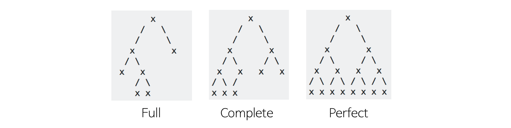

### 트리(Tree)

- 트리는 노드로 이루어진 자료 구조이며, 다음과 같은 특징을 가진다.
    - 트리는 하나의 루트 노드를 갖는다.
    - 루트 노드는 0개 이상의 자식 노드를 갖고 있다.
    - 그 자식 노드 또한 0개 이상의 자식 노드를 갖고 있고, 이는 반복적으로 정의된다.
- 노드(node)들과 노드들을 연결하는 간선(edge)들로 구성되어 있다.
    - 트리에는 사이클이 존재할 수 없다.
    - 노드들은 특정 순서로 나열될 수도 있고 그렇지 않을 수도 있다.
    - 각 노드는 부모 노드로의 연결이 있을 수도 있고 없을 수도 있다.
    - 각 노드는 어떤 자료형으로도 표현 가능하다.
- 비선형 자료구조로 계층적 관계를 표현한다.(ex - 디렉토리 구조, 조직도)
- 그래프의 한 종류이다.
    - 사이클이 없는 하나의 연결 그래프(Connected Graph)
    - 또는 DAG(Directed Acyclic Graph, 방향성이 있는 비순환 그래프)의 한 종류이다.
- 트리와 관련된 용어
    
    - 루트 노드(root node): 부모가 없는 노드, 트리는 하나의 루트 노드만을 가진다.
    - 단말 노드(leaf node): 자식이 없는 노드, ‘말단 노드’ 또는 ‘잎 노드’라고도 부른다.
    - 내부 노드(internal node): 단말 노드가 아닌 노드
    - 간선(edge): 노드를 연결하는 선
    - 형제(sibling): 같은 부모를 가지는 노드
    - 노드의 크기(size): 자신을 포함한 모든 자손 노드의 개수
    - 노드의 깊이(depth): 루트에서 어떤 노드에 도달하기 위해 거쳐야 하는 간선의 수
    - 노드의 레벨(level): 트리의 특정 깊이를 가지는 노드의 집합
    - 노드의 차수(degree): 하위 트리 개수 / 간선 수 = 각 노드가 지닌 가지의 수
    - 트리의 차수(degree of tree): 트리의 최대 차수
    - 트리의 높이(height): 트리의 최대 레벨
- 트리의 특징
    - 그래프의 한 종류이다. ‘최소 연결 트리(Minimum Spanning Tree)’라고도 불린다.
    - 트리는 계층 모델이다.
    - 노드가 N개인 트리는 항상 N - 1개의 간선을 가진다.
        - 즉, 간선은 항상 (정점의 개수 - 1) 만큼을 가진다.
    - 루트에서 어떤 노드로 가는 경로는 유일하다.
        - 임의의 두 노드 간의 경로도 유일하다. 즉, 두 개의 정점 사이에 반드시 1개의 경로만을 가진다.
    - 한 개의 루트 노드만이 존재하며 모든 자식 노드는 한 개의 부모 노드만을 가진다.
        - 부모 - 자식 관계이므로 흐름은 top - bottom 혹은 bottom - top으로 이루어진다.
    - 순회는 Pre-order, In-order 아니면 Post-order로 이루어진다. 이 3가지 모두 DFS/BFS 안에 있다.
    - 트리는 이진 트리, 이진 탐색 트리, 균형 트리(AVL 트리, Red-Black 트리), 이진 힙(최대 힙, 최소 힙) 등이 있다.
- 트리의 종류
    - 이진 트리(Binary Tree)
        - 각 노드가 최대 두 개의 자식을 갖는 트리
        - 모든 트리가 이진 트리는 아니다.
        - 이진 트리 순회
            - 전위 순회(Pre-order): 현재 노드 → 왼쪽 자식 노드 → 오른쪽 자식 노드
            - 중위 순회(In-order): 왼쪽 자식 노드 → 현재 노드 → 오른쪽 자식 노드
            - 후위 순회(Post-order): 왼쪽 자식 노드 → 오른쪽 자식 노드 → 현재 노드
    - 이진 탐색 트리(Binary Search Tree)
        - 모든 노드가 아래와 같은 특정 순서를 따르는 속성이 있는 이진 트리
            
            > 모든 왼쪽 자식들 ≤ n < 모든 오른쪽 자식들 (모든 노드 n에 대해 반드시 참)
            > 
    - 균형 트리(Balanced Tree)
        - O(log n) 시간에 insert와 find를 할 수 있을 정도로 균형이 잘 잡혀 있는 경우
        - AVL 트리, Red-Black 트리 등이 있다.
    
    - 완전 이진 트리(Complete Binary Tree)
        
        - 트리의 모든 높이에서 노드가 꽉 차 있는 이진 트리.
        - 즉, 마지막 레벨을 제외하고 모든 레벨이 완전히 채워져 있다.
        - 마지막 레벨은 꽉 차 있지 않아도 되지만 노드가 왼쪽에서 오른쪽으로 채워져야 한다.
        - 마지막 레벨 h에서 (1 ~ 2h - 1) 개의 노드를 가질 수 있다.
        - 또 다른 정의는 가장 오른쪽의 단말 노드가 (아마도) 제거된 포화 이진 트리다.
        - 완전 이진 트리는 배열을 사용해 효율적으로 표현이 가능하다.
    - 전 이진 트리(Full Binary Tree)
        
        - 모든 노드가 0개 또는 2개의 자식 노드를 갖는 트리.
    - 포화 이진 트리(Perfect Binary Tree)
        
        - 전 이진 트리이면서 완전 이진 트리인 경우.
        - 모든 말단 노드는 같은 높이에 있어야 하며, 마지막 단계에서 노드의 개수가 최대가 되어야 한다.
        - 모든 내부 노드가 두 개의 자식 노드를 가진다.
        - 모든 말단 노드가 동일한 깊이 또는 레벨을 가진다.
        - 노드의 개수가 정확히 2 ^ h - 1 개여야 한다. (h: 트리의 높이)
    - 이진 힙(Binary Heap)
        - 최소 힙(Min Heap)
            - 트리의 마지막 단계에서 오른쪽 부분을 뺀 나머지 부분이 가득 채워져 있는 완전 이진 트리이며, 각 노드의 원소가 자식들의 원소보다 작다.
                - 즉, 부모 노드의 key ≤ 자식 노드의 key인 완전 이진 트리
                - 가장 작은 값은 루트 노드이다.
                - n개가 힙에 들어가 있으면 높이는 log n 이다.
        - 최대 힙(Max Heap)
            - 원소가 내림차순으로 정렬되어 있다는 점에서만 최소 힙과 다르다.
            - 각 노드의 원소가 자식들의 원소보다 크다.