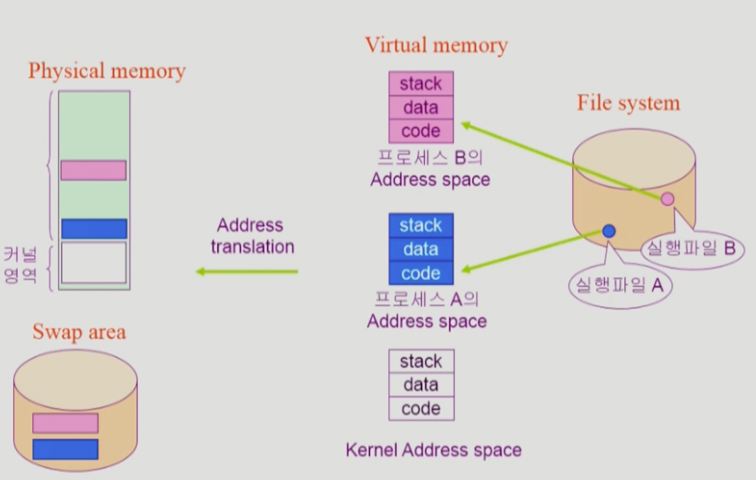
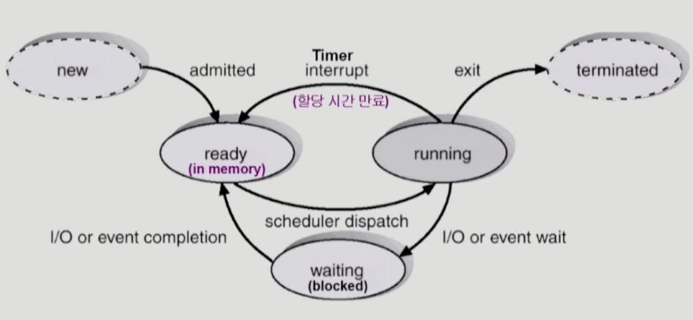
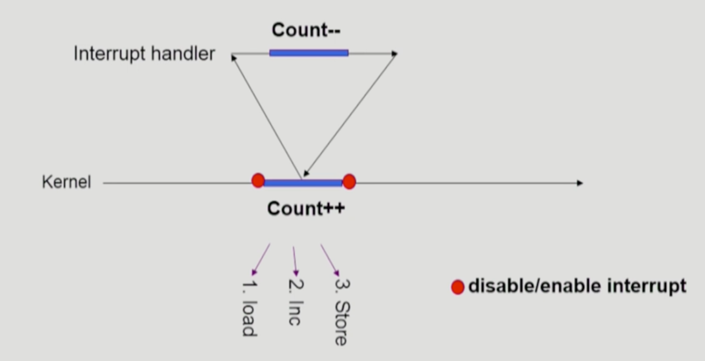
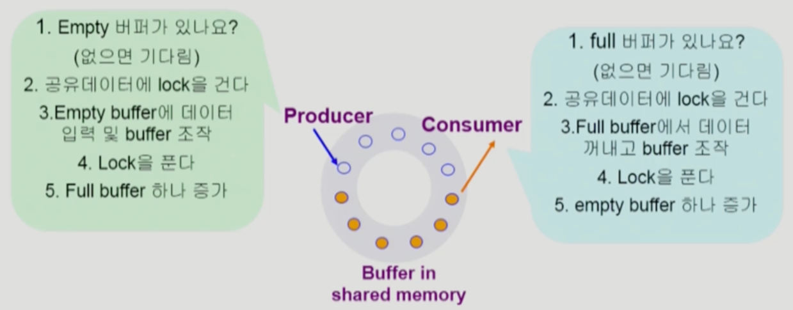
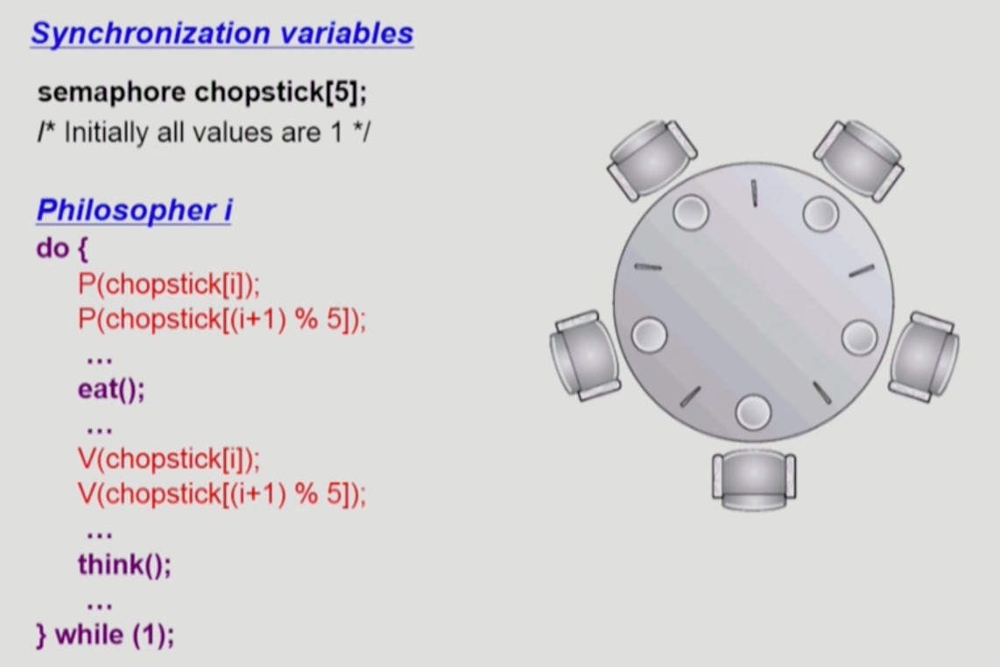
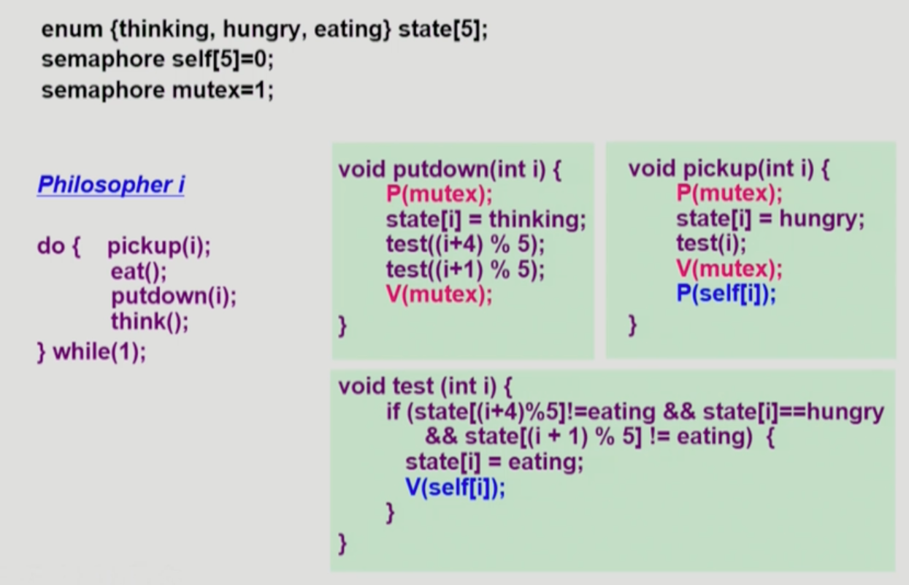
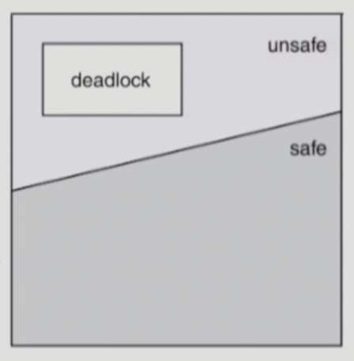
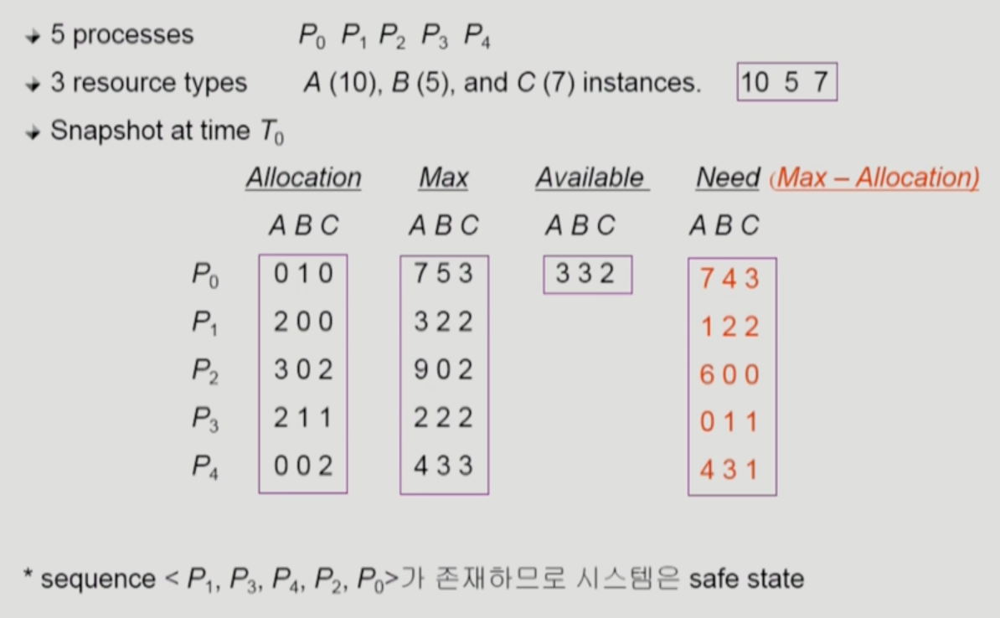

# 운영체제
[참고 강의](http://www.kocw.net/home/m/search/kemView.do?kemId=1046323) - 모두를 위한 열린 강좌 KOCW(이화여대, 반효경)

### 목차

- [운영체제](#운영체제)
    - [목차](#목차)
    - [운영체제(Operating System)란?](#운영체제operating-system란)
    - [컴퓨터 시스템의 구조](#컴퓨터-시스템의-구조)
    - [프로세스](#프로세스)
    - [CPU 스케줄링](#cpu-스케줄링)
    - [프로세스 동기화](#프로세스-동기화)
    - [데드락](#데드락)

### 운영체제(Operating System)란?

- 컴퓨터 하드웨어 바로 위에 설치되어 사용자 및 다른 모든 소프트웨어와 하드웨어를 연결하는 소프트웨어 계층이다.
- 하드웨어를 직접 다루는 복잡한 부분을 운영체제가 대행한다.
- 컴퓨터 시스템의 자원(프로세서, 기억장치, 입출력 장치 등)을 효율적으로 관리한다.
- 좁은 의미의 운영체제
    - 운영체제의 핵심 부분으로 메모리에 상주하는 부분
- 넓은 의미의 운영체제
    - 커널 뿐 아니라 각종 주변 시스템 유틸리티를 포함한 개념
- 운영체제의 목적
    - 컴퓨터 시스템을 편리하게 사용할 수 있는 환경을 제공한다.
    - 컴퓨터 시스템의 자원을 효율적으로 관리한다.
- 혼돈하기 쉬운 용어 정리
    - Multitasking
    - Multiprogramming
    - Time sharing
    - Multiprocess
    - 위 용어들은 컴퓨터에서 여러 작업을 동시에 수행하는 것을 뜻한다.
    - Multiprogramming은 여러 프로그램이 메모리에 올라가 있음을 강조한 것이다.
    - Time sharing은 CPU의 시간을 분할하여 나누어 쓴다는 의미를 강조한 것이다.
    - Multiprocessor: 하나의 컴퓨터에 CPU(processor)가 여러 개 붙어 있음을 의미한다.
- 운영체제의 구조
    - 누구한테 CPU를 줄까? → CPU 스케줄링
    - 한정된 메모리를 어떻게 쪼개어 쓰지? → 메모리 관리
    - 디스크에 파일을 어떻게 보관하지? → 파일 관리
    - 각기 다른 입출력장치와 컴퓨터 간에 어떻게 정보를 주고받게 하지? → 입출력 관리
    - 프로세스의 생성과 삭제, 자원 할당 및 반환, 프로세스 간 협력 → 프로세스 관리
    - 보호 시스템, 네트워킹, 명령어 해석기(command line interpreter 등)

### 컴퓨터 시스템의 구조


- CPU는 메모리에서 instruction을 하나씩 읽어들여 수행한다.
- CPU는 IO Device를 직접 제어하지 않고, IO Controller에게 제어하도록 시킨다.
- CPU는 굉장히 좋은 성능을 가지기 때문에, 만일 사용자 프로그램 A가 IO Device로부터 무언가를 읽어와야 하는 상황일 경우 CPU는 IO 컨트롤러에게 일을 시킨 후, 다른 프로그램으로 옮겨가 작업을 수행한다.
- timer는 특정 프로그램이 CPU를 독점하는 것을 막는다. timer에 할당된 시간만큼만 프로그램은 CPU를 사용할 수 있다.
- CPU는 instruction을 실행한 후 interrupt line을 체크하게 되는데, timer가 interrupt를 걸면 CPU는 하던 일을 멈추고 CPU의 제어권이 사용자 프로그램으로부터 운영체제로 넘어가게 된다.
- 운영체제가 CPU의 제어권을 얻게 되면, 다른 프로그램에게 timer를 걸고 CPU를 할당하게 된다.
- 프로그램이 IO Device로부터 무언가를 읽어와야 할 때, 운영체제를 통해 작업을 요청한다.
    - IO Device에서 요청받은 작업을 수행하면, interrupt를 발생시킨다.
    - 운영체제는 IO Device에서 요청받은 작업의 결과물을 메모리에 로드한다.
- Mode bit
    - 1 → 사용자 모드, 0 → 커널 모드
    - Mode bit이 0일 때는 메모리 접근, IO Device 접근 등 모든 작업이 가능하다.
    - 하지만 Mode bit이 1일 때는 제한된 instruction만 수행 가능하다.
    - 즉, Mode bit은 운영체제가 아닌 사용자 프로그램이 CPU를 제한적으로 활용할 수 있도록 하기 위한 안전장치이다.(사용자 프로그램의 잘못된 수행으로 다른 프로그램 및 운영체제에 피해가 가지 않게 하기 위함)
    - Interrupt나 Exception이 발생하면 Mode bit는 0으로 바뀐다.
    - 사용자 프로그램에게 CPU를 할당하기 전에 Mode bit은 1로 바뀐다.
- Timer
    - 정해진 시간이 흐른 뒤 운영체제에게 CPU 제어권이 넘어가도록 interrupt를 발생시킨다.
    - 타이머는 매 클럭 틱마다 1초씩 감소한다.
    - 타이머 값이 0이 되면 타이머 interrupt가 발생한다.
    - CPU를 특정 프로그램이 독점하는 것으로부터 보호한다.
- IO Device 컨트롤러
    - 해당 IO 장치 유형을 관리하는 일종의 작은 CPU
    - 제어 정보를 위해 control register, status register를 가진다.
    - 일종의 data register인 local buffer를 가진다.
    - IO는 실제 device와 local buffer 사이에서 일어난다.
    - Device 컨트롤러는 IO가 끝났을 때 interrupt로 CPU에 그 사실을 알린다.
    - 참고) Device 드라이버 vs Device 컨트롤러
        - 드라이버 - 소프트웨어, 컨트롤러 - 하드웨어
- DMA 컨트롤러
    - DMA(Direct Memory Access), 즉 DMA 컨트롤러는 CPU와 마찬가지로 메모리에 접근할 수 있다.
        - CPU와 DMA 컨트롤러가 메모리에 동시 접근하는 상황을 막기 위해 메모리 컨트롤러가 존재한다.
    - IO Device에서 작업이 끝나서 CPU에게 interrupt로 작업 완료를 알리게 되면, 매 IO 작업이 완료될 때마다 지나치게 많은 interrupt를 받게 되어 효율이 떨어질 수 있다.
    - 따라서 DMA 컨트롤러는 IO Device의 작업이 완료될 때 CPU 대신 메모리에 직접 접근해 작업 결과물을 로드한다.
    - 즉, CPU가 했어야 할 일을 대신해서 수행함으로써 CPU가 잡다한 일을 하지 않도록 해 효율을 더욱 높이는 방식이다.
- 입출력(IO)의 수행
    - 모든 입출력 명령은 커널 모드에서만 수행 가능하다.
    - 사용자 프로그램은 어떻게 IO를 하는가? - 시스템 콜(System Call)
        - 사용자 프로그램이 직접 interrupt를 걸어 운영체제에게 CPU를 넘기며(커널 모드 진입), IO를 요청한다.
        - trap을 사용해 인터럽트 벡터의 특정 위치로 이동
        - 제어권이 인터럽트 벡터가 가리키는 인터럽트 서비스 루틴으로 이동
        - 올바른 IO 요청인지 확인 후 IO 수행
        - IO 완료 시 제어권을 시스템 콜 다음 명령으로 옮김
- Interrupt(인터럽트)
    - interrupt를 당한 시점의 레지스터와 program counter를 저장한 후 CPU의 제어를 interrupt 처리 루틴에 넘긴다.
    - Interrupt(넓은 의미)
        - Interrupt(하드웨어 인터럽트): 하드웨어가 발생시킨 interrupt(IO 작업이 수행된 후 발생)
        - Trap(소프트웨어 인터럽트)
            - Exception: 프로그램이 오류를 범한 경우
            - System call: 프로그램이 커널 함수를 호출하는 경우(IO 작업을 수행하기 위해 호출됨)
    - 관련 용어
        - 인터럽트 벡터: 해당 인터럽트의 처리 루틴 주소를 가지고 있음
        - 인터럽트 처리 루틴: 해당 인터럽트를 처리하는 커널 함수
    - Interrupt가 발생했을 때만 운영체제가 CPU를 갖게 된다.
- 시스템 콜(System Call)
    - 사용자 프로그램이 운영체제의 서비스를 받기 위해 커널 함수를 호출하는 것
- 동기식 입출력과 비동기식 입출력
    
    
    
    - 동기식 입출력(synchronous IO)
        - IO 요청 후 입출력 작업이 완료된 후에야 제어가 사용자 프로그램에 넘어감
        - 만일 오래 걸리는 작업을 기다리는 동안 CPU를 가지고 있다면 CPU는 아무 일도 하지 않은 채 낭비가 되는 상황이 발생할 수 있다. → CPU를 다른 프로그램에 양보하는 것이 더 효율적이다.
        - 구현 방법 1
            - IO가 끝날 때까지 CPU를 대기시킴(낭비시킴)
            - 매 시점 하나의 IO만 일어날 수 있음
        - 구현 방법 2
            - IO가 완료될 때까지 해당 프로그램에게서 CPU를 빼앗음
            - IO 처리를 기다리는 줄에 그 프로그램을 추가함
            - 다른 프로그램에게 CPU를 줌
    - 비동기식 입출력(asynchronous IO)
        - IO가 시작된 후 입출력 작업이 끝나기를 기다리지 않고 제어가 사용자 프로그램에 즉시 넘어감
    - 두 경우 모두 IO의 완료는 인터럽트로 알려준다.
- DMA(Direct Memory Access)
    - 원래는 메모리에 접근할 수 있는 장치는 CPU 뿐이지만, DMA도 메모리에 접근할 수 있다.
    - 빠른 입출력 장치를 메모리에 가까운 속도로 처리하기 위해 사용한다.
    - CPU의 개입 없이 device 컨트롤러가 device의 buffer storage의 내용을 메모리에 block 단위로 직접 전송한다.
    - 바이트 단위가 아니라 block 단위로 인터럽트를 발생시킨다.
- 저장장치 계층 구조
    
    
    
    - (전통적으로) 위로 올라갈수록 속도는 빠르고, 비용은 비싸 용량이 적어지며, 휘발성이다.
    - Primary - CPU가 직접 접근 가능(바이트 단위 접근이 가능)
    - Secondary - CPU가 직접 접근 불가능(바이트 단위 접근이 불가능)
    - 캐싱: 데이터를 더 빠른 저장장치로 복사하는 것
- 프로그램의 실행(메모리 로드)
    
    
    
    - 메모리의 낭비를 막기 위해 당장 실행할 부분만 가상 메모리에서 물리 메모리로 올려 사용한다.
    - 당장 실행하지 않는 부분은 swap area에 위치시키고, 필요 시 swap시킬 수 있도록 한다.
    - 커널 역시 하나의 프로그램이기 때문에 스택, 데이터, 코드의 구조를 갖는다.
    - 커널 주소 공간의 내용
        - 코드
            - 시스템 콜, 인터럽트 처리 코드
            - 자원 관리를 위한 코드
            - 편리한 서비스 제공을 위한 코드
        - 데이터
            - 운영체제가 관리하는 하드웨어의 종류마다 매칭되는 자료 구조
            - 각 프로세스마다 운영체제가 관리하고 있는 자료 구조(PCB)
        - 스택
            - 각 프로세스의 커널 스택
- 사용자 프로그램이 사용하는 함수
    - 함수
        - 사용자 정의 함수 → 프로세스의 Address space 내 코드에 위치
            - 자신의 프로그램에서 정의한 함수
        - 라이브러리 함수 → 프로세스의 Address space 내 코드에 위치
            - 자신의 프로그램에서 정의하지 않고 갖다 쓴 함수
            - 자신의 프로그램의 실행 파일에 포함되어 있다.
        - 커널 함수 → 커널의 Address space 내 코드에 위치
            - 운영체제 프로그램의 함수
            - 커널 함수의 호출 = 시스템 콜

### 프로세스

- 프로세스: 실행 중인 프로그램
- 프로세스의 문맥(context) - 이 프로세스는 현재 시점에 어디까지 와 있는가(수행했는가)
    - CPU 수행 상태를 나타내는 하드웨어 문맥
        - Program Counter
        - 각종 register
    - 프로세스의 주소 공간
        - code, data, stack
    - 프로세스 관련 커널 자료 구조
        - PCB, 커널 스택
    - 프로세스의 문맥이 왜 중요한가? → Time sharing 과정에서, 이 프로세스가 다음 번에 CPU를 할당받았을 때 어디서부터 이어서 작업을 수행해야 하는지 알 수 있기 때문
- 프로세스의 상태(State)
    
    
    
    - 프로세스는 상태가 변경되면서 수행된다.
        - Running
            - CPU를 할당받아 instruction을 수행 중인 상태
        - Ready
            - CPU를 기다리는 상태(메모리 등 다른 조건을 모두 만족하고, CPU를 할당받기만을 기다리는 상태)
        - Blocked(Wait, Sleep)
            - CPU를 할당받아도 지금 당장 instruction을 수행할 수 없는 상태
            - 프로세스 자신이 요청한 event(ex - IO)가 즉시 만족되지 않아 이를 기다리는 상태
        - New
            - 프로세스가 생성 중인 상태
        - Terminated
            - 수행(execution)이 끝난 상태
    
    
    
    - 프로세스는 Ready queue에서 대기하다가 CPU를 할당받아 Running 상태가 된다.
    - CPU를 할당받고 작업을 수행하던 중 IO 작업이나 공유 데이터 접근 등 Block되는 상태가 발생하면 Blocked 상태로 변한다.
    - IO 작업이 끝난 프로세스는 Ready queue로 되돌아가 CPU 할당을 기다리게 된다.
- PCB(Process Control Block)
    
    
    
    - 운영체제가 각 프로세스를 관리하기 위해 프로세스당 유지하는 정보
    - 다음 구성 요소를 가진다.(구조체로 유지)
        - OS가 관리하기 위해 사용하는 정보
            - Process state, Process ID(PID)
            - Scheduling information, priority(ready queue 내에서의 우선순위)
        - CPU 수행 관련 하드웨어 값
            - Program Counter, registers
        - 메모리 관련
            - Code, Data, Stack의 위치 정보
        - 파일 관련
            - Open file descriptor 등
- 문맥 교환(Context Switch)
    
    
    
    - CPU를 한 프로세스에서 다른 프로세스로 넘겨주는 과정
    - CPU가 다른 프로세스에게 넘어갈 때 운영체제는 다음을 수행한다.
        - CPU를 내어주는 프로세스의 상태를 그 프로세스의 PCB에 저장
        - CPU를 새롭게 얻는 프로세스의 상태를 PCB에서 읽어옴
    - 시스템 콜이나 인터럽트 발생 시 반드시 context switch가 일어나는 것은 아니다.
        - 시스템 콜이나 인터럽트가 발생하더라도 CPU가 다른 프로세스로 넘어가지 않고 기존의 프로세스가 그대로 할당받아 사용한다면, context switch가 일어나지 않는다.
        - 비록 위 경우일지라도, CPU의 수행 정보 등 context의 일부를 PCB에 저장해야 하지만 다른 프로세스로 CPU를 넘기는 경우가 부담이 더 크다. (ex - 캐시 메모리 flush)
- 프로세스를 스케줄링하기 위한 큐
    
    
    
    - Job queue
        - 현재 시스템 내에 있는 모든 프로세스의 집합
    - Ready queue
        - 현재 메모리 내에 있으면서 CPU를 잡아서 실행되기를 기다리는 프로세스의 집합
    - Device queue
        - IO device의 처리를 기다리는 프로세스의 집합
    - 프로세스들은 각 큐들을 오가며 수행된다.
- 스케줄러
    - Long-term scheduler(장기 스케줄러 or Job scheduler)
        - 시작 프로세스 중 어떤 것들을 ready queue로 보낼지 결정(new → ready)
        - 프로세스에 memory(및 각종 자원)을 주는 문제
        - degree of Multiprogramming(메모리에 올라간 프로그램의 수)을 제어
        - time sharing system에는 보통 장기 스케줄러가 없음(new 상태가 끝나자마자 바로 ready 상태가 되기 때문)
    - Short-term scheduler(단기 스케줄러 or CPU scheduler)
        - 어떤 프로세스를 다음번에 running 시킬지 결정(ready → running)
        - 프로세스에 CPU를 주는 문제
        - 충분히 빨라야 함(millisecond 단위)
    - Medium-term scheduler(중기 스케줄러 or Swapper)
        - 여유 공간 마련을 위해 프로세스를 통째로 메모리에서 디스크로 쫓아냄(ready → suspended)
        - 프로세스에게서 메모리를 뺏는 문제
        - degree of Multiprogramming(메모리에 올라간 프로그램의 수)을 제어
        - 추가) 프로세스의 상태 중 Suspended(Stopped)란?
            - 외부적인 이유로 프로세스의 수행이 정지된 상태
            - 프로세스는 통째로 디스크에 swap out(쫓겨남)된다.
            - 사용자가 프로그램을 일시 정지 시킨 경우 or 시스템이 여러 이유로 프로세스를 잠시 중단시킨 경우
                - 외부에서 resume해주어야 active
- 스레드
    - 프로세스 내부에 CPU 수행 단위가 여러 개 있는 경우, 그것을 스레드 라고 부른다.
    - CPU 수행을 별도로 하기 때문에, 스레드는 별도의 스택을 가진다.
    - 스레드의 구성
        - Program Counter
        - Register set
        - Stack space
    - 스레드가 다른 스레드와 공유하는 부분(=task)
        - code section
        - data section
        - OS resource
    - 전통적인 개념의 heavy-weight process는 하나의 스레드를 가지고 있는 task로 볼 수 있다.
    - 프로세스를 여러 개 두는 것보다, 여러 스레드를 두는 것이 효율적이기 때문에 light-weight thread라고도 부른다.
        
        
        
    - 스레드를 사용해서 얻을 수 있는 장점
        - 응답성
            - 한 스레드가 blocked 상태인 동안에도 다른 스레드는 running 상태에 들어가 실행되어 빠른 응답을 얻을 수 있다.
        - 자원 공유
            - 여러 스레드는 프로세스의 코드 영역, 데이터 영역, 그리고 자원을 공유할 수 있다.
        - 효율성
            - 프로세스를 생성하고 CPU를 넘겨주는 것보다 스레드를 생성하고 CPU를 넘겨주는 것이 더 효율적이다.
        - 병렬성
            - 멀티코어 환경(CPU가 여럿인 환경)에서는 각각의 스레드가 병렬적으로 실행될 수 있다.

- 프로세스 생성
    - Copy-On-Write(COW) 기법: Write가 발생했을 때 Copy하겠다. (리눅스 등에서 조금 더 효율을 높이기 위해 사용하는 기법)
    - 부모 프로세스가 자식 프로세스를 생성
    - 프로세스의 트리(계층 구조) 형성
    - 프로세스는 자원을 필요로 함
        - 운영체제로부터 받는다.
        - 부모와 공유한다.
    - 자원의 공유
        - 부모와 자식이 모든 자원을 공유하는 모델
        - 일부를 공유하는 모델
        - 전혀 공유하지 않는 모델(보통은 공유하지 않는 것이 일반적)
    - 수행(Execution)
        - 부모와 자식은 공존하며 수행되는 모델
        - 자식이 종료(terminate)될 때까지 부모가 기다리는(wait) 모델
    - 주소 공간(Address space)
        - 자식은 부모의 공간을 복사함
        - 자식은 그 공간에 새로운 프로그램을 올림
    - 유닉스의 예
        - fork() 시스템 콜이 새로운 프로세스를 생성
            - 부모를 그대로 복사, 주소 공간 할당
            - fork() 시스템 콜
                - 프로세스는 fork() 시스템 콜에 의해 생성된다.
                - 호출한 부모와 동일한 복제된 주소 공간을 새로 생성한다.
                - pid가 0이면 자식 프로세스, 0이 아니면 부모 프로세스
        - exec() 시스템 콜을 통해 새로운 프로그램을 메모리에 올림
            - exec() 시스템 콜
                - 프로세스는 exec() 시스템 콜에 의해 다른 프로그램을 실행할 수 있다.
                - 부모에게 받은 메모리를 새 프로그램의 것으로 교체한다.
- 프로세스 종료
    - 프로세스가 마지막 명령을 수행한 후 운영체제에게 이를 알려줌(exit)
        - 자식이 부모에게 output data를 보냄(via wait)
            - wait() 시스템 콜
                - 프로세스 A가 wait() 시스템 콜을 호출하면,
                - 커널은 프로세스 A의 자식 프로세스가 종료될 때까지 프로세스 A를 sleep시킨다.(blocked)
                - 자식 프로세스가 종료되면 커널은 프로세스 A를 깨운다.(ready)
        - 프로세스의 각종 자원들이 운영체제에게 반납됨
            - exit() 시스템 콜
                - 자발적 종료
                    - 마지막 statement 수행 후 exit() 시스템 콜을 통해서
                    - 프로그램에 명시적으로 적어주지 않아도 main 함수가 리턴되는 위치에 컴파일러가 넣어줌
    - 부모 프로세스가 자식의 수행을 종료시킴(abort) - 비 정상적
        - 자식이 할당 자원의 한계치를 넘어섬
        - 자식에게 할당된 태스크가 더 이상 필요하지 않음
        - 부모가 종료(exit)하는 경우
            - 운영체제는 부모 프로세스가 종료하는 경우 자식이 더 이상 수행되도록 두지 않는다.
            - 단계적인 종료
- 프로세스와 관련된 시스템 콜
    - fork(): create a child(copy)
    - exec(): overlay new image
    - wait(): sleep until child is donw
    - exit(): frees all the resources, notify parent
- 프로세스 간 협력
    - 독립적 프로세스(Independent process)
        - 프로세스는 각자의 주소 공간을 가지고 수행되므로 원칙적으로 하나의 프로세스는 다른 프로세스의 수행에 영향을 미치지 못함
    - 협력 프로세스(Cooperating process)
        - 프로세스 협력 메커니즘을 통해 하나의 프로세스가 다른 프로세스의 수행에 영향을 미칠 수 있음
    - 프로세스 간 협력 메커니즘(IPC: Inter-Process Communication)
        - 메시지를 전달하는 방법
            - message passing: 커널을 통해 메시지 전달
        - 주소 공간을 공유하는 방법
            - shared memory: 서로 다른 프로세스 간에도 일부 주소 공간을 공유하게 하는 shared memory 메커니즘이 있음
            - thread: 스레드는 사실상 하나의 프로세스에 속한 실행 단위이므로 프로세스 간 협력으로 보기는 어렵지만 동일한 프로세스를 구성하는 스레드들 간에는 주소 공간을 공유하므로 협력이 가능
    - Message Passing
        - 프로세스 사이에 공유 변수(shared variables)를 일체 사용하지 않고 통신하는 시스템
        - Direct Communication
            - 통신하려는 프로세스의 이름을 명시적으로 표시
        - Indirect Communication
            - mailbox(또는 port)를 통해 메시지를 간접 전달
    - Shared Memory
        - 두 프로세스의 메모리 공간을 겹치게 함으로써 공유하는 메모리 영역을 만들어 프로세스 간 협력하는 방식

### CPU 스케줄링

- 여러 종류의 job(=process)이 섞여있기 때문에 CPU 스케줄링이 필요하다.
    - IO bound job → Burst duration은 짧으나 빈도가 높음
    - CPU bound job → Burst duration은 길지만 빈도가 낮음
    - Interactive job에게 적절한 response를 제공해야 하기 때문
    - CPU와 IO Device 등 시스템 자원을 골고루 효율적으로 사용
- 프로세스의 특성 분류
    - 프로세스는 그 특성에 따라 다음 두 가지로 나눌 수 있다.
    - IO bound process
        - CPU를 잡고 계산하는 시간보다 IO에 많은 시간이 필요한 job(many short CPU bursts)
    - CPU bound process
        - 계산 위주의 job(few very long CPU bursts)
- CPU Scheduler & Dispatcher
    - CPU 스케줄러
        - Ready 상태의 프로세스 중에서 이번에 CPU를 줄 프로세스를 고른다.
    - Dispatcher
        - CPU의 제어권을 CPU 스케줄러에 의해 선택된 프로세스에게 넘긴다.
        - 이 과정을 context switch(문맥 교환)라고 한다.
    - CPU 스케줄링이 필요한 경우는 프로세스에게 다음과 같은 상태 변화가 있는 경우이다.
        - Running → Blocked (ex - IO를 요청하는 시스템 콜)
        - Running → Ready (ex - 할당 시간 만료로 timer interrupt)
        - Blocked → Ready (ex - IO 완료 후 인터럽트)
        - Terminate
        - 1, 4에서의 스케줄링은 non-preemptive(=강제로 빼앗지 않고 자진 반납, 비선점형)
        - 2, 3에서의 스케줄링은 preemptive(=강제로 빼앗김, 선점형)
- 스케줄링 알고리즘의 성능 척도
    - 성능 척도
        - CPU utilization(이용률)
            - CPU가 쉬지 않고 일한 시간
            - keep the CPU as busy as possible
        - Throughput(처리량)
            - 주어진 시간동안 얼마나 작업을 완료했는가
            - number of process that complete their execution per time unit
        - Turnaround time(소요 시간, 반환 시간)
            - 어떤 프로세스의 작업이 완료될 때까지 걸린 시간
            - amount of time to execute a particular process
        - Waiting time(대기 시간)
            - ready queue에서 프로세스가 대기한 시간의 합
            - amount of time a process has been waiting in the ready queue
        - Response time(응답 시간)
            - ready queue에서 CPU를 최초로 할당받을 때까지 대기한 시간
            - amount of time it takes from when a request was submitted until the first response is produced, not output (for time-sharing environment)
    - 예시
        - 식당의 쉐프를 고용했다고 하자.
        - 사장의 입장에서, 쉐프가 쉬지 않고 계속 일을 하면 좋다. → CPU Utilization
        - 사장의 입장에서, 시간 당 손님이 많은 것이 좋다. → Throughput
        - 손님의 입장에서, 식사하러 들어가서 다 먹고 나갈 때까지 걸린 시간(음식을 기다리는 시간 + 음식을 먹는 시간) → Turnaround time
        - 손님의 입장에서, 모든 대기하는 시간 → Waiting time
        - 손님의 입장에서, 첫 음식이 나올 때까지 대기하는 시간 → Response time
- 여러 스케줄링 알고리즘
    - FCFS(First Come, First Served)
        - 먼저 온 순서대로 프로세스에게 CPU를 할당한다.
        - 비선점형 스케줄링 방식
        - 썩 효율적이지는 않다. 
        왜냐하면 굉장히 CPU를 오래 쓰는 프로세스가 먼저 들어오면, 이후에 들어오는 CPU를 짧게 쓰는 프로세스들이 먼저 CPU를 할당받은 프로세스가 작업을 완료할 때까지 기다려야 하기 때문이다.
        - Convoy effect: CPU를 사용하는 시간이 짧은 프로세스가 CPU를 사용하는 시간이 긴 프로세스보다 늦게 도착해 오래 기다리게 되는 현상
    - SJF(Shortest Job First)
        - 각 프로세스의 다음 번 CPU burst time을 가지고 스케줄링에 활용한다.
        - CPU burst time이 가장 짧은 프로세스에게 제일 먼저 CPU를 할당한다.
        - Non-Preemptive vs Preemptive
            - Non-Preemptive
                - 일단 CPU를 할당받으면 이번 CPU burst가 완료될 때까지 CPU를 빼앗기지 않음
                - 프로세스의 CPU burst가 끝날 때마다 스케줄링이 이루어짐
            - Preemptive
                - 현재 수행중인 프로세스의 남은 CPU burst time보다 더 짧은 CPU burst time을 가지는 새로운 프로세스가 도착하면 CPU를 빼앗김
                - 새로운 프로세스가 ready queue에 도착할 때마다 스케줄링이 이루어짐
                - 이 방법을 SRTF(Shortest Remaining Time First)라고도 한다.
        - SJF(Preemptive)는 최적이다.
            - 주어진 프로세스들에 대해 minimum average waiting time을 보장하기 때문
        - 단점
            - Starvation: 기아 현상
                - 우선순위에서 계속 밀리는 프로세스는 최악의 경우 영원히 CPU를 할당받지 못하는 상황이 발생할 수 있다.
            - 다음 번 CPU burst time을 정확히 알지는 못 하고, 과거의 CPU burst time을 이용해 추정하는 것만 가능하다.
    - Priority Scheduling
        - 높은 우선순위를 가진 프로세스에게 CPU를 할당한다. (우선순위 값이 작은 것이 우선순위가 높다.)
        - Non-Preemptive vs Preemptive 방식 존재
        - SJF는 일종의 Priority Scheduling이다.
            - priority = predicted next CPU burst time
        - 단점
            - Starvation(기아 현상)
                - 우선순위에서 계속 밀리는 프로세스는 최악의 경우 영원히 CPU를 할당받지 못하는 상황이 발생할 수 있다.
                - 해결 방안 - Aging 기법
                    - 시간이 지날수록 프로세스의 우선순위를 높여 영원히 대기하는 상황을 방지한다.
    - Round Robin(RR)
        - 각 프로세스는 동일한 크기의 할당 시간(time quantum)을 가진다. (일반적으로 10-100ms)
        - 할당 시간이 끝나면 프로세스는 선점(preempted)당하고 ready queue의 제일 뒤로 들어간다.
        - n개의 프로세스가 ready queue에 있고, 할당 시간이 q time unit인 경우 프로세스는 최대 q time unit 단위로 CPU 시간의 1/n을 얻는다.
            - 즉, 어떤 프로세스도 (n - 1) * q time unit 이상 기다리지 않는다.
        - time quantum의 크기에 따른 성능
            - q가 너무 크면, FCFS 알고리즘과 유사해진다.
            - q가 너무 작으면, 오히려 프로세스 간 Context Swtich가 빈번하게 일어나 오버헤드가 커진다.
        - 일반적으로 SJF보다 average turnaround time이 길지만, response time은 더 짧다.
    - Multi-level Queue
        
        
        
        - 프로세스들을 하나의 ready queue에 한 줄로 세우는 것이 아니라, 여러 큐를 두고 각 queue에 우선순위를 부여해 우선순위가 높은 큐에서부터 프로세스를 꺼내오는 방식
        - ready queue를 여러 개로 분할
            - foreground(interactive)
            - background(batch - no human interaction)
        - 각 큐는 독립적인 스케줄링 알고리즘을 가진다. (큐 안에서의 스케줄링)
            - foreground - RR
            - background - FCFS
        - 큐에 대한 스케줄링이 필요하다. (큐 간의 스케줄링)
            - Fixed priority scheduling
                - 고정된 우선순위대로 스케줄링한다.
                - 우선순위 스케줄링의 고질적인 문제점인 starvation의 가능성을 배제할 수 없다.
            - Time slice
                - 각 큐에 CPU time을 적절한 비율로 할당
                - ex - foreground 80%, background 20%
    - Multi-level Feedback Queue
        
        
        
        - Multi-level Queue에서, 프로세스가 다른 큐로 이동할 수 있다는 특징이 추가됨
        - 우선순위가 높은 큐에서는 time quantum이 짧은 RR을, 중간 큐에서는 time quantum이 조금 더 긴 RR을, 낮은 큐에서는 FCFS 알고리즘으로 스케줄링을 수행하는 등의 방식으로 사용된다.
    - Multi-Processor Scheduling
        - CPU가 여러 개인 경우 스케줄링은 더욱 복잡해진다.
        - Homogeneous processor인 경우
            - 큐에 한 줄로 세워서 각 프로세서가 알아서 꺼내가게 할 수 있다.
            - 반드시 특정 프로세서에서 수행되어야 하는 프로세스가 있는 경우에는 문제가 더욱 복잡해진다.
        - Load sharing
            - 일부 프로세서에 job이 몰리지 않도록 부하를 적절히 공유하는 메커니즘이 필요하다.
            - 별개의 큐를 두는 방법 vs 공동 큐를 사용하는 방법
        - Symmetric MultiProcessing(SMP)
            - 각 프로세서가 각자 알아서 스케줄링 결정
        - Asymmetric MultiProcessing
            - 하나의 프로세서가 시스템 데이터의 접근과 공유를 책임지고 나머지 프로세서가 거기에 따름
    - Real-Time Scheduling
        - Hard real-time systems
            - Hard real-time task는 정해진 시간 안에 반드시 끝내도록 스케줄링해야 함
        - Soft real-time computing
            - Soft real-time task는 일반 프로세스에 비해 높은 priority를 갖도록 해야 함
    - Thread Scheduling
        - Local scheduling
            - User level thread의 경우 사용자 수준의 thread library에 의해 어떤 thread를 스케줄할지 결정
            - 프로세스 내부에서 어떤 스레드에게 CPU를 할당할 것인지 결정
        - Global scheduling
            - Kernel level thread의 경우 일반 프로세스와 마찬가지로 커널의 단기 스케줄러가 어떤 스레드를 스케줄할지 결정
- 스케줄링 알고리즘 평가
    - Queueing models
        - 확률 분포로 주어지는 arrival rate와 service rate 등을 통해 각종 performance index 값을 계산
    - Implementation(구현) & Measurement(성능 측정)
        - 실제 시스템에 알고리즘을 구현하여 실제 작업(workload)에 대해서 성능을 측정 비교
    - Simulation(모의 실험)
        - 알고리즘을 모의 프로그램으로 작성 후 trace를 입력으로 하여 결과 비교

### 프로세스 동기화

- Race condition
    - 두 개 이상의 프로세스가 공통 자원을 병행적으로 읽거나 쓰는 동작을 할 때, 공용 데이터에 대한 접근이 어떤 순서에 따라 이루어졌는지에 따라 그 실행 결과가 같지 않고 달라지는 상황
    - OS에서 Race condition이 발생하는 상황
        - 1) 커널 모드 수행 중 interrupt가 발생한 경우
        - 2) 프로세스가 시스템 콜을 호출해 커널 모드로 수행 중인데 context switch가 일어나는 경우
        - 3) MultiProcessor에서 공유 메모리 내의 커널 데이터
        
        
        
        - 1 예시) 커널 모드 running 중 interrupt가 발생하여 인터럽트 처리 루틴이 수행된다.
            - 양쪽 다 커널 코드이므로 kernel address space를 공유
        
        
        
        - 2 예시) 프로세스 A가 시스템 콜을 호출해 커널 모드로 수행 중인데, Time quantum이 끝나서 프로세스 B로 context switch가 발생
            - 해결책 - 커널 모드에서 수행 중일 때는 CPU를 preempt하지 않도록 하고, 커널 모드에서 유저 모드로 돌아갈 때 preempt하도록 한다.
        
        
        
        - 3 예시) 멀티 프로세서 시스템에서 여러 CPU가 하나의 공유 메모리에 접근하는 상황
            - 어떤 CPU가 마지막으로 count를 store했는가 → race condition
            - MultiProcessor의 경우 interrupt enable/disable로 해결되지 않는다
            - 방법 1 - 한 번에 하나의 CPU만이 커널에 들어갈 수 있게 하는 방법
            - 방법 2 - 커널 내부에 있는 각 공유 데이터에 접근할 때마다 그 데이터에 대한 lock / unlock을 하는 방법
- Process Synchronization 문제
    - 공유 데이터(shared data)의 동시 접근(concurrent access)은 데이터의 불일치 문제(inconsistency)를 발생시킬 수 있다.
    - 일관성(consistency) 유지를 위해서는 협력 프로세스(cooperating process) 간의 실행 순서(orderly execution)를 정해주는 메커니즘이 필요하다.
    - Race condition
        - 여러 프로세스들이 동시에 공유 데이터를 접근하는 상황
        - 데이터의 최종 연산 결과는 마지막에 그 데이터를 다룬 프로세스에 따라 달라진다.
    - Race condition을 막기 위해서는 concurrent process는 동기화(synchronized)되어야 한다.
        
        
        
- Critical Section 문제
    - n개의 프로세스가 공유 데이터를 동시에 사용하기를 원하는 경우
    - 각 프로세스의 code segment에는 공유 데이터를 접근하는 코드인 critical section이 존재한다.
    - 위 사진에서 critical section은 각각 `x = x + 1`, `x = x - 1`이다.
    - Problem
        - 하나의 프로세스가 critical section에 있을 때 다른 모든 프로세스는 critical section에 들어갈 수 없어야 한다.
    - 프로그램적 해결법의 충족 조건
        - Mutual Exclusion(상호 배제)
            - 한 프로세스가 critical section 부분을 수행 중이면 다른 모든 프로세스들은 그들의 critical section에 들어가면 안 된다.
        - Progress(진입 가능 시 진입)
            - 아무도 critical section에 있지 않은 상태에서 critical section에 들어가고자 하는 프로세스가 있으면 critical section에 들어가게 해줘야 한다.
        - Bounded Waiting(유한 대기)
            - 프로세스가 critical section에 들어가려고 요청한 후부터 그 요청이 허용될 때까지 다른 프로세스들이 critical section에 들어가는 횟수에 한계가 있어야 한다.
        - 가정
            - 모든 프로세스의 수행 속도는 0보다 크다
            - 프로세스들 간의 상대적인 수행 속도는 가정하지 않는다.
    - 해결법
        - 동기화를 위한 변수를 사용하기
            - 두 개의 프로세스 P1, P2가 있다고 가정
            - 프로세스의 일반적인 구조는 아래와 같다.
                
                ```
                do {
                	entry section
                	**critical section**
                	exit section
                	remainder section
                } while (1)
                ```
                
            - 수행의 동기화를 위해 변수를 사용 → synchronization variable
        - 알고리즘 1 - 동기화 변수 turn을 사용한 예시
            
            ```
            // Process Pi, Pj
            do {
            	while (turn != i);   /* My turn? */
            	**critical section**
            	turn = j;    /* Now it's your turn */
            } while (true);
            ```
            
            - 문제점
                - Progress의 조건을 만족하지 못한다. turn이 내 차례일 때만 critical section에 진입할 수 있는 상황이 되기 때문이다.
        - 알고리즘 2 - bool형 flag 배열 변수를 사용한 예시
            
            ```
            // Process Pi, Pj
            do {
            	flag[i] = true;   /* Pretend I am in */
            	while (flag[j]);    /* Is he also in? then wait */
            	**critical section**
            	flag[i] = false;    /* I am out now */
            	remainder section
            } while (true);
            ```
            
            - 문제점
                - 둘 다 2행(flag[i] = true;)까지 수행 후 끊임없이 양보하는 상황 발생 가능
        - 알고리즘 3 - 피터슨의 알고리즘(알고리즘 1 + 알고리즘 2)
            
            ```
            do {
            	flag[i] = true;    /* My intention is to enter */
            	turn = j;    /* Set to his turn */
            	while (flag[j] && turn == j);   /* Wait only if... */
            	**critical section**
            	flag[i] = false;
            	remainder section
            } while (true);
            ```
            
            - Busy waiting(Spin lock)
                - 계속 CPU와 메모리를 쓰면서 wait
        - 하드웨어적인 방법 - Test_and_set(a)
            - 하드웨어적으로 Test & Modify를 atomic하게 수행할 수 있도록 지원하는 경우 앞의 문제는 간단히 해결
            - Mutual Exclusion with Test & Set
                
                ```
                Synchronization variable:
                boolean lock = false;
                
                Process Pi
                do {
                	while (Test_and_set(lock));
                	**critical section**
                	lock = false;
                	remainder section
                }
                ```
                
        - 세마포어
            - 앞의 방식들을 추상화시킴
            - Semaphore S
                - integer 변수이며, 아래의 두 가지 atomic 연산에 의해서만 접근 가능하다.
                - Busy waiting 문제가 여전히 존재한다.
                - P(S) - lock을 거는 과정
                    
                    ```
                    while (S <= 0) do no-op;   /* i.e. wait */
                    S--;
                    ```
                    
                - V(S) - lock을 푸는 과정
                    
                    ```
                    S++;
                    ```
                    
            - n개의 프로세스들의 Critical section
                
                ```
                Synchronization variable
                semaphore mutex;   /* initially 1 */
                
                Process Pi
                do {
                	P(mutex);   /* If positive, dec & enter, Otherwise, wait */
                	critical section
                	V(mutex);   /* Increment Semaphore */
                } while (true);
                ```
                
                - 문제점
                    - P(mutex)의 과정에서 Busy waiting이 발생한다.
        - Block / WakeUp 방식의 세마포어
            - 세마포어를 다음과 같이 정의한다.
                
                ```
                typedef struct {
                	int value;   /* semaphore */
                	struct process *L;   /* process wait queue */
                } semaphore;
                ```
                
                
                
            - block과 wakeup을 다음과 같이 가정
                - block
                    - 커널은 block을 호출한 프로세스를 suspend시킨다.
                    - 이 프로세스의 PCB를 세마포어에 대한 wait queue에 넣는다.
                - wakeup(P)
                    - block된 프로세스 P를 wakeup시킨다.
                    - 이 프로세스의 PCB를 ready queue로 옮긴다.
            - 세마포어 연산은 다음과 같이 정의된다.
                - P(S)
                    
                    ```
                    S.value--;
                    if (S.value < 0) {
                    	add this process to S.L;
                    	block();
                    }
                    ```
                    
                - V(S)
                    
                    ```
                    S.value++;
                    if (S.value <= 0) {
                    	remove a process P from S.L;
                    	wakeup(P);
                    }
                    ```
                    
        - Busy wait vs Block & Wakeup
            - Block & Wakeup 오버헤드 vs Critical section 길이
                - Critical Section의 길이가 긴 경우 Block & Wakeup이 적당
                - Critical Section의 길이가 매우 짧은 경우 Block & Wakeup 오버헤드가 Busy wait 오버헤드보다 더 커질 수 있음
                - 일반적으로는 Block & Wakeup 방식이 더 좋음
        - 세마포어의 종류
            - 카운팅 세마포어
                - 도메인이 0 이상인 임의의 정수값
                - 주로 resource counting에 사용
            - 바이너리 세마포어(뮤텍스)
                - 0 또는 1 값만 가질 수 있는 세마포어
                - 주로 mutual exclusion(lock / unlock)에 사용
        - 세마포어의 문제점
            - 코딩하기 힘들다.
            - 정확성(correctness)의 입증이 어렵다.
            - 자발적 협력(voluntary cooperation)이 필요하다.
            - 한 번의 실수가 모든 시스템에 치명적 영향을 끼친다.
            - 세마포어의 문제점은 모니터를 사용해 해결할 수 있다.
        - 모니터
            - 모니터란, 동시 수행 중인 프로세스 사이에서 abstract data type의 안전한 공유를 보장하기 위한 high-level synchronization construct이다.
            - 모니터 내에서는 한 번에 하나의 프로세스만이 활동할 수 있다.
            - 프로그래머가 동기화 제약 조건을 명시적으로 코딩할 필요가 없다.
            - 프로세스가 모니터 안에서 기다릴 수 있도록 하기 위해 condition variable을 사용한다.
            - condition variable은 wait와 signal 연산에 의해서만 접근 가능하다.
                - wait(): x.wait()을 invoke한 프로세스는 다른 프로세스가 x.signal()을 invoke하기 전까지 suspend된다.
                - signal(): x.signal()은 정확하게 하나의 suspend된 프로세스를 resume한다. suspend된 프로세스가 없으면 아무 일도 일어나지 않는다.
- 동기화와 관련된 몇 가지 문제
    - Bounded-Buffer Problem
        
        
        
        - Shared data
            - buffer 자체 및 buffer 조작 변수 (empty / full buffer의 시작 위치)
        - Synchronization variables
            - mutual exclusion → binary semaphore
            - resource count → integer(counting) semaphore
        
        
        
    - Readers-Writers Problem
        - 한 프로세스가 DB에 write중일 때 다른 프로세스가 접근하면 안 됨
        - read는 동시에 여럿이 해도 됨
        - 해결 방법
            - Writer가 DB에 접근 허가를 아직 얻지 못한 상태에서는 모든 대기중인 Reader들을 다 DB에 접근할 수 있도록 해준다.
            - Writer는 대기 중인 Reader가 하나도 없을 때 DB 접근이 허용된다.
            - 일단 Writer가 DB에 접근 중이면 Reader들은 접근이 금지된다.
            - Writer가 DB에서 빠져나가야만 Reader의 접근이 허용된다.
        - Shared data
            - DB 자체
            - readcount → 현재 DB에 접근 중인 Reader의 수
        - Synchronization variables
            - mutex → 공유 변수 readcount를 접근하는 코드(Critical section)의 mutual exclusion을 보장하기 위해 사용
            - db → Reader와 Writer가 공유 DB 자체를 올바르게 접근하는 역할
        
        
        
        - 위 코드의 문제점은, Reading 중일 때 Reader, Writer가 오는 경우 Writer는 Starvation에 빠질 수 있다는 점이다.
    - Dining Philosophers Problem
        
        
        
        - 식사하는 철학자 문제에서는 데드락이 발생할 수 있다는 문제점이 있다.
            - 모든 철학자가 동시에 배가 고파져 왼쪽 젓가락을 집어버린 경우
        - 해결 방법(대략적으로)
            - 4명의 철학자만이 테이블에 동시에 앉을 수 있도록 한다.
            - 젓가락을 두 개 모두 집을 수 있을 때만 젓가락을 집을 수 있게 한다.
                
                
                
                - (사실 위 코드는 모니터 코드를 세마포어로 변경한 것이다. → 조금 이해하기 난해할 수 있음)
                
                
                
            - 짝수 번째 철학자는 왼쪽 젓가락부터, 홀수 번째 철학자는 오른쪽 젓가락부터 집도록 한다.

### 데드락

- 교착상태(deadlock)
    
    
    
    - Deadlock
        - 일련의 프로세스들이 서로가 가진 자원을 기다리며 block된 상태
    - Resource(자원)
        - 하드웨어, 소프트웨어 등을 포함하는 개념
        - 예시 - IO Device, CPU cycle, memory space, semaphore 등
        - 프로세스가 자원을 사용하는 절차
            - Request(요청), Allocate(획득), Use(사용), Release(반납)
    - Deadlock Example 1
        - 시스템에 2개의 tape drive가 있다.
        - 프로세스 P1과 P2가 각각 하나의 tape drive를 보유한 채 다른 하나를 기다리고 있다.
    - Deadlock Example 2
        - Binary semaphores A and B
            
            
            | P0 | P1 |
            | --- | --- |
            | P(A); | P(B); |
            | P(B); | P(A); |
- Deadlock 발생의 4가지 조건
    - Mutual Exclusion(상호 배제)
        - 매 순간 하나의 프로세스만이 자원을 사용할 수 있음
    - No preemption(비선점)
        - 프로세스는 자원을 스스로 내어놓을 뿐 강제로 빼앗기지 않음
    - Hold and Wait(보유 및 대기)
        - 자원을 가진 프로세스가 다른 자원을 기다릴 때 보유 자원을 놓지 않고 계속 가지고 있음
    - Circular wait(순환 대기)
        - 자원을 기다리는 프로세스 간에 사이클이 형성되어야 함
        - 프로세서 P0, P1, …, Pn이 있을 때
            - P0은 P1이 가진 자원을 기다림
            - P1은 P2가 가진 자원을 기다림
            - ..
            - Pn-1은 Pn이 가진 자원을 기다림
            - Pn은 P0이 가진 자원을 기다림
- Resource-Allocation Graph(자원 할당 그래프)
    
    

    사이클이 존재하지 않기 때문에 데드락이 아니다.
    
    - Vertex
        - Process P = {P1, P2, …, Pn}
        - Resource R = {R1, R2, …, Rn}
            - Resource 내부에 작은 점: 자원 인스턴스의 수를 의미
    - Edge
        - Request(자원 요청) edge Pi → Rj
        - Assignment(자원 할당) edge Rj → Pi
    - 그래프에 사이클이 없으면 데드락이 아니다.
    - 그래프에 사이클이 있으면,
        - 자원 당 인스턴스가 하나뿐이라면 데드락이다.
        - 자원 당 여러 인스턴스가 존재한다면 데드락일 가능성이 존재한다.
    
    
    
    왼쪽 그림은 데드락이 발생한 상황이고, 오른쪽 상황은 데드락이 발생한 상황이 아니다.
    
- Deadlock의 처리 방법
    - Deadlock Prevention
        - 자원 할당 시 데드락의 4가지 필요 조건 중 어느 하나가 만족되지 않도록 하는 것
            - Mutual Exclusion
                - 공유해서는 안 되는 자원의 경우 반드시 성립해야 함(막을 수 있는 조건이 아님)
            - Hold and Wait
                - 프로세스가 자원을 요청할 때 다른 어떤 자원도 가지고 있지 않아야 한다.
                - 방법 1) 프로세스 시작 시 모든 필요한 자원을 할당받게 하는 방법 - 자원에 대한 비효율성 문제가 생길 수 있다.
                - 방법 2) 자원이 필요할 경우 보유 자원을 모두 놓고 다시 요청 - 자진해서 반납을 하도록 하여 문제를 해결
            - No Preemption
                - 프로세스가 어떤 자원을 기다려야 하는 경우 이미 보유한 자원이 선점됨
                - 모든 필요한 자원을 얻을 수 있을 때 그 프로세스는 다시 시작된다.
                - State를 쉽게 save하고 restore할 수 있는 자원에서 주로 사용(CPU, memory)
            - Circular Wait
                - 모든 자원 유형에 할당 순서를 정하여 정해진 순서대로만 자원 할당
                - 예를 들어 순서가 3인 자원 Ri를 보유 중인 프로세스가 순서가 1인 자원 Rj을 할당받기 위해서는 우선 Ri를 release해야 한다.
        - 이러한 방식은 Utilization 저하, throughput 감소, starvation 문제를 야기할 수 있다(생기지도 않을 데드락을 방지하기 위해 제약을 걸기 때문).
    - Deadlock Avoidance
        - 자원 요청에 대한 부가적인 정보를 이용해서 데드락의 가능성이 없는 경우에만 자원을 할당
            - 가장 단순하고 일반적인 모델은 프로세스들이 필요로 하는 각 자원별 최대 사용량을 미리 선언하도록 하는 방법
        - 시스템 state가 원래 state로 돌아올 수 있는 경우에만 자원 할당
            - safe state
                - 시스템 내의 프로세스들에 대한 safe sequence가 존재하는 상태
            - safe sequence
                - 프로세스의 sequence <P1, P2, …, Pn>이 safe하려면 Pi(1 ≤ i ≤ n)의 자원 요청이 “가용 자원 + 모든 Pj(j < i)의 보유 자원”에 의해 충족되어야 함
                - 조건을 만족하면 다음 방법으로 모든 프로세스의 수행을 보장
                    - Pi의 자원 요청이 즉시 충족될 수 없으면 모든 Pj(j < i)가 종료될 때까지 기다린다.
                    - Pi-1이 종료되면 Pi의 자원 요청을 만족시켜 수행한다.
            - 시스템이 safe state에 있으면 데드락이 발생하지 않고, unsafe state에 있으면 데드락이 발생할 가능성이 존재한다.
                
                
                
            - Avoidance는 시스템이 unsafe state에 들어가지 않는 것을 보장한다.
                - 2가지 경우의 avoidance 알고리즘
                    - Single instance per resource type
                        - Resource Allocation Graph 알고리즘 사용
                    - Multiple instance per resource type
                        - Banker’s 알고리즘 사용
        - Resource Allocation Graph 알고리즘
            
            
            
            - Claim edge Pi → Rj
                - 프로세스 Pi가 자원 Rj를 미래에 요청할 수 있음을 뜻함(점선으로 표시)
                - 프로세스가 해당 자원 요청 시 request edge로 바뀜(실선)
                - Rj가 release되면 assignment edge는 다시 claim edge로 바뀜
            - request edge의 assignment edge 변경시 (점선을 포함하여) cycle이 생기지 않는 경우에만 요청 자원을 할당한다.
            - Cycle 생성 여부 조사 시 프로세스 수가 n일 때 O(n^2) 시간이 걸린다.
        - Banker’s 알고리즘
            
            
            
            - 프로세스별 최대로 필요로 하는 자원의 수를 미리 알려져 있다고 가정한다.
            - 현 시점에서 가용한 자원의 수를 매 순간 계산한다.
            - 어떤 프로세스 Pi가 자원을 요청할 때, 최악의 경우(Need = Max - Allocation)만큼 가용한 자원이 존재한다면(요청을 충족할 만큼 자원을 할당해준다.
                - Banker’s 알고리즘은 최악의 경우, 즉 데드락이 발생할 가능성이 조금이라도 있는 상황이 발생하도록 자원을 할당하지 않고 확실히 데드락이 발생하지 않을 때만 자원을 할당한다.
    - Deadlock Detection and Recovery
        - 데드락 발생은 허용하되 그에 대한 detection 루틴을 두어 데드락 발견 시 recover
        - Deadlock Detection
            - Resource type 당 single instance인 경우
                - 자원 할당 그래프(Resource Allocation Graph)에서의 사이클이 곧 데드락을 의미
            - Resource type 당 multiple instance인 경우
                
                
                
                만약 P2가 자원 C의 인스턴스 1개를 요청하게 된다면, 데드락이 발생한다.
                
                - Banker’s 알고리즘과 유사한 방법 활용
            - Wait-for graph 알고리즘
                
                
                
                - Resource type 당 single instance인 경우
                - Wait-for graph
                    - 자원 할당 그래프의 변형
                    - 프로세스만으로 node 구성
                    - Pj가 가지고 있는 자원을 Pk가 기다리는 경우 Pk → Pj
                - 알고리즘
                    - Wait-for graph에 사이클이 존재하는지를 주기적으로 조사
                    - O(n^2) → n개의 프로세스에서 최대 n-1개의 간선이 생길 수 있기 때문
        - Deadlock Recovery
            - Process termination
                - 방법 1) 데드락에 걸린 모든 프로세스를 중지한다.
                - 방법 2) 데드락 사이클이 제거될 때까지 프로세스를 하나씩 중지한다.
            - Resource Preemption
                - 비용을 최소화할 victim을 선정
                - safe state로 rollback해 프로세스를 재시작한다.
                - starvation 문제
                    - 동일한 프로세스가 계속해서 victim으로 선정되는 경우
                    - cost factor에 rollback 횟수도 같이 고려하는 방법으로 starvation 문제를 해소해볼 수 있다.
    - Deadlock Ignorance
        - 데드락을 시스템이 책임지지 않음
            - 데드락이 매우 드물게 발생하므로 데드락에 대한 조치 자체가 더 큰 overhead일 수 있음
            - 만약, 시스템에 데드락이 발생한 경우 시스템이 비정상적으로 작동하는 것을 사람(개발자)이 느낀 후 직접 프로세스를 죽이는 등의 방법으로 대처한다.
        - UNIX를 포함한 대부분의 OS가 채택