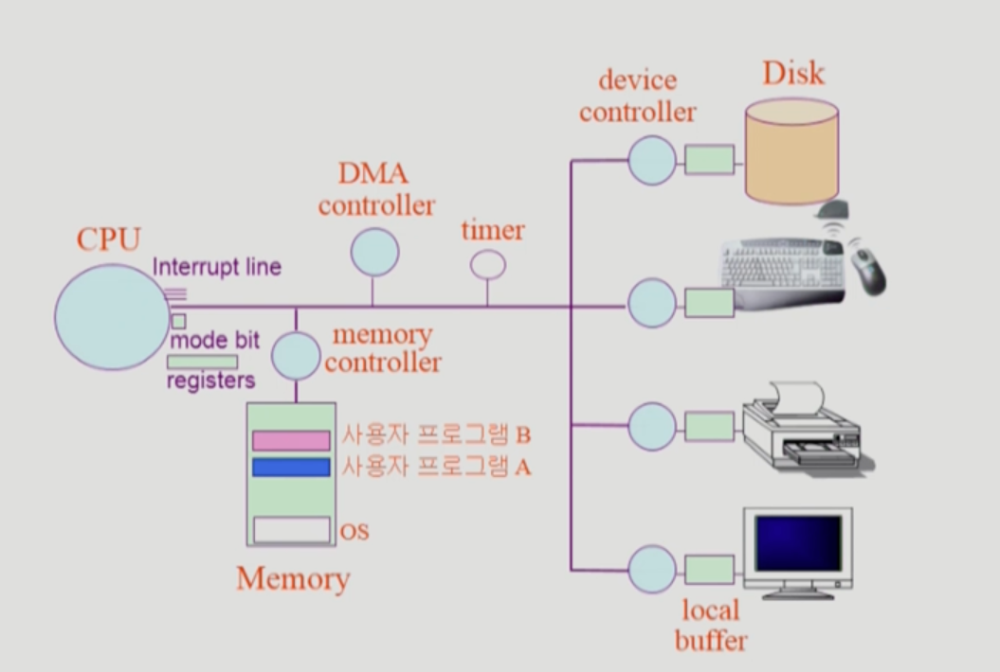
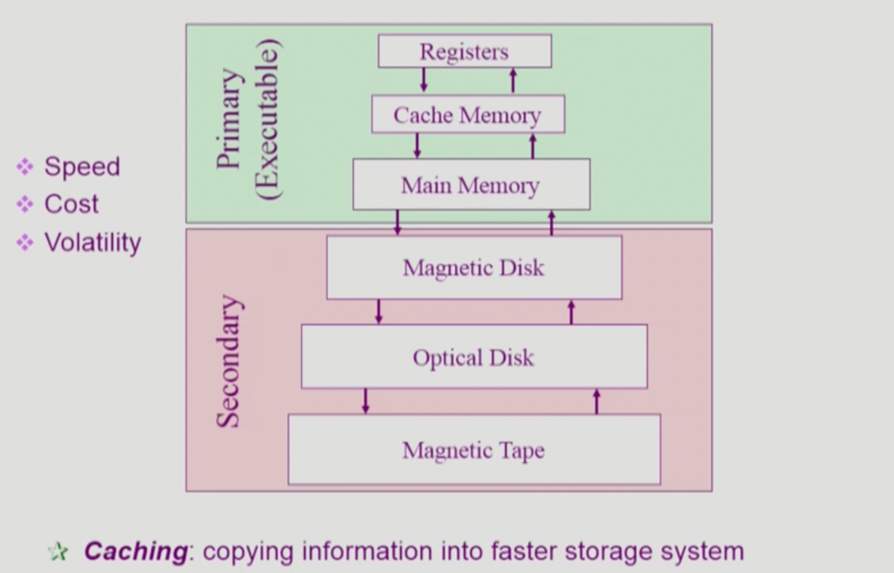
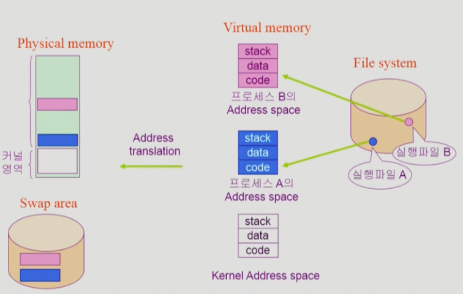

### 컴퓨터 시스템의 구조

- CPU는 메모리에서 instruction을 하나씩 읽어들여 수행한다.
- CPU는 IO Device를 직접 제어하지 않고, IO Controller에게 제어하도록 시킨다.
- CPU는 굉장히 좋은 성능을 가지기 때문에, 만일 사용자 프로그램 A가 IO Device로부터 무언가를 읽어와야 하는 상황일 경우 CPU는 IO 컨트롤러에게 일을 시킨 후, 다른 프로그램으로 옮겨가 작업을 수행한다.
- timer는 특정 프로그램이 CPU를 독점하는 것을 막는다. timer에 할당된 시간만큼만 프로그램은 CPU를 사용할 수 있다.
- CPU는 instruction을 실행한 후 interrupt line을 체크하게 되는데, timer가 interrupt를 걸면 CPU는 하던 일을 멈추고 CPU의 제어권이 사용자 프로그램으로부터 운영체제로 넘어가게 된다.
- 운영체제가 CPU의 제어권을 얻게 되면, 다른 프로그램에게 timer를 걸고 CPU를 할당하게 된다.
- 프로그램이 IO Device로부터 무언가를 읽어와야 할 때, 운영체제를 통해 작업을 요청한다.
    - IO Device에서 요청받은 작업을 수행하면, interrupt를 발생시킨다.
    - 운영체제는 IO Device에서 요청받은 작업의 결과물을 메모리에 로드한다.
- Mode bit
    - 1 → 사용자 모드, 0 → 커널 모드
    - Mode bit이 0일 때는 메모리 접근, IO Device 접근 등 모든 작업이 가능하다.
    - 하지만 Mode bit이 1일 때는 제한된 instruction만 수행 가능하다.
    - 즉, Mode bit은 운영체제가 아닌 사용자 프로그램이 CPU를 제한적으로 활용할 수 있도록 하기 위한 안전장치이다.(사용자 프로그램의 잘못된 수행으로 다른 프로그램 및 운영체제에 피해가 가지 않게 하기 위함)
    - Interrupt나 Exception이 발생하면 Mode bit는 0으로 바뀐다.
    - 사용자 프로그램에게 CPU를 할당하기 전에 Mode bit은 1로 바뀐다.
- Timer
    - 정해진 시간이 흐른 뒤 운영체제에게 CPU 제어권이 넘어가도록 interrupt를 발생시킨다.
    - 타이머는 매 클럭 틱마다 1초씩 감소한다.
    - 타이머 값이 0이 되면 타이머 interrupt가 발생한다.
    - CPU를 특정 프로그램이 독점하는 것으로부터 보호한다.
- IO Device 컨트롤러
    - 해당 IO 장치 유형을 관리하는 일종의 작은 CPU
    - 제어 정보를 위해 control register, status register를 가진다.
    - 일종의 data register인 local buffer를 가진다.
    - IO는 실제 device와 local buffer 사이에서 일어난다.
    - Device 컨트롤러는 IO가 끝났을 때 interrupt로 CPU에 그 사실을 알린다.
    - 참고) Device 드라이버 vs Device 컨트롤러
        - 드라이버 - 소프트웨어, 컨트롤러 - 하드웨어
- DMA 컨트롤러
    - DMA(Direct Memory Access), 즉 DMA 컨트롤러는 CPU와 마찬가지로 메모리에 접근할 수 있다.
        - CPU와 DMA 컨트롤러가 메모리에 동시 접근하는 상황을 막기 위해 메모리 컨트롤러가 존재한다.
    - IO Device에서 작업이 끝나서 CPU에게 interrupt로 작업 완료를 알리게 되면, 매 IO 작업이 완료될 때마다 지나치게 많은 interrupt를 받게 되어 효율이 떨어질 수 있다.
    - 따라서 DMA 컨트롤러는 IO Device의 작업이 완료될 때 CPU 대신 메모리에 직접 접근해 작업 결과물을 로드한다.
    - 즉, CPU가 했어야 할 일을 대신해서 수행함으로써 CPU가 잡다한 일을 하지 않도록 해 효율을 더욱 높이는 방식이다.
- 입출력(IO)의 수행
    - 모든 입출력 명령은 커널 모드에서만 수행 가능하다.
    - 사용자 프로그램은 어떻게 IO를 하는가? - 시스템 콜(System Call)
        - 사용자 프로그램이 직접 interrupt를 걸어 운영체제에게 CPU를 넘기며(커널 모드 진입), IO를 요청한다.
        - trap을 사용해 인터럽트 벡터의 특정 위치로 이동
        - 제어권이 인터럽트 벡터가 가리키는 인터럽트 서비스 루틴으로 이동
        - 올바른 IO 요청인지 확인 후 IO 수행
        - IO 완료 시 제어권을 시스템 콜 다음 명령으로 옮김
- Interrupt(인터럽트)
    - interrupt를 당한 시점의 레지스터와 program counter를 저장한 후 CPU의 제어를 interrupt 처리 루틴에 넘긴다.
    - Interrupt(넓은 의미)
        - Interrupt(하드웨어 인터럽트): 하드웨어가 발생시킨 interrupt(IO 작업이 수행된 후 발생)
        - Trap(소프트웨어 인터럽트)
            - Exception: 프로그램이 오류를 범한 경우
            - System call: 프로그램이 커널 함수를 호출하는 경우(IO 작업을 수행하기 위해 호출됨)
    - 관련 용어
        - 인터럽트 벡터: 해당 인터럽트의 처리 루틴 주소를 가지고 있음
        - 인터럽트 처리 루틴: 해당 인터럽트를 처리하는 커널 함수
    - Interrupt가 발생했을 때만 운영체제가 CPU를 갖게 된다.
- 시스템 콜(System Call)
    - 사용자 프로그램이 운영체제의 서비스를 받기 위해 커널 함수를 호출하는 것
- 동기식 입출력과 비동기식 입출력
    
    
    
    - 동기식 입출력(synchronous IO)
        - IO 요청 후 입출력 작업이 완료된 후에야 제어가 사용자 프로그램에 넘어감
        - 만일 오래 걸리는 작업을 기다리는 동안 CPU를 가지고 있다면 CPU는 아무 일도 하지 않은 채 낭비가 되는 상황이 발생할 수 있다. → CPU를 다른 프로그램에 양보하는 것이 더 효율적이다.
        - 구현 방법 1
            - IO가 끝날 때까지 CPU를 대기시킴(낭비시킴)
            - 매 시점 하나의 IO만 일어날 수 있음
        - 구현 방법 2
            - IO가 완료될 때까지 해당 프로그램에게서 CPU를 빼앗음
            - IO 처리를 기다리는 줄에 그 프로그램을 추가함
            - 다른 프로그램에게 CPU를 줌
    - 비동기식 입출력(asynchronous IO)
        - IO가 시작된 후 입출력 작업이 끝나기를 기다리지 않고 제어가 사용자 프로그램에 즉시 넘어감
    - 두 경우 모두 IO의 완료는 인터럽트로 알려준다.
- DMA(Direct Memory Access)
    - 원래는 메모리에 접근할 수 있는 장치는 CPU 뿐이지만, DMA도 메모리에 접근할 수 있다.
    - 빠른 입출력 장치를 메모리에 가까운 속도로 처리하기 위해 사용한다.
    - CPU의 개입 없이 device 컨트롤러가 device의 buffer storage의 내용을 메모리에 block 단위로 직접 전송한다.
    - 바이트 단위가 아니라 block 단위로 인터럽트를 발생시킨다.
- 저장장치 계층 구조
    
    
    
    - (전통적으로) 위로 올라갈수록 속도는 빠르고, 비용은 비싸 용량이 적어지며, 휘발성이다.
    - Primary - CPU가 직접 접근 가능(바이트 단위 접근이 가능)
    - Secondary - CPU가 직접 접근 불가능(바이트 단위 접근이 불가능)
    - 캐싱: 데이터를 더 빠른 저장장치로 복사하는 것
- 프로그램의 실행(메모리 로드)
    
    
    
    - 메모리의 낭비를 막기 위해 당장 실행할 부분만 가상 메모리에서 물리 메모리로 올려 사용한다.
    - 당장 실행하지 않는 부분은 swap area에 위치시키고, 필요 시 swap시킬 수 있도록 한다.
    - 커널 역시 하나의 프로그램이기 때문에 스택, 데이터, 코드의 구조를 갖는다.
    - 커널 주소 공간의 내용
        - 코드
            - 시스템 콜, 인터럽트 처리 코드
            - 자원 관리를 위한 코드
            - 편리한 서비스 제공을 위한 코드
        - 데이터
            - 운영체제가 관리하는 하드웨어의 종류마다 매칭되는 자료 구조
            - 각 프로세스마다 운영체제가 관리하고 있는 자료 구조(PCB)
        - 스택
            - 각 프로세스의 커널 스택
- 사용자 프로그램이 사용하는 함수
    - 함수
        - 사용자 정의 함수 → 프로세스의 Address space 내 코드에 위치
            - 자신의 프로그램에서 정의한 함수
        - 라이브러리 함수 → 프로세스의 Address space 내 코드에 위치
            - 자신의 프로그램에서 정의하지 않고 갖다 쓴 함수
            - 자신의 프로그램의 실행 파일에 포함되어 있다.
        - 커널 함수 → 커널의 Address space 내 코드에 위치
            - 운영체제 프로그램의 함수
            - 커널 함수의 호출 = 시스템 콜