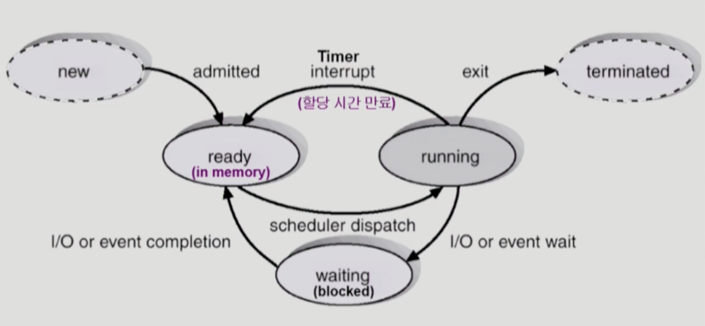
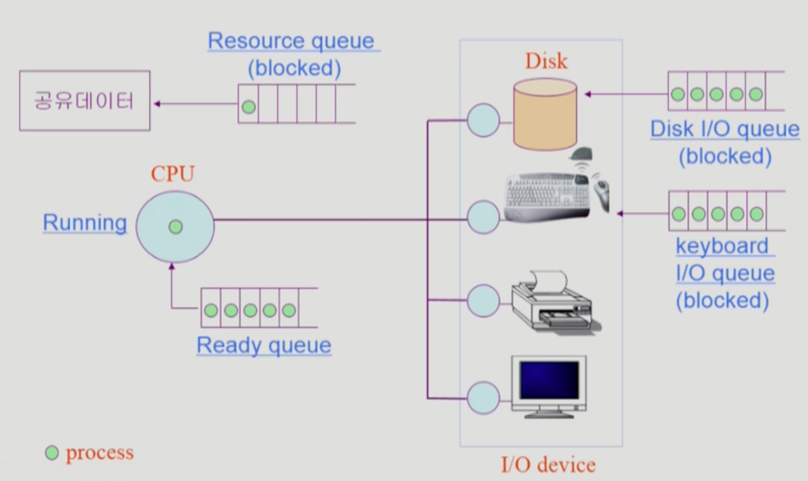
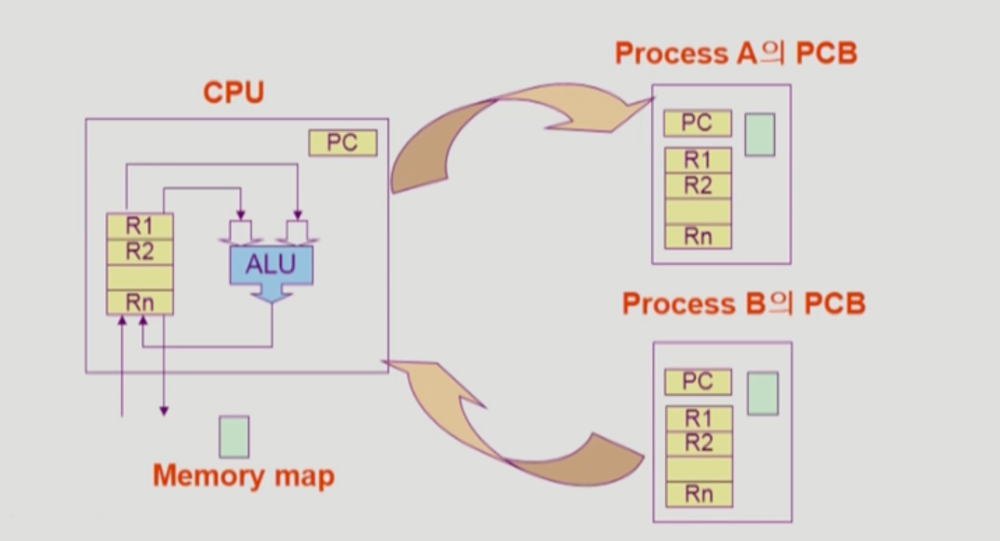

### 프로세스

- 프로세스: 실행 중인 프로그램
- 프로세스의 문맥(context) - 이 프로세스는 현재 시점에 어디까지 와 있는가(수행했는가)
    - CPU 수행 상태를 나타내는 하드웨어 문맥
        - Program Counter
        - 각종 register
    - 프로세스의 주소 공간
        - code, data, stack
    - 프로세스 관련 커널 자료 구조
        - PCB, 커널 스택
    - 프로세스의 문맥이 왜 중요한가? → Time sharing 과정에서, 이 프로세스가 다음 번에 CPU를 할당받았을 때 어디서부터 이어서 작업을 수행해야 하는지 알 수 있기 때문
- 프로세스의 상태(State)
    
    
    
    - 프로세스는 상태가 변경되면서 수행된다.
        - Running
            - CPU를 할당받아 instruction을 수행 중인 상태
        - Ready
            - CPU를 기다리는 상태(메모리 등 다른 조건을 모두 만족하고, CPU를 할당받기만을 기다리는 상태)
        - Blocked(Wait, Sleep)
            - CPU를 할당받아도 지금 당장 instruction을 수행할 수 없는 상태
            - 프로세스 자신이 요청한 event(ex - IO)가 즉시 만족되지 않아 이를 기다리는 상태
        - New
            - 프로세스가 생성 중인 상태
        - Terminated
            - 수행(execution)이 끝난 상태
    
    
    
    - 프로세스는 Ready queue에서 대기하다가 CPU를 할당받아 Running 상태가 된다.
    - CPU를 할당받고 작업을 수행하던 중 IO 작업이나 공유 데이터 접근 등 Block되는 상태가 발생하면 Blocked 상태로 변한다.
    - IO 작업이 끝난 프로세스는 Ready queue로 되돌아가 CPU 할당을 기다리게 된다.
- PCB(Process Control Block)
    
    
    
    - 운영체제가 각 프로세스를 관리하기 위해 프로세스당 유지하는 정보
    - 다음 구성 요소를 가진다.(구조체로 유지)
        - OS가 관리하기 위해 사용하는 정보
            - Process state, Process ID(PID)
            - Scheduling information, priority(ready queue 내에서의 우선순위)
        - CPU 수행 관련 하드웨어 값
            - Program Counter, registers
        - 메모리 관련
            - Code, Data, Stack의 위치 정보
        - 파일 관련
            - Open file descriptor 등
- 문맥 교환(Context Switch)
    
    
    
    - CPU를 한 프로세스에서 다른 프로세스로 넘겨주는 과정
    - CPU가 다른 프로세스에게 넘어갈 때 운영체제는 다음을 수행한다.
        - CPU를 내어주는 프로세스의 상태를 그 프로세스의 PCB에 저장
        - CPU를 새롭게 얻는 프로세스의 상태를 PCB에서 읽어옴
    - 시스템 콜이나 인터럽트 발생 시 반드시 context switch가 일어나는 것은 아니다.
        - 시스템 콜이나 인터럽트가 발생하더라도 CPU가 다른 프로세스로 넘어가지 않고 기존의 프로세스가 그대로 할당받아 사용한다면, context switch가 일어나지 않는다.
        - 비록 위 경우일지라도, CPU의 수행 정보 등 context의 일부를 PCB에 저장해야 하지만 다른 프로세스로 CPU를 넘기는 경우가 부담이 더 크다. (ex - 캐시 메모리 flush)
- 프로세스를 스케줄링하기 위한 큐
    
    
    
    - Job queue
        - 현재 시스템 내에 있는 모든 프로세스의 집합
    - Ready queue
        - 현재 메모리 내에 있으면서 CPU를 잡아서 실행되기를 기다리는 프로세스의 집합
    - Device queue
        - IO device의 처리를 기다리는 프로세스의 집합
    - 프로세스들은 각 큐들을 오가며 수행된다.
- 스케줄러
    - Long-term scheduler(장기 스케줄러 or Job scheduler)
        - 시작 프로세스 중 어떤 것들을 ready queue로 보낼지 결정(new → ready)
        - 프로세스에 memory(및 각종 자원)을 주는 문제
        - degree of Multiprogramming(메모리에 올라간 프로그램의 수)을 제어
        - time sharing system에는 보통 장기 스케줄러가 없음(new 상태가 끝나자마자 바로 ready 상태가 되기 때문)
    - Short-term scheduler(단기 스케줄러 or CPU scheduler)
        - 어떤 프로세스를 다음번에 running 시킬지 결정(ready → running)
        - 프로세스에 CPU를 주는 문제
        - 충분히 빨라야 함(millisecond 단위)
    - Medium-term scheduler(중기 스케줄러 or Swapper)
        - 여유 공간 마련을 위해 프로세스를 통째로 메모리에서 디스크로 쫓아냄(ready → suspended)
        - 프로세스에게서 메모리를 뺏는 문제
        - degree of Multiprogramming(메모리에 올라간 프로그램의 수)을 제어
        - 추가) 프로세스의 상태 중 Suspended(Stopped)란?
            - 외부적인 이유로 프로세스의 수행이 정지된 상태
            - 프로세스는 통째로 디스크에 swap out(쫓겨남)된다.
            - 사용자가 프로그램을 일시 정지 시킨 경우 or 시스템이 여러 이유로 프로세스를 잠시 중단시킨 경우
                - 외부에서 resume해주어야 active
- 스레드
    - 프로세스 내부에 CPU 수행 단위가 여러 개 있는 경우, 그것을 스레드 라고 부른다.
    - CPU 수행을 별도로 하기 때문에, 스레드는 별도의 스택을 가진다.
    - 스레드의 구성
        - Program Counter
        - Register set
        - Stack space
    - 스레드가 다른 스레드와 공유하는 부분(=task)
        - code section
        - data section
        - OS resource
    - 전통적인 개념의 heavy-weight process는 하나의 스레드를 가지고 있는 task로 볼 수 있다.
    - 프로세스를 여러 개 두는 것보다, 여러 스레드를 두는 것이 효율적이기 때문에 light-weight thread라고도 부른다.
        
        
        
    - 스레드를 사용해서 얻을 수 있는 장점
        - 응답성
            - 한 스레드가 blocked 상태인 동안에도 다른 스레드는 running 상태에 들어가 실행되어 빠른 응답을 얻을 수 있다.
        - 자원 공유
            - 여러 스레드는 프로세스의 코드 영역, 데이터 영역, 그리고 자원을 공유할 수 있다.
        - 효율성
            - 프로세스를 생성하고 CPU를 넘겨주는 것보다 스레드를 생성하고 CPU를 넘겨주는 것이 더 효율적이다.
        - 병렬성
            - 멀티코어 환경(CPU가 여럿인 환경)에서는 각각의 스레드가 병렬적으로 실행될 수 있다.

- 프로세스 생성
    - Copy-On-Write(COW) 기법: Write가 발생했을 때 Copy하겠다. (리눅스 등에서 조금 더 효율을 높이기 위해 사용하는 기법)
    - 부모 프로세스가 자식 프로세스를 생성
    - 프로세스의 트리(계층 구조) 형성
    - 프로세스는 자원을 필요로 함
        - 운영체제로부터 받는다.
        - 부모와 공유한다.
    - 자원의 공유
        - 부모와 자식이 모든 자원을 공유하는 모델
        - 일부를 공유하는 모델
        - 전혀 공유하지 않는 모델(보통은 공유하지 않는 것이 일반적)
    - 수행(Execution)
        - 부모와 자식은 공존하며 수행되는 모델
        - 자식이 종료(terminate)될 때까지 부모가 기다리는(wait) 모델
    - 주소 공간(Address space)
        - 자식은 부모의 공간을 복사함
        - 자식은 그 공간에 새로운 프로그램을 올림
    - 유닉스의 예
        - fork() 시스템 콜이 새로운 프로세스를 생성
            - 부모를 그대로 복사, 주소 공간 할당
            - fork() 시스템 콜
                - 프로세스는 fork() 시스템 콜에 의해 생성된다.
                - 호출한 부모와 동일한 복제된 주소 공간을 새로 생성한다.
                - pid가 0이면 자식 프로세스, 0이 아니면 부모 프로세스
        - exec() 시스템 콜을 통해 새로운 프로그램을 메모리에 올림
            - exec() 시스템 콜
                - 프로세스는 exec() 시스템 콜에 의해 다른 프로그램을 실행할 수 있다.
                - 부모에게 받은 메모리를 새 프로그램의 것으로 교체한다.
- 프로세스 종료
    - 프로세스가 마지막 명령을 수행한 후 운영체제에게 이를 알려줌(exit)
        - 자식이 부모에게 output data를 보냄(via wait)
            - wait() 시스템 콜
                - 프로세스 A가 wait() 시스템 콜을 호출하면,
                - 커널은 프로세스 A의 자식 프로세스가 종료될 때까지 프로세스 A를 sleep시킨다.(blocked)
                - 자식 프로세스가 종료되면 커널은 프로세스 A를 깨운다.(ready)
        - 프로세스의 각종 자원들이 운영체제에게 반납됨
            - exit() 시스템 콜
                - 자발적 종료
                    - 마지막 statement 수행 후 exit() 시스템 콜을 통해서
                    - 프로그램에 명시적으로 적어주지 않아도 main 함수가 리턴되는 위치에 컴파일러가 넣어줌
    - 부모 프로세스가 자식의 수행을 종료시킴(abort) - 비 정상적
        - 자식이 할당 자원의 한계치를 넘어섬
        - 자식에게 할당된 태스크가 더 이상 필요하지 않음
        - 부모가 종료(exit)하는 경우
            - 운영체제는 부모 프로세스가 종료하는 경우 자식이 더 이상 수행되도록 두지 않는다.
            - 단계적인 종료
- 프로세스와 관련된 시스템 콜
    - fork(): create a child(copy)
    - exec(): overlay new image
    - wait(): sleep until child is donw
    - exit(): frees all the resources, notify parent
- 프로세스 간 협력
    - 독립적 프로세스(Independent process)
        - 프로세스는 각자의 주소 공간을 가지고 수행되므로 원칙적으로 하나의 프로세스는 다른 프로세스의 수행에 영향을 미치지 못함
    - 협력 프로세스(Cooperating process)
        - 프로세스 협력 메커니즘을 통해 하나의 프로세스가 다른 프로세스의 수행에 영향을 미칠 수 있음
    - 프로세스 간 협력 메커니즘(IPC: Inter-Process Communication)
        - 메시지를 전달하는 방법
            - message passing: 커널을 통해 메시지 전달
        - 주소 공간을 공유하는 방법
            - shared memory: 서로 다른 프로세스 간에도 일부 주소 공간을 공유하게 하는 shared memory 메커니즘이 있음
            - thread: 스레드는 사실상 하나의 프로세스에 속한 실행 단위이므로 프로세스 간 협력으로 보기는 어렵지만 동일한 프로세스를 구성하는 스레드들 간에는 주소 공간을 공유하므로 협력이 가능
    - Message Passing
        - 프로세스 사이에 공유 변수(shared variables)를 일체 사용하지 않고 통신하는 시스템
        - Direct Communication
            - 통신하려는 프로세스의 이름을 명시적으로 표시
        - Indirect Communication
            - mailbox(또는 port)를 통해 메시지를 간접 전달
    - Shared Memory
        - 두 프로세스의 메모리 공간을 겹치게 함으로써 공유하는 메모리 영역을 만들어 프로세스 간 협력하는 방식