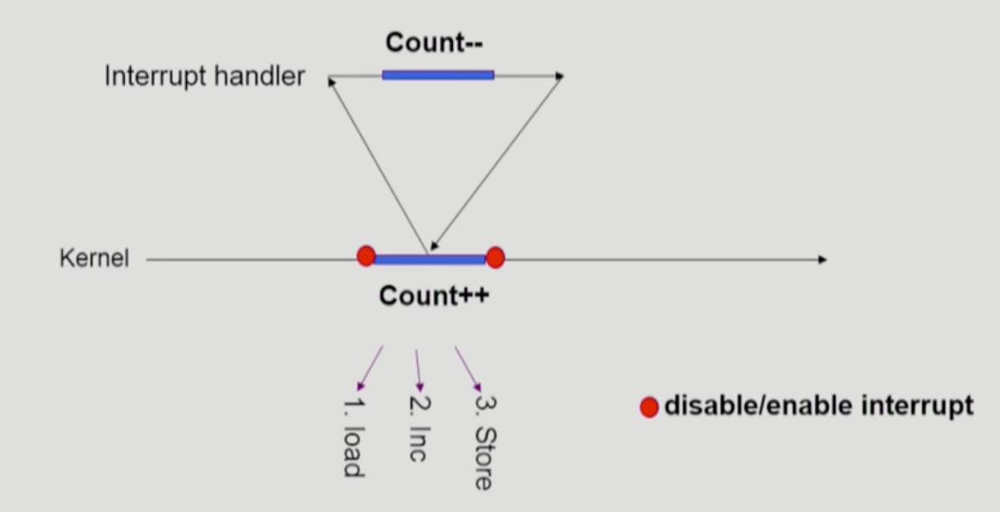
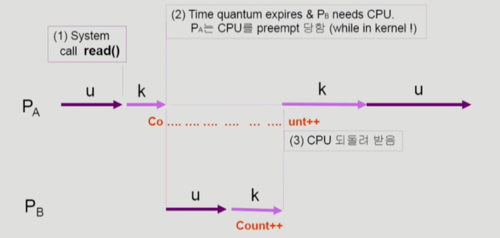
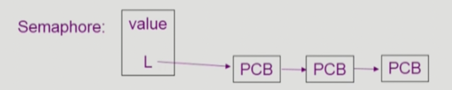
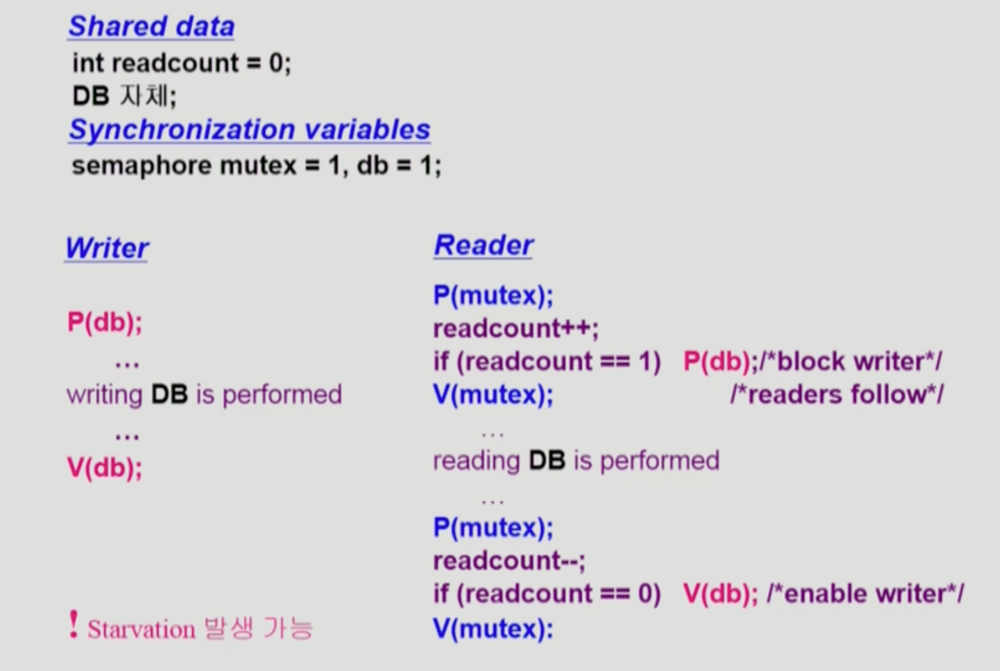
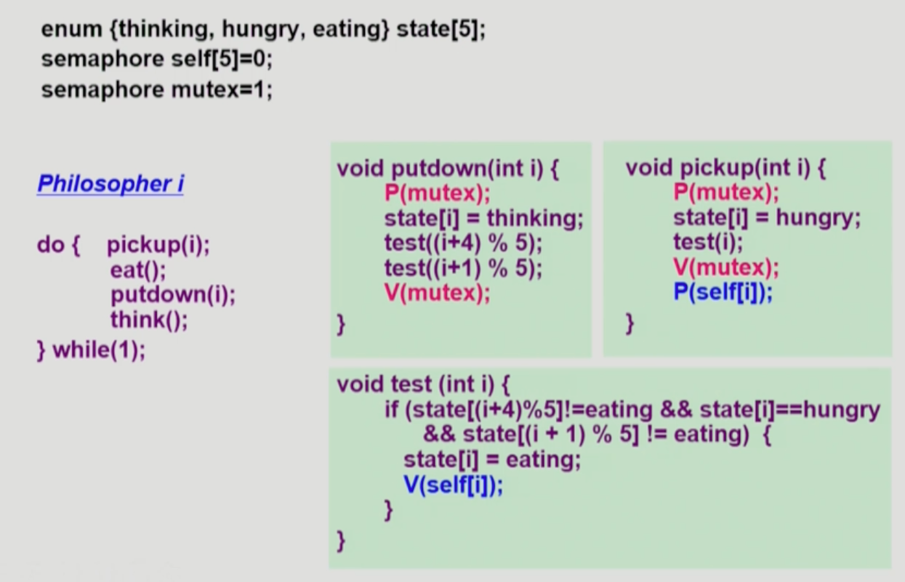
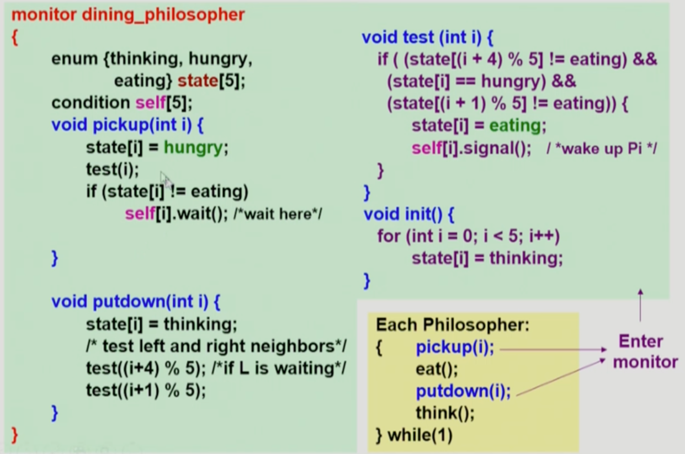

### 프로세스 동기화

- Race condition
    - 두 개 이상의 프로세스가 공통 자원을 병행적으로 읽거나 쓰는 동작을 할 때, 공용 데이터에 대한 접근이 어떤 순서에 따라 이루어졌는지에 따라 그 실행 결과가 같지 않고 달라지는 상황
    - OS에서 Race condition이 발생하는 상황
        - 1) 커널 모드 수행 중 interrupt가 발생한 경우
        - 2) 프로세스가 시스템 콜을 호출해 커널 모드로 수행 중인데 context switch가 일어나는 경우
        - 3) MultiProcessor에서 공유 메모리 내의 커널 데이터
        
        
        
        - 1 예시) 커널 모드 running 중 interrupt가 발생하여 인터럽트 처리 루틴이 수행된다.
            - 양쪽 다 커널 코드이므로 kernel address space를 공유
        
        
        
        - 2 예시) 프로세스 A가 시스템 콜을 호출해 커널 모드로 수행 중인데, Time quantum이 끝나서 프로세스 B로 context switch가 발생
            - 해결책 - 커널 모드에서 수행 중일 때는 CPU를 preempt하지 않도록 하고, 커널 모드에서 유저 모드로 돌아갈 때 preempt하도록 한다.
        
        
        
        - 3 예시) 멀티 프로세서 시스템에서 여러 CPU가 하나의 공유 메모리에 접근하는 상황
            - 어떤 CPU가 마지막으로 count를 store했는가 → race condition
            - MultiProcessor의 경우 interrupt enable/disable로 해결되지 않는다
            - 방법 1 - 한 번에 하나의 CPU만이 커널에 들어갈 수 있게 하는 방법
            - 방법 2 - 커널 내부에 있는 각 공유 데이터에 접근할 때마다 그 데이터에 대한 lock / unlock을 하는 방법
- Process Synchronization 문제
    - 공유 데이터(shared data)의 동시 접근(concurrent access)은 데이터의 불일치 문제(inconsistency)를 발생시킬 수 있다.
    - 일관성(consistency) 유지를 위해서는 협력 프로세스(cooperating process) 간의 실행 순서(orderly execution)를 정해주는 메커니즘이 필요하다.
    - Race condition
        - 여러 프로세스들이 동시에 공유 데이터를 접근하는 상황
        - 데이터의 최종 연산 결과는 마지막에 그 데이터를 다룬 프로세스에 따라 달라진다.
    - Race condition을 막기 위해서는 concurrent process는 동기화(synchronized)되어야 한다.
        
        
        
- Critical Section 문제
    - n개의 프로세스가 공유 데이터를 동시에 사용하기를 원하는 경우
    - 각 프로세스의 code segment에는 공유 데이터를 접근하는 코드인 critical section이 존재한다.
    - 위 사진에서 critical section은 각각 `x = x + 1`, `x = x - 1`이다.
    - Problem
        - 하나의 프로세스가 critical section에 있을 때 다른 모든 프로세스는 critical section에 들어갈 수 없어야 한다.
    - 프로그램적 해결법의 충족 조건
        - Mutual Exclusion(상호 배제)
            - 한 프로세스가 critical section 부분을 수행 중이면 다른 모든 프로세스들은 그들의 critical section에 들어가면 안 된다.
        - Progress(진입 가능 시 진입)
            - 아무도 critical section에 있지 않은 상태에서 critical section에 들어가고자 하는 프로세스가 있으면 critical section에 들어가게 해줘야 한다.
        - Bounded Waiting(유한 대기)
            - 프로세스가 critical section에 들어가려고 요청한 후부터 그 요청이 허용될 때까지 다른 프로세스들이 critical section에 들어가는 횟수에 한계가 있어야 한다.
        - 가정
            - 모든 프로세스의 수행 속도는 0보다 크다
            - 프로세스들 간의 상대적인 수행 속도는 가정하지 않는다.
    - 해결법
        - 동기화를 위한 변수를 사용하기
            - 두 개의 프로세스 P1, P2가 있다고 가정
            - 프로세스의 일반적인 구조는 아래와 같다.
                
                ```
                do {
                	entry section
                	**critical section**
                	exit section
                	remainder section
                } while (1)
                ```
                
            - 수행의 동기화를 위해 변수를 사용 → synchronization variable
        - 알고리즘 1 - 동기화 변수 turn을 사용한 예시
            
            ```
            // Process Pi, Pj
            do {
            	while (turn != i);   /* My turn? */
            	**critical section**
            	turn = j;    /* Now it's your turn */
            } while (true);
            ```
            
            - 문제점
                - Progress의 조건을 만족하지 못한다. turn이 내 차례일 때만 critical section에 진입할 수 있는 상황이 되기 때문이다.
        - 알고리즘 2 - bool형 flag 배열 변수를 사용한 예시
            
            ```
            // Process Pi, Pj
            do {
            	flag[i] = true;   /* Pretend I am in */
            	while (flag[j]);    /* Is he also in? then wait */
            	**critical section**
            	flag[i] = false;    /* I am out now */
            	remainder section
            } while (true);
            ```
            
            - 문제점
                - 둘 다 2행(flag[i] = true;)까지 수행 후 끊임없이 양보하는 상황 발생 가능
        - 알고리즘 3 - 피터슨의 알고리즘(알고리즘 1 + 알고리즘 2)
            
            ```
            do {
            	flag[i] = true;    /* My intention is to enter */
            	turn = j;    /* Set to his turn */
            	while (flag[j] && turn == j);   /* Wait only if... */
            	**critical section**
            	flag[i] = false;
            	remainder section
            } while (true);
            ```
            
            - Busy waiting(Spin lock)
                - 계속 CPU와 메모리를 쓰면서 wait
        - 하드웨어적인 방법 - Test_and_set(a)
            - 하드웨어적으로 Test & Modify를 atomic하게 수행할 수 있도록 지원하는 경우 앞의 문제는 간단히 해결
            - Mutual Exclusion with Test & Set
                
                ```
                Synchronization variable:
                boolean lock = false;
                
                Process Pi
                do {
                	while (Test_and_set(lock));
                	**critical section**
                	lock = false;
                	remainder section
                }
                ```
                
        - 세마포어
            - 앞의 방식들을 추상화시킴
            - Semaphore S
                - integer 변수이며, 아래의 두 가지 atomic 연산에 의해서만 접근 가능하다.
                - Busy waiting 문제가 여전히 존재한다.
                - P(S) - lock을 거는 과정
                    
                    ```
                    while (S <= 0) do no-op;   /* i.e. wait */
                    S--;
                    ```
                    
                - V(S) - lock을 푸는 과정
                    
                    ```
                    S++;
                    ```
                    
            - n개의 프로세스들의 Critical section
                
                ```
                Synchronization variable
                semaphore mutex;   /* initially 1 */
                
                Process Pi
                do {
                	P(mutex);   /* If positive, dec & enter, Otherwise, wait */
                	critical section
                	V(mutex);   /* Increment Semaphore */
                } while (true);
                ```
                
                - 문제점
                    - P(mutex)의 과정에서 Busy waiting이 발생한다.
        - Block / WakeUp 방식의 세마포어
            - 세마포어를 다음과 같이 정의한다.
                
                ```
                typedef struct {
                	int value;   /* semaphore */
                	struct process *L;   /* process wait queue */
                } semaphore;
                ```
                
                
                
            - block과 wakeup을 다음과 같이 가정
                - block
                    - 커널은 block을 호출한 프로세스를 suspend시킨다.
                    - 이 프로세스의 PCB를 세마포어에 대한 wait queue에 넣는다.
                - wakeup(P)
                    - block된 프로세스 P를 wakeup시킨다.
                    - 이 프로세스의 PCB를 ready queue로 옮긴다.
            - 세마포어 연산은 다음과 같이 정의된다.
                - P(S)
                    
                    ```
                    S.value--;
                    if (S.value < 0) {
                    	add this process to S.L;
                    	block();
                    }
                    ```
                    
                - V(S)
                    
                    ```
                    S.value++;
                    if (S.value <= 0) {
                    	remove a process P from S.L;
                    	wakeup(P);
                    }
                    ```
                    
        - Busy wait vs Block & Wakeup
            - Block & Wakeup 오버헤드 vs Critical section 길이
                - Critical Section의 길이가 긴 경우 Block & Wakeup이 적당
                - Critical Section의 길이가 매우 짧은 경우 Block & Wakeup 오버헤드가 Busy wait 오버헤드보다 더 커질 수 있음
                - 일반적으로는 Block & Wakeup 방식이 더 좋음
        - 세마포어의 종류
            - 카운팅 세마포어
                - 도메인이 0 이상인 임의의 정수값
                - 주로 resource counting에 사용
            - 바이너리 세마포어(뮤텍스)
                - 0 또는 1 값만 가질 수 있는 세마포어
                - 주로 mutual exclusion(lock / unlock)에 사용
        - 세마포어의 문제점
            - 코딩하기 힘들다.
            - 정확성(correctness)의 입증이 어렵다.
            - 자발적 협력(voluntary cooperation)이 필요하다.
            - 한 번의 실수가 모든 시스템에 치명적 영향을 끼친다.
            - 세마포어의 문제점은 모니터를 사용해 해결할 수 있다.
        - 모니터
            - 모니터란, 동시 수행 중인 프로세스 사이에서 abstract data type의 안전한 공유를 보장하기 위한 high-level synchronization construct이다.
            - 모니터 내에서는 한 번에 하나의 프로세스만이 활동할 수 있다.
            - 프로그래머가 동기화 제약 조건을 명시적으로 코딩할 필요가 없다.
            - 프로세스가 모니터 안에서 기다릴 수 있도록 하기 위해 condition variable을 사용한다.
            - condition variable은 wait와 signal 연산에 의해서만 접근 가능하다.
                - wait(): x.wait()을 invoke한 프로세스는 다른 프로세스가 x.signal()을 invoke하기 전까지 suspend된다.
                - signal(): x.signal()은 정확하게 하나의 suspend된 프로세스를 resume한다. suspend된 프로세스가 없으면 아무 일도 일어나지 않는다.
- 동기화와 관련된 몇 가지 문제
    - Bounded-Buffer Problem
        
        
        
        - Shared data
            - buffer 자체 및 buffer 조작 변수 (empty / full buffer의 시작 위치)
        - Synchronization variables
            - mutual exclusion → binary semaphore
            - resource count → integer(counting) semaphore
        
        
        
    - Readers-Writers Problem
        - 한 프로세스가 DB에 write중일 때 다른 프로세스가 접근하면 안 됨
        - read는 동시에 여럿이 해도 됨
        - 해결 방법
            - Writer가 DB에 접근 허가를 아직 얻지 못한 상태에서는 모든 대기중인 Reader들을 다 DB에 접근할 수 있도록 해준다.
            - Writer는 대기 중인 Reader가 하나도 없을 때 DB 접근이 허용된다.
            - 일단 Writer가 DB에 접근 중이면 Reader들은 접근이 금지된다.
            - Writer가 DB에서 빠져나가야만 Reader의 접근이 허용된다.
        - Shared data
            - DB 자체
            - readcount → 현재 DB에 접근 중인 Reader의 수
        - Synchronization variables
            - mutex → 공유 변수 readcount를 접근하는 코드(Critical section)의 mutual exclusion을 보장하기 위해 사용
            - db → Reader와 Writer가 공유 DB 자체를 올바르게 접근하는 역할
        
        
        
        - 위 코드의 문제점은, Reading 중일 때 Reader, Writer가 오는 경우 Writer는 Starvation에 빠질 수 있다는 점이다.
    - Dining Philosophers Problem
        
        
        
        - 식사하는 철학자 문제에서는 데드락이 발생할 수 있다는 문제점이 있다.
            - 모든 철학자가 동시에 배가 고파져 왼쪽 젓가락을 집어버린 경우
        - 해결 방법(대략적으로)
            - 4명의 철학자만이 테이블에 동시에 앉을 수 있도록 한다.
            - 젓가락을 두 개 모두 집을 수 있을 때만 젓가락을 집을 수 있게 한다.
                
                
                
                - (사실 위 코드는 모니터 코드를 세마포어로 변경한 것이다. → 조금 이해하기 난해할 수 있음)
                
                
                
            - 짝수 번째 철학자는 왼쪽 젓가락부터, 홀수 번째 철학자는 오른쪽 젓가락부터 집도록 한다.