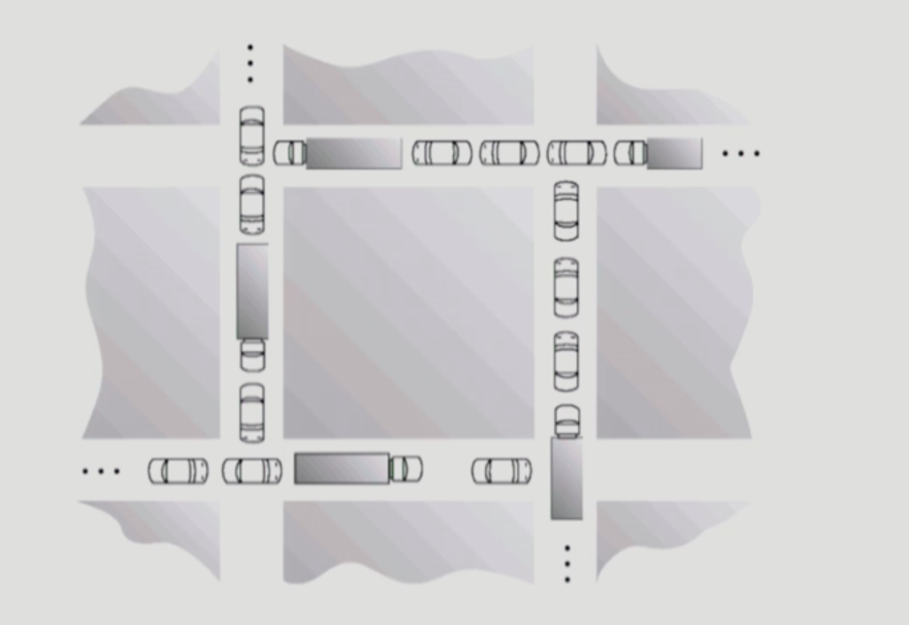
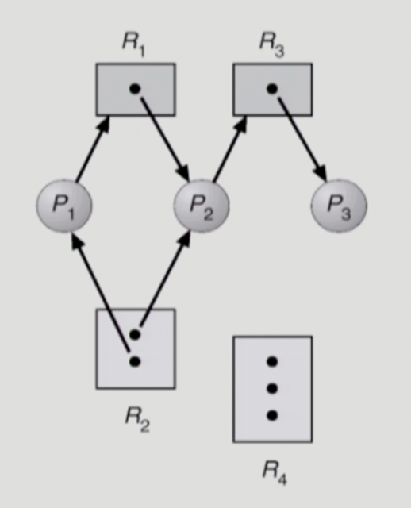
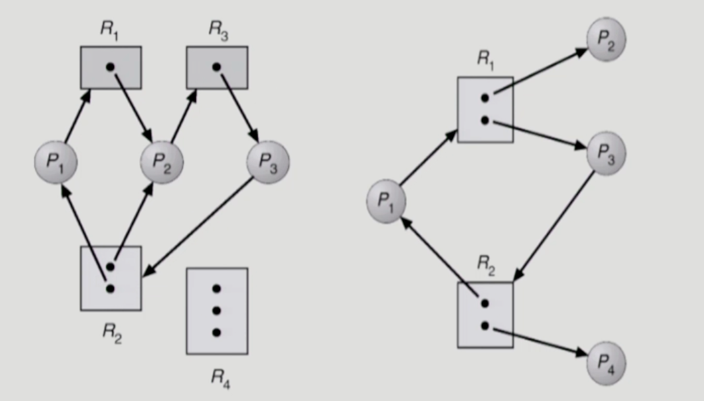
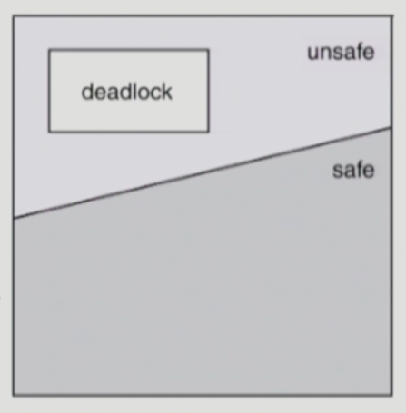
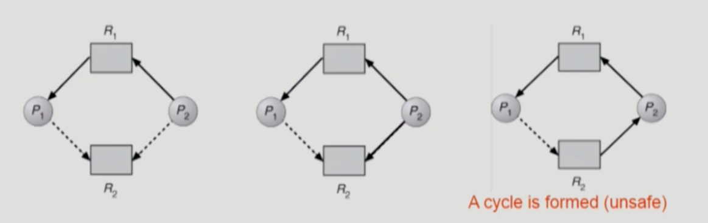
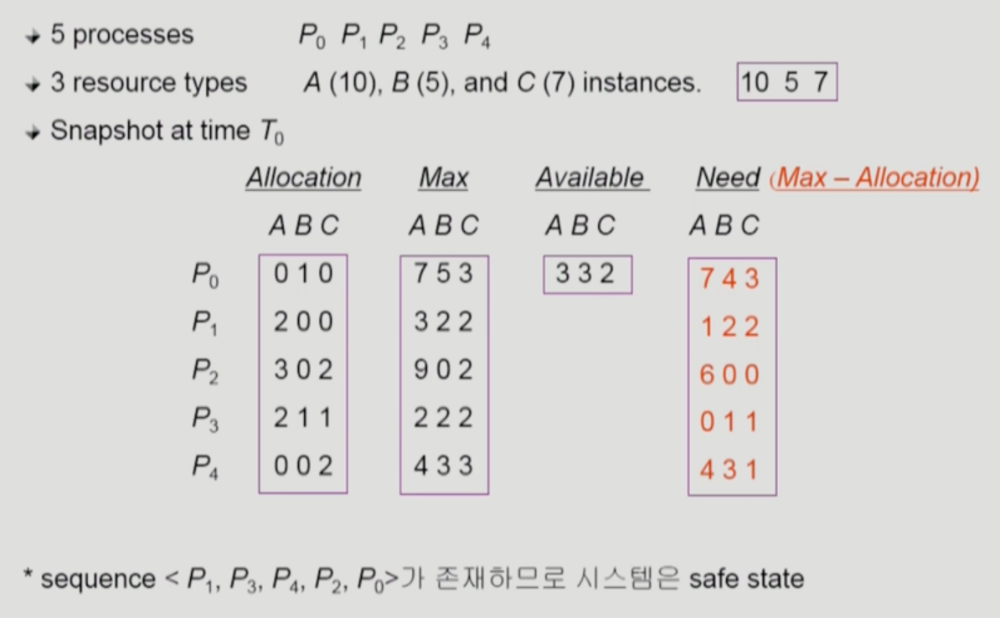
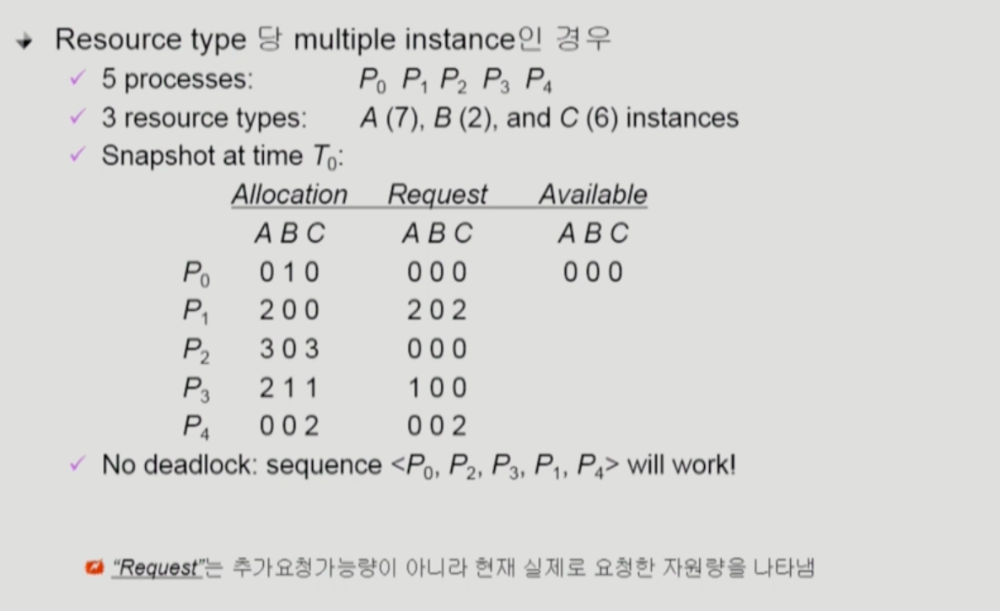
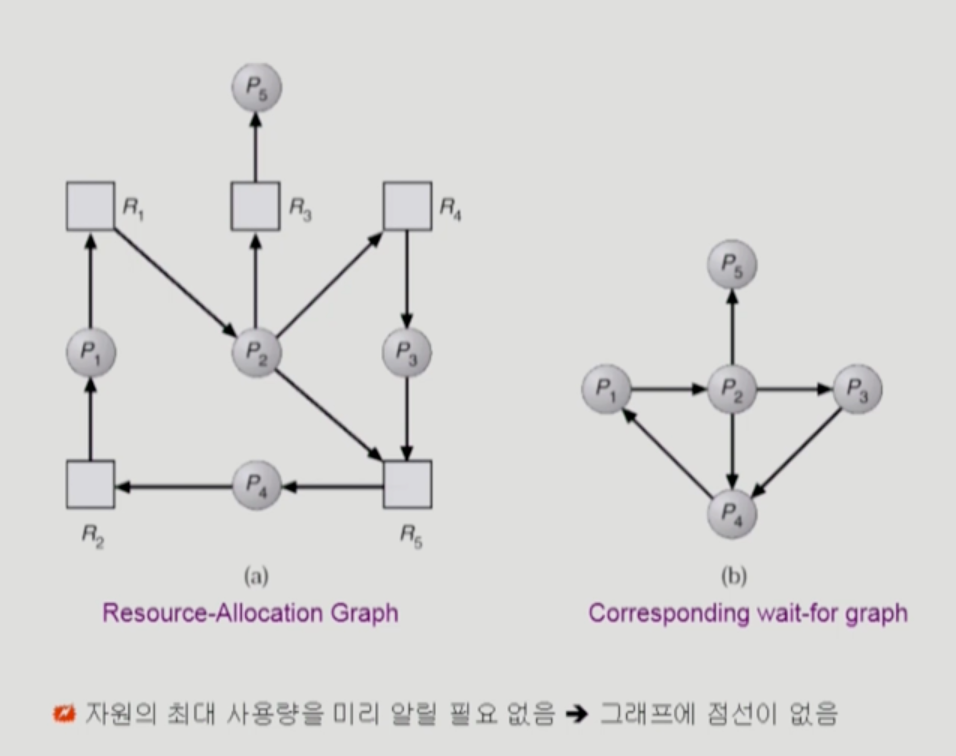

### 데드락

- 교착상태(deadlock)
    
    
    
    - Deadlock
        - 일련의 프로세스들이 서로가 가진 자원을 기다리며 block된 상태
    - Resource(자원)
        - 하드웨어, 소프트웨어 등을 포함하는 개념
        - 예시 - IO Device, CPU cycle, memory space, semaphore 등
        - 프로세스가 자원을 사용하는 절차
            - Request(요청), Allocate(획득), Use(사용), Release(반납)
    - Deadlock Example 1
        - 시스템에 2개의 tape drive가 있다.
        - 프로세스 P1과 P2가 각각 하나의 tape drive를 보유한 채 다른 하나를 기다리고 있다.
    - Deadlock Example 2
        - Binary semaphores A and B
            
            
            | P0 | P1 |
            | --- | --- |
            | P(A); | P(B); |
            | P(B); | P(A); |
- Deadlock 발생의 4가지 조건
    - Mutual Exclusion(상호 배제)
        - 매 순간 하나의 프로세스만이 자원을 사용할 수 있음
    - No preemption(비선점)
        - 프로세스는 자원을 스스로 내어놓을 뿐 강제로 빼앗기지 않음
    - Hold and Wait(보유 및 대기)
        - 자원을 가진 프로세스가 다른 자원을 기다릴 때 보유 자원을 놓지 않고 계속 가지고 있음
    - Circular wait(순환 대기)
        - 자원을 기다리는 프로세스 간에 사이클이 형성되어야 함
        - 프로세서 P0, P1, …, Pn이 있을 때
            - P0은 P1이 가진 자원을 기다림
            - P1은 P2가 가진 자원을 기다림
            - ..
            - Pn-1은 Pn이 가진 자원을 기다림
            - Pn은 P0이 가진 자원을 기다림
- Resource-Allocation Graph(자원 할당 그래프)
    
    

    사이클이 존재하지 않기 때문에 데드락이 아니다.
    
    - Vertex
        - Process P = {P1, P2, …, Pn}
        - Resource R = {R1, R2, …, Rn}
            - Resource 내부에 작은 점: 자원 인스턴스의 수를 의미
    - Edge
        - Request(자원 요청) edge Pi → Rj
        - Assignment(자원 할당) edge Rj → Pi
    - 그래프에 사이클이 없으면 데드락이 아니다.
    - 그래프에 사이클이 있으면,
        - 자원 당 인스턴스가 하나뿐이라면 데드락이다.
        - 자원 당 여러 인스턴스가 존재한다면 데드락일 가능성이 존재한다.
    
    
    
    왼쪽 그림은 데드락이 발생한 상황이고, 오른쪽 상황은 데드락이 발생한 상황이 아니다.
    
- Deadlock의 처리 방법
    - Deadlock Prevention
        - 자원 할당 시 데드락의 4가지 필요 조건 중 어느 하나가 만족되지 않도록 하는 것
            - Mutual Exclusion
                - 공유해서는 안 되는 자원의 경우 반드시 성립해야 함(막을 수 있는 조건이 아님)
            - Hold and Wait
                - 프로세스가 자원을 요청할 때 다른 어떤 자원도 가지고 있지 않아야 한다.
                - 방법 1) 프로세스 시작 시 모든 필요한 자원을 할당받게 하는 방법 - 자원에 대한 비효율성 문제가 생길 수 있다.
                - 방법 2) 자원이 필요할 경우 보유 자원을 모두 놓고 다시 요청 - 자진해서 반납을 하도록 하여 문제를 해결
            - No Preemption
                - 프로세스가 어떤 자원을 기다려야 하는 경우 이미 보유한 자원이 선점됨
                - 모든 필요한 자원을 얻을 수 있을 때 그 프로세스는 다시 시작된다.
                - State를 쉽게 save하고 restore할 수 있는 자원에서 주로 사용(CPU, memory)
            - Circular Wait
                - 모든 자원 유형에 할당 순서를 정하여 정해진 순서대로만 자원 할당
                - 예를 들어 순서가 3인 자원 Ri를 보유 중인 프로세스가 순서가 1인 자원 Rj을 할당받기 위해서는 우선 Ri를 release해야 한다.
        - 이러한 방식은 Utilization 저하, throughput 감소, starvation 문제를 야기할 수 있다(생기지도 않을 데드락을 방지하기 위해 제약을 걸기 때문).
    - Deadlock Avoidance
        - 자원 요청에 대한 부가적인 정보를 이용해서 데드락의 가능성이 없는 경우에만 자원을 할당
            - 가장 단순하고 일반적인 모델은 프로세스들이 필요로 하는 각 자원별 최대 사용량을 미리 선언하도록 하는 방법
        - 시스템 state가 원래 state로 돌아올 수 있는 경우에만 자원 할당
            - safe state
                - 시스템 내의 프로세스들에 대한 safe sequence가 존재하는 상태
            - safe sequence
                - 프로세스의 sequence <P1, P2, …, Pn>이 safe하려면 Pi(1 ≤ i ≤ n)의 자원 요청이 “가용 자원 + 모든 Pj(j < i)의 보유 자원”에 의해 충족되어야 함
                - 조건을 만족하면 다음 방법으로 모든 프로세스의 수행을 보장
                    - Pi의 자원 요청이 즉시 충족될 수 없으면 모든 Pj(j < i)가 종료될 때까지 기다린다.
                    - Pi-1이 종료되면 Pi의 자원 요청을 만족시켜 수행한다.
            - 시스템이 safe state에 있으면 데드락이 발생하지 않고, unsafe state에 있으면 데드락이 발생할 가능성이 존재한다.
                
                
                
            - Avoidance는 시스템이 unsafe state에 들어가지 않는 것을 보장한다.
                - 2가지 경우의 avoidance 알고리즘
                    - Single instance per resource type
                        - Resource Allocation Graph 알고리즘 사용
                    - Multiple instance per resource type
                        - Banker’s 알고리즘 사용
        - Resource Allocation Graph 알고리즘
            
            
            
            - Claim edge Pi → Rj
                - 프로세스 Pi가 자원 Rj를 미래에 요청할 수 있음을 뜻함(점선으로 표시)
                - 프로세스가 해당 자원 요청 시 request edge로 바뀜(실선)
                - Rj가 release되면 assignment edge는 다시 claim edge로 바뀜
            - request edge의 assignment edge 변경시 (점선을 포함하여) cycle이 생기지 않는 경우에만 요청 자원을 할당한다.
            - Cycle 생성 여부 조사 시 프로세스 수가 n일 때 O(n^2) 시간이 걸린다.
        - Banker’s 알고리즘
            
            
            
            - 프로세스별 최대로 필요로 하는 자원의 수를 미리 알려져 있다고 가정한다.
            - 현 시점에서 가용한 자원의 수를 매 순간 계산한다.
            - 어떤 프로세스 Pi가 자원을 요청할 때, 최악의 경우(Need = Max - Allocation)만큼 가용한 자원이 존재한다면(요청을 충족할 만큼 자원을 할당해준다.
                - Banker’s 알고리즘은 최악의 경우, 즉 데드락이 발생할 가능성이 조금이라도 있는 상황이 발생하도록 자원을 할당하지 않고 확실히 데드락이 발생하지 않을 때만 자원을 할당한다.
    - Deadlock Detection and Recovery
        - 데드락 발생은 허용하되 그에 대한 detection 루틴을 두어 데드락 발견 시 recover
        - Deadlock Detection
            - Resource type 당 single instance인 경우
                - 자원 할당 그래프(Resource Allocation Graph)에서의 사이클이 곧 데드락을 의미
            - Resource type 당 multiple instance인 경우
                
                
                
                만약 P2가 자원 C의 인스턴스 1개를 요청하게 된다면, 데드락이 발생한다.
                
                - Banker’s 알고리즘과 유사한 방법 활용
            - Wait-for graph 알고리즘
                
                
                
                - Resource type 당 single instance인 경우
                - Wait-for graph
                    - 자원 할당 그래프의 변형
                    - 프로세스만으로 node 구성
                    - Pj가 가지고 있는 자원을 Pk가 기다리는 경우 Pk → Pj
                - 알고리즘
                    - Wait-for graph에 사이클이 존재하는지를 주기적으로 조사
                    - O(n^2) → n개의 프로세스에서 최대 n-1개의 간선이 생길 수 있기 때문
        - Deadlock Recovery
            - Process termination
                - 방법 1) 데드락에 걸린 모든 프로세스를 중지한다.
                - 방법 2) 데드락 사이클이 제거될 때까지 프로세스를 하나씩 중지한다.
            - Resource Preemption
                - 비용을 최소화할 victim을 선정
                - safe state로 rollback해 프로세스를 재시작한다.
                - starvation 문제
                    - 동일한 프로세스가 계속해서 victim으로 선정되는 경우
                    - cost factor에 rollback 횟수도 같이 고려하는 방법으로 starvation 문제를 해소해볼 수 있다.
    - Deadlock Ignorance
        - 데드락을 시스템이 책임지지 않음
            - 데드락이 매우 드물게 발생하므로 데드락에 대한 조치 자체가 더 큰 overhead일 수 있음
            - 만약, 시스템에 데드락이 발생한 경우 시스템이 비정상적으로 작동하는 것을 사람(개발자)이 느낀 후 직접 프로세스를 죽이는 등의 방법으로 대처한다.
        - UNIX를 포함한 대부분의 OS가 채택