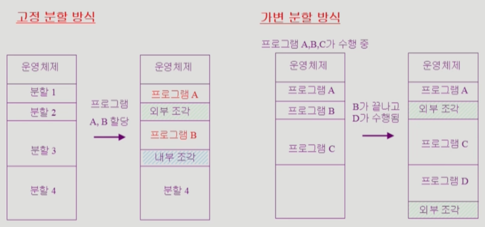
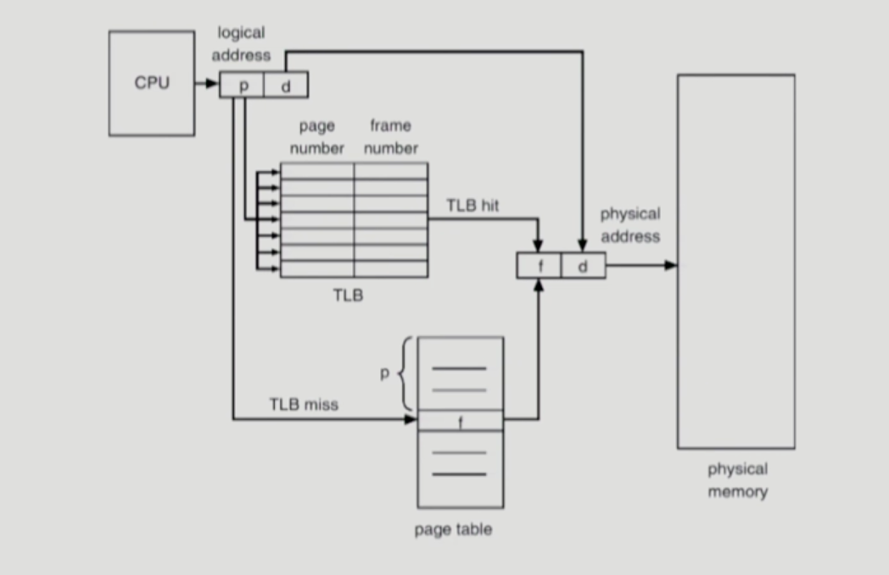

### 메모리 관리

- 논리적 주소와 물리적 주소
    - Logical Address(Virtual Address)
        - 프로세스마다 독립적으로 가지는 주소 공간
        - 각 프로세스마다 0번지부터 시작
        - CPU가 보는 주소는 Logical Address임
    - Physical Address
        - 메모리에 실제 올라가는 위치
    - 주소 바인딩(Address Binding)
        - 주소를 결정하는 것
        - Symbolic Address → Logical Address → Physical Address
            - Symbolic Address란, 개발자가 사용하는 Symbol로 된 주소들
- 주소 바인딩(Address Binding)
    - Compile time binding
        - 물리적 메모리 주소(physical address)가 컴파일 시 알려짐
        - 시작 위치 변경 시 재컴파일
        - 컴파일러는 절대 코드(absoulte code) 생성
    - Load time binding
        - Loader의 책임 하에 물리적 메모리 주소 부여
        - 컴파일러가 재배치 가능 코드(relocatable code)를 생성한 경우 가능
    - Execution time binding(Run time binding)
        - 수행이 시작된 이후에도 프로세스의 메모리 상 위치를 옮길 수 있음
        - CPU가 주소를 참조할 때마다 binding을 점검(address mapping table)
        - 하드웨어적인 지원이 필요(base and limit registers, MMU)
    
    
    
- Memory Management Unit(MMU)
    - MMU(Memory Management Unit)
        - logical address를 physical address로 매핑해주는 hardware device
    - MMU scheme
        - 사용자 프로세스가 CPU에서 수행되며 생성해내는 모든 주소 값에 대해 base register(relocation register)의 값을 더한다.
    - user program
        - logical address만을 다루며, 실제 physical address를 볼 수 없고 알 필요가 없다.
        
        
        
    - 주소 변환 과정에서의 하드웨어적 지원
        
        
        
        - 운영체제 및 사용자 프로세스 간의 메모리 보호를 위해 사용하는 레지스터
            - Relocation register(Base register)
                - 접근할 수 있는 물리적 메모리 주소의 최소값
            - Limit register
                - 논리적 주소의 범위
- Dynamic Loading
    - 프로세스 전체를 메모리에 다 올리는 것이 아니라, 해당 루틴이 불려질 때 메모리에 load하는 것
    - memory utilization의 향상
    - 가끔씩 사용되는 많은 양의 코드의 경우 유용
        - ex - 오류 처리 루틴
    - 운영체제의 특별한 지원 없이 프로그램 자체에서 구현 가능(OS는 라이브러리를 통해 지원 가능)
- Overlay
    - 메모리에 프로세스의 부분 중 실제 필요한 정보만을 올림
    - 프로세스의 크기가 메모리보다 클 때 유용
    - 운영체제의 지원 없이 사용자에 의해 구현
    - 작은 공간의 메모리를 사용하던 초창기 시스템에서 수작업으로 프로그래머가 구현
        - Manual Overlay라고 부르며, 프로그래밍이 매우 복잡
- Swapping
    - Swapping
        - 프로세스를 일시적으로 메모리에서 backing store로 쫓아내는 것
    - Backing store(swap area)
        - 디스크
            - 많은 사용자의 프로세스 이미지를 담을 만큼 충분히 빠르고 큰 저장 공간
    - Swap in / Swap out
        - 일반적으로 중기 스케줄러(swapper)에 의해 swap out 시킬 프로세스 선정
        - priority-based CPU scheduling algorithm
            - priority가 낮은 프로세스를 swapped out 시킴
            - priority가 높은 프로세스를 메모리에 올려놓음
        - Compile time binding 혹은 Load time binding에서는 원래 메모리 위치로 swap in 해야 함
        - Execution time binding에서는 추후 빈 메모리 영역 아무 곳에나 올릴 수 있음
        - swap time은 대부분 transfer time(swap되는 양에 비례하는 시간)임
    
    
    
- Dynamic Linking
    - Linking을 실행 시간(execution time)까지 미루는 기법
    - Static linking
        - 라이브러리가 프로그램의 실행 파일 코드에 포함됨
        - 실행 파일의 크기가 커짐
        - 동일한 라이브러리의 각각의 프로세스가 메모리에 올리므로 메모리 낭비(eg. printf 함수의 라이브러리 코드)
    - Dynamic linking
        - 라이브러리가 실행 시 연결(link)됨
        - 라이브러리 호출 부분에 라이브러리 루틴의 위치를 찾기 위한 stub이라는 작은 코드를 둠
        - 라이브러리가 이미 메모리에 있으면 그 루틴의 주소로 가고 없으면 디스크에서 읽어옴
        - 운영체제의 도움이 필요
- 물리적 메모리 할당
    - 메모리는 일반적으로 두 영역으로 나뉘어 사용
        - OS 상주 영역
            - interrupt vector와 함께 낮은 주소 영역 사용
        - 사용자 프로세스 영역
            - 높은 주소 영역 사용
    - 사용자 프로세스 영역의 할당 방법
        - Contiguous allocation
            - 각각의 프로세스가 메모리의 연속적인 공간에 적재되도록 하는 것
                - Fixed partition allocation
                - Variable partition allocation
        - Noncontiguous allocation
            - 하나의 프로세스가 메모리의 여러 영역에 분산되어 올라갈 수 있음
                - Paging
                - Segmentation
                - Paged Segmentation
- Contiguous allocation
    
    
    
    - 고정 분할 방식(Fixed partition allocation)
        - 물리적 메모리를 몇 개의 영구적 분할(partition)로 나눔
        - 분할의 크기가 모두 동일한 방식과 서로 다른 방식이 존재
        - 분할 당 하나의 프로그램 적재
        - 융통성이 없음
            - 동시에 메모리에 load되는 프로그램의 수가 고정됨
            - 최대 수행 가능 프로그램 크기 제한
        - Internal fragmentation 발생(External fragmentation도 발생)
    - 가변 분할 방식(Variable partition allocation)
        - 프로그램의 크기를 고려해서 할당
        - 분할의 크기, 개수가 동적으로 변함
        - 기술적 관리 기법 필요
        - External fragmentation 발생
    - Hole
        - 가용 메모리 공간
        - 다양한 크기의 hole들이 메모리 여러 곳에 흩어져 있음
        - 프로세스가 도착하면 수용 가능한 hole을 할당
        - 운영체제는 다음의 정보를 유지
            - 할당 공간
            - 가용 공간(hole)
    - Dynamic Storage-Allocation Problem
        - 가변 분할 방식에서 size n인 요청을 만족하는 가장 적절한 hole을 찾는 문제
        - First-fit
            - Size가 n 이상인 것 중 최초로 찾아지는 hole에 할당
        - Best-fit
            - Size가 n 이상인 가장 작은 hole을 찾아서 할당
            - Hole들의 리스트가 크기 순으로 정렬되지 않은 경우 모든 hole의 리스트를 탐색해야 함
            - 많은 수의 아주 작은 hole들이 생성됨
        - Worst-fit
            - 가장 큰 hole에 할당
            - 역시 모든 리스트를 탐색해야 함
            - 상대적으로 아주 큰 hole들이 생성됨
        - First-fit과 Best-fit이 Worst-fit보다 속도와 공간 이용률 측면에서 효과적인 것으로 알려짐(실험 결과)
    - Compaction
        - External fragmentation 문제를 해결하는 한 가지 방법
        - 사용 중인 메모리 영역을 한 군데로 몰고 hole들을 다른 한 곳으로 몰아 큰 block을 만드는 것
        - 매우 비용이 많이 드는 방법
        - 최소한의 메모리 이동으로 compaction하는 방법(매우 복잡한 문제)
        - Compaction은 프로세스의 주소가 실행 시간에 동적으로 재배치 가능한 경우에만 수행될 수 있음
- Noncontiguous allocation
    - Paging
        - 프로세스의 가상 메모리를 동일한 사이즈의 page 단위로 나눔
        - 가상 메모리의 내용이 page 단위로 noncontiguous하게 저장됨
        - 일부는 backing store에, 일부는 physical memory에 저장
    - Basic method
        - physical memory를 동일한 크기의 frame으로 나눔
        - logical memory를 동일 크기의 page로 나눔(frame과 같은 크기)
        - 모든 가용 frame들을 관리
        - page table을 사용하여 logical address를 physical address로 변환
        - external fragmentation 발생 안 함
        - internal fragmentation 발생 가능
        
        
        
        
        
        p는 page, d는 offset, f는 frame을 의미한다.
        
    - Page Table의 구현
        - page table은 메인 메모리에 상주
        - Page-Table Base Register(PTBR)가 page table을 가리킴
        - Page-Table Length Register(PTLR)가 테이블 크기를 보관
        - 모든 메모리 접근 연산에는 2번의 memory access가 필요
            - page table 접근을 위해 1번, 실제 data/instruction 접근 1번
        - 속도 향상을 위해 associative register 혹은 translation look-aside buffer(TLB)라 불리는 고속의 lookup hardware cache 사용
        
        
        
    - Associative registers(TLB)
        - parallel search가 가능하며, TLB에는 page table 중 일부만 존재한다.
        - Address translation
            - page table 중 일부가 associative register에 보관되어 있음
            - 만약 해당 page #가 associative register에 있는 경우 곧바로 frame #를 얻음
            - 그렇지 않은 경우 메인 메모리에 있는 page table로부터 frame #를 얻음
            - TLB는 context switch 때 flush(remove old entries)
    - Effective Access Time
        - Associative register lookup time을 ε, memory cycle time을 1, hit ratio를 α라 하면
        Effective Access Time(EAT)는
        EAT = (1 + ε) * α + (2 + ε) * (1 - α) = 2 + ε - α
    - Two-Level Page Table
        - 현대의 컴퓨터는 address space가 매우 큰 프로그램을 지원
            - 32bit address 사용 시: 2^32B(4G)의 주소 공간
                - page size가 4K일 때, 1M개의 page table entry 필요
                - 각 page entry가 4B일 때, 프로세스 당 4M의 page table 필요
                - 그러나, 대부분의 프로그램은 4G의 주소 공간 중 지극히 일부분만 사용하므로 page table 공간이 심하게 낭비됨
            - page table 자체를 page로 구성하고, 사용되지 않는 주소 공간에 대한 outer page table의 엔트리 값은 NULL(대응하는 inner page table이 없음)
        - Logical address(on 32bit machine with 4K page size)의 구성
            - 20bit의 page number, 12bit의 page offset
        - page table 자체가 page로 구성되기 때문에 page number는 다음과 같이 나뉜다(각 page table entry가 4B).
            - 10bit의 page number, 10bit의 page offset
        - 따라서, logical address는 다음과 같다.
            
            
            
            - P1은 outer page table의 index이고, P2는 outer page table의 page에서의 변위(displacement)
  - Multilevel Paging
    - Address space가 더 커지면 다단계 페이지 테이블 필요
    - 각 단계의 페이지 테이블이 메모리에 존재하므로 logical address의 physical address 변환에 더 많은 메모리 접근 필요
    - TLB를 통해 메모리 접근 시간을 줄일 수 있음
    - 4단계 페이지 테이블을 사용하는 경우,
        - 메모리 접근 시간이 100ns, TLB 접근 시간이 20ns이고 TLB hit ratio가 98%인 경우
        effective memory access time = 0.98 * 120 + 0.02 * 520 = 128(ns)
        - 결과적으로 주소 변환을 위해 28ns만 소요
- Memory Protection
    - page table의 각 entry마다 아래의 bit를 둔다.
        - Protection bit
            - page에 대한 접근 권한(read/write/read-only)
        - Valid-invalid bit
            - valid는 해당 주소의 frame에 그 프로세스를 구성하는 유효한 내용이 있음을 뜻함(접근 허용)
            - invalid는 해당 주소의 frame에 유효한 내용이 없음(해당 페이지가 메모리에 올라와 있지 않고 swap area에 있는 경우)을 뜻함(접근 불허)
- Inverted Page Table
    - page table이 매우 큰 이유
        - 모든 process별로 그 logical address에 대응하는 모든 page에 대해 page table entry가 존재
        - 대응하는 page가 메모리에 있든 아니든 간에 page table에는 entry로 존재
    - Inverted page table
        - Page frame 하나당 page table에 하나의 entry를 둔 것(system-wide)
        - 각 page table entry는 각각의 물리적 메모리의 page frame이 담고 있는 표시(process-id, process의 logical address)
        - 단점
            - 테이블 전체를 탐색해야 함
        - 조치
            - associative register 사용(expensive)
    
    
    
- Shared Page
    - Shared code
        - Re-entrant Code(재진입 가능 코드, Pure Code)라고도 함
        - read-only로 하여 프로세스 간에 하나의 code만 메모리에 올림
        - Shared code는 모든 프로세스의 logical address space에서 동일한 위치에 있어야 함
            - 이유: Address binding 시 일치해야 하기 때문
    - Private code and data
        - 각 프로세스들은 독자적으로 메모리에 올림
        - Private data는 logical address space의 아무 곳에 와도 무방
- Segmentation
    - 프로그램은 의미 단위인 여러 개의 segment로 구성
        - 작게는 프로그램을 구성하는 함수 하나하나를 세그먼트로 정의
        - 크게는 프로그램 전체를 하나의 세그먼트로 정의 가능
        - 일반적으로는 code, data, stack 부분이 하나씩의 세그먼트로 정의됨
    - Segment는 다음과 같은 logical unit들임
        - main()
        - function
        - global variables
        - stack
        - symbol table, arrays
- Segmentation Architecture
    - Logical address는 다음의 두 가지로 구성된다
        - <segment-number, offset>
    - Segment table
        - 각각의 table entry는 base(세그먼트의 물리적 시작 주소)와 limit(세그먼트의 길이)를 가짐
    - Segment-table base register(STBR)
        - 물리적 메모리에서의 segment table의 위치
    - Segment-table length register(STLR)
        - 프로그램이 사용하는 segment의 수
            - segment number s는 s < STLR이다
        
        
        
    - Protection
        - 각 세그먼트 별로 protection bit가 있음
        - 각각의 entry에는 valid bit, read/write/execution 권한 bit가 있는데 valid bit이 0이면 illegal segment이다.
    - Sharing
        - Shared segment
        - Shared segment number
        - segment는 의미 단위이기 때문에 공유(sharing)와 보안(protection)에 있어 paging보다 훨씬 효과적이다
    - Allocation
        - first fit/best fit
        - external fragmentation 발생
        - segment의 길이가 동일하지 않으므로 가변 분할 방식에서와 동일한 문제점들이 발생
- Segmentation with Paging
    - segment가 여러 page로 쪼개져 메모리 상에 올라가는 기법
    - pure segmentation과의 차이점
        - segment-table entry가 segment의 base address를 가지고 있는 것이 아니라 segment를 구성하는 page table의 base address를 가지고 있음
    
    