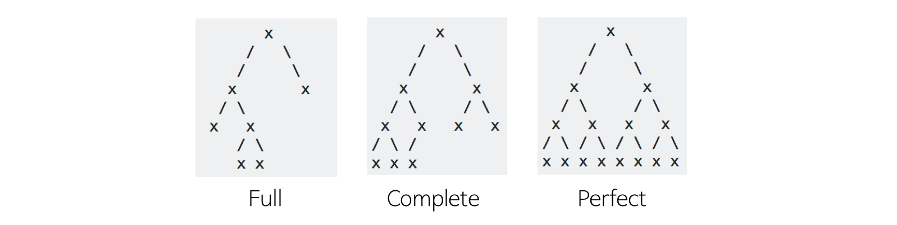
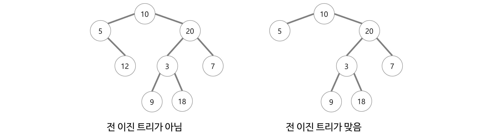
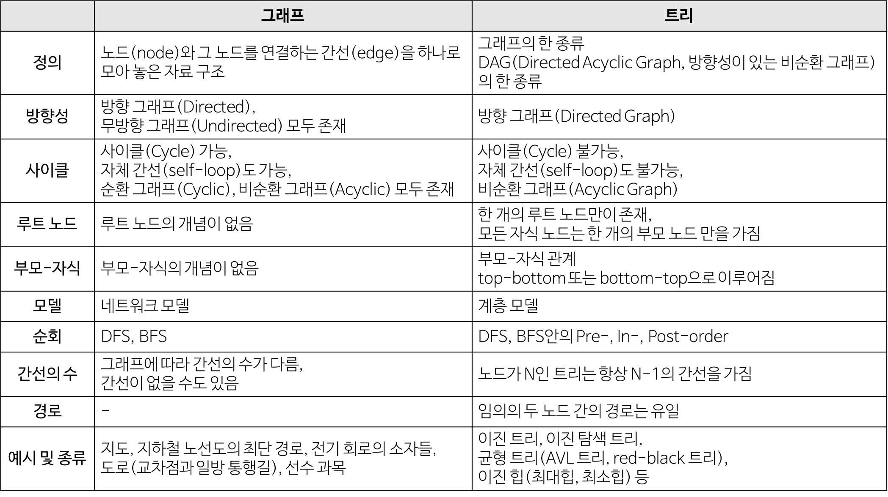

# 자료구조

### 목차

- [자료구조](#자료구조)
    - [목차](#목차)
    - [자료구조(Data Structure)란?](#자료구조data-structure란)
    - [추상 자료형(ADT)](#추상-자료형adt)
    - [추상적 자료 구조](#추상적-자료-구조)
    - [배열(Array)](#배열array)
    - [연결 리스트(Linked List)](#연결-리스트linked-list)
    - [스택(Stack)](#스택stack)
    - [큐(Queue)](#큐queue)
    - [덱(Deque)](#덱deque)
    - [트리(Tree)](#트리tree)
    - [그래프(Graph)](#그래프graph)
    - [집합(Set)](#집합set)
    - [사전(Dictionary) / 맵(Map)](#사전dictionary--맵map)
    - [Red-Black Tree](#red-black-tree)

### 자료구조(Data Structure)란?

- 효율적인 접근 및 수정을 가능케 하는 자료의 조직, 관리, 저장을 의미한다.
- 데이터 값의 모임, 데이터 간의 관계, 데이터에 적용할 수 있는 함수나 명령을 의미하기도 한다.

### 추상 자료형(ADT)

- 자료들과 그 자료들에 대한 연산들을 명기한 것.
- 추상 자료형은 구현 방법을 명시하고 있지 않다는 점에서 자료구조와 다르다.

### 추상적 자료 구조

- 자료에 대한 일련의 연산이 정의되며, 각각의 연산에 대한 연산 복잡도가 정의된 가상의 자료 저장 공간.
- 추상적 자료 구조를 올바르게 선택하는 것은 효율적 알고리즘을 설계하고 연산 복잡도를 추정함에 있어 필수적이다.

### 배열(Array)

- 번호(인덱스)와 번호에 대응하는 데이터들로 이루어진 자료 구조.
- 배열에는 같은 종류의 데이터들이 순차적으로 저장되어, 값의 번호가 곧 배열의 시작점으로부터 값이 저장되어 있는 상대적인 위치가 된다.
- **시간 복잡도**
    - 접근(Access) - O(1)
    - 탐색(Search) - O(n)
    - 삽입(Insert), 삭제(Delete) - O(n)

### 연결 리스트(Linked List)

- 각 노드가 데이터와 포인터를 가지고 한 줄로 연결되어 있는 방식으로 데이터를 저장하는 자료 구조.
- 데이터를 담고 있는 노드들이 연결되어 있는데, 노드의 포인터가 다음이나 이전의 노드와의 연결을 담당하게 된다.
- 단일 연결 리스트, 이중 연결 리스트 등이 있다.
- 늘어선 노드의 중간지점에서도 자료의 추가와 삭제가 O(1)의 시간에 가능하다는 장점을 갖는다. 그러나 배열이나 트리 구조와는 달리 특정 위치의 데이터를 검색해내는 데에는 O(n)의 시간이 걸리는 단점도 가지고 있다.
- 단일 연결 리스트
    - 단일 연결 리스트는 각 노드에 자료 공간과 한 개의 포인터 공간이 있고, 각 노드의 포인터는 다음 노드를 가리킨다.
- 이중 연결 리스트
    - 이중 연결 리스트의 구조는 단일 연결 리스트와 비슷하지만, 포인터 공간이 두 개가 있고 각각의 포인터는 앞의 노드와 뒤의 노드를 가리킨다.
- 원형 연결 리스트
    - 원형 연결 리스트는 일반적인 연결 리스트에 마지막 노드와 처음 노드를 연결시켜 원형으로 만든 구조이다.
- **시간 복잡도**
    - 접근(Access), 탐색(Search) - O(n)
    - 삽입(Insert), 삭제(Delete) - O(1)

### 스택(Stack)

- 제한적으로 접근할 수 있는 나열 구조이며, 접근 방법은 언제나 목록의 끝에서만 일어난다.
- 스택은 한 쪽 끝에서만 자료를 넣거나 뺄 수 있는 선형 구조(LIFO - Last In First Out)으로 되어 있다.
- 자료를 넣는 것을 ‘밀어넣는다’ 하여 push라고 하고, 반대로 넣어둔 자료를 꺼내는 것을 pop이라고 하는데, 이 때 꺼내지는 자료는 가장 최근에 push한 자료부터 나오게 된다.
- 주요 연산
    - top(): 스택의 가장 윗 데이터를 반환한다. 만약 스택이 비었다면 이 연산은 정의불가 상태이다.
    - pop(): 스택의 가장 윗 데이터를 삭제한다. 스택이 비었다면 연산 정의불가 상태
    - push(x): 스택의 가장 윗 데이터로 top이 가리키는 자리 위에 (top = top + 1) 메모리를 생성, 데이터 x를 넣는다.
    - empty(): 스택이 비었다면 1(true)을 반환하고, 그렇지 않다면 0(false)을 반환한다.
- ************************시간 복잡도************************
    - 탐색(Search) - O(n)
    - 삽입(Insert), 삭제(Delete) - O(1)
    

### 큐(Queue)

- 기본적인 자료 구조의 한 가지로, 먼저 집어 넣은 데이터가 먼저 나오는 FIFO(First In FIrst Out) 구조로 저장하는 형식을 말한다.
- 영어 단어 queue는 표를 사러 일렬로 늘어선 사람들로 이루어진 줄을 말하기도 하며, 먼저 줄을 선 사람이 먼저 나갈 수 있는 상황을 연상하면 된다.
- 나중에 집어 넣은 데이터가 먼저 나오는 스택과는 반대되는 개념이다.
- 큐는 put과 get을 이용하여 구현된다. put은 큐에 자료를 넣는 것을, get은 큐에서 자료를 꺼내는 것을 의미한다.
- front(head)와 rear(tail)는 데이터의 위치를 가리킨다. front는 데이터를 get할 수 있는 위치를, rear은 데이터를 put할 수 있는 위치를 의미한다.
- 큐가 꽉 차서 더 이상 자료를 넣을 수 없는 경우(put할 수 없는 경우)를 오버플로우(overflow), 큐가 비어 있어 자료를 꺼낼 수 없는 경우(get할 수 없는 경우)를 언더플로우(underflow)fkrh gksek.
- 큐에는 선형과 환형이 있다.
- 선형 큐
    - 막대 모양으로 된 큐이다. 크기가 제한되어 있고 빈 공간을 사용하려면 모든 자료를 꺼내거나 자료를 한 칸씩 옮겨야 한다는 단점이 있다.
- 환형 큐
    - 선형 큐의 문제점(배열로 큐를 선언할 시 큐의 삭제와 생성이 계속 일어났을 때, 마지막 배열에 도달 후 실제로는 데이터 공간이 남아있지만 오버플로우가 발생)을 보완한 것이 환형 큐이다.
    - front가 뷰의 끝에 닿으면 큐의 맨 앞으로 자료를 보내어 원형으로 연결하는 방식이다.
- 연결 리스트로 구현한 큐
    - 연결 리스트를 사용한 것으로써, 큐의 길이를 쉽게 늘릴 수 있어 오버플로우가 발생하지 않는 것이 특징이다.
    - 필요에 따라 환형으로 만들 수도 있으며, 환형으로 만들지 않아도 삽입과 삭제가 제한되지 않아 편리하다.
- ************************시간 복잡도************************
    - 탐색(Search) - O(n)
    - 삽입(Insert), 삭제(Delete) - O(1)
    

### 덱(Deque)

- 양쪽에서 삽입과 삭제가 모두 가능한 자료 구조.
- 두 개의 포인터를 사용하며, 양쪽에서 삽입과 삭제를 발생시킬 수 있다. 큐와 스택을 합친 형태로 생각할 수 있다.

### 트리(Tree)

- 트리는 노드로 이루어진 자료 구조이며, 다음과 같은 특징을 가진다.
    - 트리는 하나의 루트 노드를 갖는다.
    - 루트 노드는 0개 이상의 자식 노드를 갖고 있다.
    - 그 자식 노드 또한 0개 이상의 자식 노드를 갖고 있고, 이는 반복적으로 정의된다.
- 노드(node)들과 노드들을 연결하는 간선(edge)들로 구성되어 있다.
    - 트리에는 사이클이 존재할 수 없다.
    - 노드들은 특정 순서로 나열될 수도 있고 그렇지 않을 수도 있다.
    - 각 노드는 부모 노드로의 연결이 있을 수도 있고 없을 수도 있다.
    - 각 노드는 어떤 자료형으로도 표현 가능하다.
- 비선형 자료구조로 계층적 관계를 표현한다.(ex - 디렉토리 구조, 조직도)
- 그래프의 한 종류이다.
    - 사이클이 없는 하나의 연결 그래프(Connected Graph)
    - 또는 DAG(Directed Acyclic Graph, 방향성이 있는 비순환 그래프)의 한 종류이다.
- 트리와 관련된 용어
    
    - 루트 노드(root node): 부모가 없는 노드, 트리는 하나의 루트 노드만을 가진다.
    - 단말 노드(leaf node): 자식이 없는 노드, ‘말단 노드’ 또는 ‘잎 노드’라고도 부른다.
    - 내부 노드(internal node): 단말 노드가 아닌 노드
    - 간선(edge): 노드를 연결하는 선
    - 형제(sibling): 같은 부모를 가지는 노드
    - 노드의 크기(size): 자신을 포함한 모든 자손 노드의 개수
    - 노드의 깊이(depth): 루트에서 어떤 노드에 도달하기 위해 거쳐야 하는 간선의 수
    - 노드의 레벨(level): 트리의 특정 깊이를 가지는 노드의 집합
    - 노드의 차수(degree): 하위 트리 개수 / 간선 수 = 각 노드가 지닌 가지의 수
    - 트리의 차수(degree of tree): 트리의 최대 차수
    - 트리의 높이(height): 트리의 최대 레벨
- 트리의 특징
    - 그래프의 한 종류이다. ‘최소 연결 트리(Minimum Spanning Tree)’라고도 불린다.
    - 트리는 계층 모델이다.
    - 노드가 N개인 트리는 항상 N - 1개의 간선을 가진다.
        - 즉, 간선은 항상 (정점의 개수 - 1) 만큼을 가진다.
    - 루트에서 어떤 노드로 가는 경로는 유일하다.
        - 임의의 두 노드 간의 경로도 유일하다. 즉, 두 개의 정점 사이에 반드시 1개의 경로만을 가진다.
    - 한 개의 루트 노드만이 존재하며 모든 자식 노드는 한 개의 부모 노드만을 가진다.
        - 부모 - 자식 관계이므로 흐름은 top - bottom 혹은 bottom - top으로 이루어진다.
    - 순회는 Pre-order, In-order 아니면 Post-order로 이루어진다. 이 3가지 모두 DFS/BFS 안에 있다.
    - 트리는 이진 트리, 이진 탐색 트리, 균형 트리(AVL 트리, Red-Black 트리), 이진 힙(최대 힙, 최소 힙) 등이 있다.
- 트리의 종류
    - 이진 트리(Binary Tree)
        - 각 노드가 최대 두 개의 자식을 갖는 트리
        - 모든 트리가 이진 트리는 아니다.
        - 이진 트리 순회
            - 전위 순회(Pre-order): 현재 노드 → 왼쪽 자식 노드 → 오른쪽 자식 노드
            - 중위 순회(In-order): 왼쪽 자식 노드 → 현재 노드 → 오른쪽 자식 노드
            - 후위 순회(Post-order): 왼쪽 자식 노드 → 오른쪽 자식 노드 → 현재 노드
    - 이진 탐색 트리(Binary Search Tree)
        - 모든 노드가 아래와 같은 특정 순서를 따르는 속성이 있는 이진 트리
            
            > 모든 왼쪽 자식들 ≤ n < 모든 오른쪽 자식들 (모든 노드 n에 대해 반드시 참)
            > 
    - 균형 트리(Balanced Tree)
        - O(log n) 시간에 insert와 find를 할 수 있을 정도로 균형이 잘 잡혀 있는 경우
        - AVL 트리, Red-Black 트리 등이 있다.
    
    - 완전 이진 트리(Complete Binary Tree)
        
        - 트리의 모든 높이에서 노드가 꽉 차 있는 이진 트리.
        - 즉, 마지막 레벨을 제외하고 모든 레벨이 완전히 채워져 있다.
        - 마지막 레벨은 꽉 차 있지 않아도 되지만 노드가 왼쪽에서 오른쪽으로 채워져야 한다.
        - 마지막 레벨 h에서 (1 ~ 2h - 1) 개의 노드를 가질 수 있다.
        - 또 다른 정의는 가장 오른쪽의 단말 노드가 (아마도) 제거된 포화 이진 트리다.
        - 완전 이진 트리는 배열을 사용해 효율적으로 표현이 가능하다.
    - 전 이진 트리(Full Binary Tree)
        
        - 모든 노드가 0개 또는 2개의 자식 노드를 갖는 트리.
    - 포화 이진 트리(Perfect Binary Tree)
        
        - 전 이진 트리이면서 완전 이진 트리인 경우.
        - 모든 말단 노드는 같은 높이에 있어야 하며, 마지막 단계에서 노드의 개수가 최대가 되어야 한다.
        - 모든 내부 노드가 두 개의 자식 노드를 가진다.
        - 모든 말단 노드가 동일한 깊이 또는 레벨을 가진다.
        - 노드의 개수가 정확히 2 ^ h - 1 개여야 한다. (h: 트리의 높이)
    - 이진 힙(Binary Heap)
        - 최소 힙(Min Heap)
            - 트리의 마지막 단계에서 오른쪽 부분을 뺀 나머지 부분이 가득 채워져 있는 완전 이진 트리이며, 각 노드의 원소가 자식들의 원소보다 작다.
                - 즉, 부모 노드의 key ≤ 자식 노드의 key인 완전 이진 트리
                - 가장 작은 값은 루트 노드이다.
                - n개가 힙에 들어가 있으면 높이는 log n 이다.
        - 최대 힙(Max Heap)
            - 원소가 내림차순으로 정렬되어 있다는 점에서만 최소 힙과 다르다.
            - 각 노드의 원소가 자식들의 원소보다 크다.
    

### 그래프(Graph)

- 단순히 노드(N, node)와 그 노드를 연결하는 간선(E, edge)을 하나로 모아놓은 자료 구조.
    - 연결되어 있는 객체 간의 관계를 표현할 수 있는 자료 구조이다.(ex - 지도, 지하철 노선도의 최단 경로, 전기 회로의 소자들, 도로(교차점과 일방 통행길), 선수 과목 등)
    - 그래프는 여러 개의 고립된 부분 그래프(Isolated Subgraphs)로 구성될 수 있다.
- 그래프와 관련된 용어
    - 정점(vertex): 위치라는 개념(node라고도 부름)
    - 간선(edge): 위치 간의 관계. 즉, 노드를 연결하는 선
    - 인접 정점(adjacent vertex): 간선에 의해 직접 연결된 정점
    - 정점의 차수(degree): 무방향 그래프에서 하나의 정점에 인접한 정점의 수
        - 무방향 그래프에 존재하는 정점의 모든 차수의 합 = 그래프의 간선 수의 2배
    - 진입 차수(in-degree): 방향 그래프에서 외부에서 오는 간선의 수(내차수 라고도 부름)
    - 진출 차수(out-degree): 방향 그래프에서 외부로 향하는 간선의 수(외차수 라고도 부름)
        - 방향 그래프에 있는 정점의 진입 차수 또는 진출 차수의 합 = 방향 그래프의 간선의 수(내차수 + 외차수)
    - 경로 길이(path length): 경로를 구성하는 데 사용된 간선의 수
    - 단순 경로(simple path): 경로 중에서 반복되는 정점이 없는 경우
    - 사이클(cycle): 단순 경로의 시작 정점과 종료 정점이 동일한 경우
- 그래프의 특징
    - 그래프는 네트워크 모델이다.
    - 2개 이상의 경로가 가능하다.
        - 즉, 노드들 사이에 무방향/방향에서 양방향 경로를 가질 수 있다.
    - self-loop 뿐 아니라 loop/circuit 모두 가능하다.
    - 루트 노드라는 개념이 없다.
    - 부모-자식 관계라는 개념이 없다.
    - 순회는 DFS나 BFS로 이루어진다.
    - 그래프는 순환(cyclic) 혹은 비순환(acyclic)이다.
    - 그래프는 크게 방향 그래프와 무방향 그래프가 있다.
    - 간선의 유무는 그래프에 따라 다르다.

- 그래프의 종류
    - 무방향 그래프(Undirected Graph)
        - 무방향 그래프의 간선은 간선을 통해서 양방향으로 갈 수 있다.
        - 정점 A와 정점 B를 연결하는 간선은 (A, B)와 같이 정점의 쌍으로 표현한다.
            - (A, B)와 (B, A)는 동일
        - ex - 양방향 통행 도로
    - 방향 그래프(Directed Graph)
        - 간선에 방향성이 존재하는 그래프
        - A → B로만 갈 수 있는 간선은 <A, B>로 표시한다.
            - <A, B>, <B, A>는 다름
    - 가중치 그래프
        - 간선에 비용이나 가중치가 할당된 그래프
        - 네트워크(Network)라고도 한다.
            - ex - 도시와 도시의 연결, 도로의 길이, 회로 소자의 용량, 통신망의 사용료 등
    - 연결 그래프(Connected Graph)
        - 무방향 그래프에 있는 모든 정점쌍에 대해서 항상 경로가 존재하는 경우
    - 비연결 그래프(Disconnected Graph)
        - 무방향 그래프에서 특정 정점쌍 사이에 경로가 존재하지 않는 경우
    - 사이클(Cycle)
        - 단순 경로의 시작 정점과 종료 정점이 동일한 경우
            - 단순 경로(Simple Path: 경로 중에서 반복되는 정점이 없는 경우)
    - 비순환 그래프(Acyclic Graph)
        - 사이클이 없는 그래프
    - 완전 그래프(Complete Graph)
        - 그래프에 속해 있는 모든 정점이 서로 연결되어 있는 그래프
        - 무방향 완전 그래프
            - 정점 수가 n이면 간선 수는 n * (n - 1) / 2이다.
- 그래프의 구현 2가지
    - 인접 리스트, 인접 행렬을 사용할 수 있다.
    - 인접 리스트
        - 그래프 내에 적은 숫자의 간선만을 가지는 희소 그래프(Sparse Graph)의 경우
        - 장점
            - 어떤 노드에 인접한 노드들을 쉽게 찾을 수 있다.
            - 그래프에 존재하는 모든 간선의 수는 O(N + E) 안에 알 수 있다.(인접 리스트 전체를 조사한다.)
        - 단점
            - 간선의 존재 여부와 정점의 차수를 알려면, 정점 i의 리스트에 있는 노드의 수, 즉 정점 차수 만큼의 시간이 필요하다.
    - 인접 행렬
        - 그래프에 간선이 많이 존재하는 밀집 그래프(Dense Graph)의 경우
        - 장점
            - 두 정점을 연결하는 간선의 존재 여부(M[i][j])를 O(1) 안에 즉시 알 수 있다.
            - 정점의 차수는 O(n) 안에 알 수 있다.(인접 행렬의 i번째 행 또는 열을 모두 더한다.)
        - 단점
            - 어떤 노드에 인접한 노드들을 찾기 위해서는 모든 노드를 전부 순회해야 한다.
            - 그래프에 존재하는 모든 간선의 수는 O(n ^ 2) 안에 알 수 있다.(인접 행렬 전체를 조사한다.)
- 그래프의 탐색
    - 깊이 우선 탐색(DFS, Depth First Search)
        - 루트 노드(혹은 다른 임의의 노드)에서 시작해 다음 분기로 넘어가기 전에 해당 분기를 완벽하게 탐색하는 방법
            - 즉, 넓게 탐색하기 전에 깊게 탐색하는 것이다.
            - 사용하는 경우: 모든 노드를 방문하고자 하는 경우에 이 방법을 선택한다.
                - 깊이 우선 탐색이 너비 우선 탐색보다 좀 더 간단하다.
    - 너비 우선 탐색(BFS, Breadth First Search)
        - 루트 노드(혹은 다른 임의의 노드)에서 시작해서 인접한 노드를 먼저 탐색하는 방법
            - 즉, 깊게 탐색하기 전에 넓게 탐색하는 것이다.
            - 사용하는 경우: 두 노드 사이의 최단 경로 혹은 임의의 경로를 찾고 싶을 때 이 방법을 선택한다.

### 집합(Set)

- 순서가 없고, 중복을 허용하지 않는 자료 구조.
- Set의 구현
    - Hash
        - 속도 측면에서 O(1)에 데이터에 접근할 수 있음
    - Binary Tree(Red-Black Tree)
        - 이진 트리를 이용하면 정렬된 형태의 Set이 구현되며, 탐색에 O(log n)이 걸린다.

### 사전(Dictionary) / 맵(Map)

- Key와 Value 쌍으로 이루어진 자료 구조.
- 구현
    - Hash
        - 데이터 접근에 O(1)의 시간이 소요된다.
    - Binary Tree(Red-Black Tree)
        - 이진 트리를 이용하면 정렬된 형태의 Dictionary/Map이 구현되며, 탐색에 O(log n)이 걸린다.

### Red-Black Tree

- Red-Black 트리란 자가 균형 이진 탐색 트리로서, 좌, 우 균형이 맞춰지는 이진 탐색 트리이다.
- 트리 균형에 있어 높이 차이가 최대 1까지 차이날 수 있는 이진 탐색 트리이다.
- 특징
    - 모든 노드는 Red 또는 Black이다.
    - 루트 노드는 Black이다.
    - 리프 노드들은 Black이다.(리프 노드들은 NULL 노드들이다.)
    - Red 노드의 자식 노드는 Black이다.(Red가 두 번 연속으로 나올 수 없다.)
    - 모든 리프 노드에서 루트 노드까지 가는 데 만나는 Black 노드의 수는 같다.
    - 새로운 노드는 항상 Red 노드로 삽입되는데, Red 노드가 두 번 연속으로 나오는 Double Red는 Restructuring / Recoloring 과정을 통해 해결된다.
        - Restructuring
            - 삼촌 노드가 Black인 경우
        - Recoloring
            - 삼촌 노드가 Red인 경우
    - C++에서 Set, Map은 Red Black Tree를 기반으로 만들어져 있다.