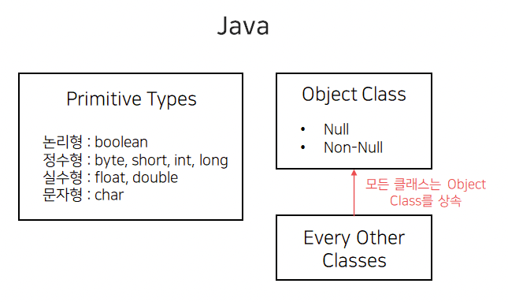
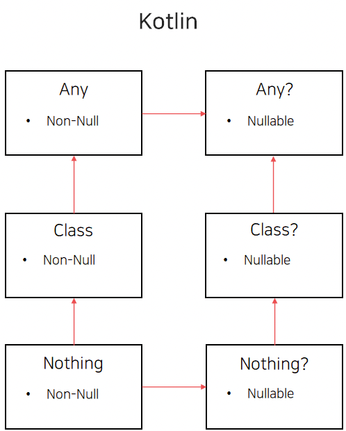
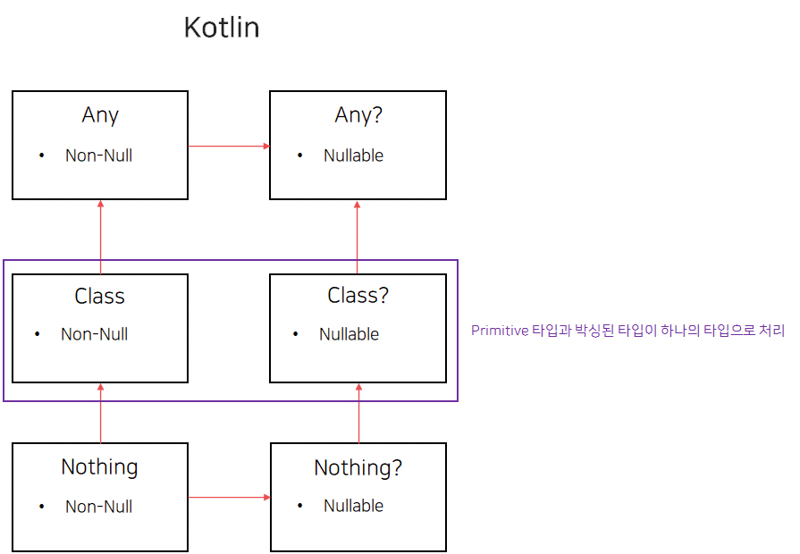

# Kotlin의 타입 시스템과 Java의 타입 시스템의 차이

### Java의 타입 시스템

- Java에서는 데이터의 타입이 원시 타입과 Object 클래스를 상속하는 타입 두 가지로 나뉜다.
    
    
    
    - 원시 타입(Primitive Type)
        - 값 그 자체가 Stack 메모리에 저장되어 접근 속도가 빠르다. null을 담을 수 없다.
    - Object 클래스를 상속하는 타입
        - Stack에는 참조값을 저장하고 실제 데이터는 Heap 메모리에 저장된다.
- Primitive type은 Object 클래스를 상속하지 않으며, 별도 타입으로 분류된다.
    - Primitive의 박싱된 타입인 Boolean, Integer 등은 Object 클래스를 상속받음
- Primitive type 외의 모든 클래스는 Object 클래스를 상속받으며, Object 클래스는 nullable해서 null 값이 들어갈 수 있다.
- **모든 Java 클래스의 최상위 클래스는 Object 클래스가 된다.**

### Java의 타입 시스템의 문제점

- **null 값을 인수로 취할 수 있는 클래스인 Object 클래스가 모든 클래스의 최상위 클래스가 됨으로써 Object 클래스를 상속받아 만들어진 클래스는 모두 nullable해진다.**
- 이로 인해, 프로그래머들은 Java를 이용한 프로그램 작성 시 null과 관련된 오류 처리에 많은 신경을 써야 하며 NPE(Null Pointer Exception)는 제대로 처리되지 않을 경우 프로세스를 다운시키기도 하기 때문에 Java의 치명적인 단점이 되었다.
- 이를 해결하기 위해 Java에서는 Optional을 도입하는 등의 시도를 하고 있지만, 기존 클래스를 Wrapping시켜 연산을 위한 비용을 비싸게 만든다는 점과 메모리를 더 많이 사용한다는 점 및 보일러 플레이트 코드를 만드는 한계가 있다.

### Kotlin의 타입 시스템

- **Kotlin은 Null-Safety에 초점을 맞춰 타입 시스템이 설계되었다.**
- **Kotlin의 타입 시스템은 크게 Nullable하지 않은 Any와 Nullable한 Any? 로 나뉜다.**
    
    
    
- **null이 될 수 없는 타입인 Any를 상속받은 클래스는 null 값을 인자로 받을 수 없다.**
- 만약 우리가 Any를 상속받은 클래스를 사용한다면 더 이상 Java와 같이 nullable할 경우에 대한 Exception을 처리할 필요가 없다. 또한, nullable하지 않은 값이란 것을 타입 자체에서 명시할 수 있으므로 null 처리를 해야 할 경우와 처리하지 않아도 될 곳을 명확히 구분할 수 있게 된다.
    
    
    
- 또한 Java와는 다르게 원시 타입은 따로 존재하지 않으며, Java와 다르게 원시 타입을 따로 boxing/unboxing 할 필요 없이 Wrapping된 하나의 클래스로 사용한다.
    - 이 클래스는 Any 혹은 Any?를 상속받는다.
- **컴파일하여 바이트 코드로 변환될 때 만약 Primitive 타입으로 변환될 수 있으면 변환해준다.**
    - 즉, 기존에 사람이 처리해주던 것을 모두 컴파일러가 처리해주는 것이다.

### Kotlin의 타입 시스템의 장점

- Null-Safety를 위한 설계가 되어 있어 null 처리가 편하고 직관적이다.
- 메모리 절약과 속도를 위해 Primitive 타입을 별도로 선언하고 처리할 필요 없이 하나의 타입을 이용하면 컴파일러 단에서 자동으로 처리해준다.