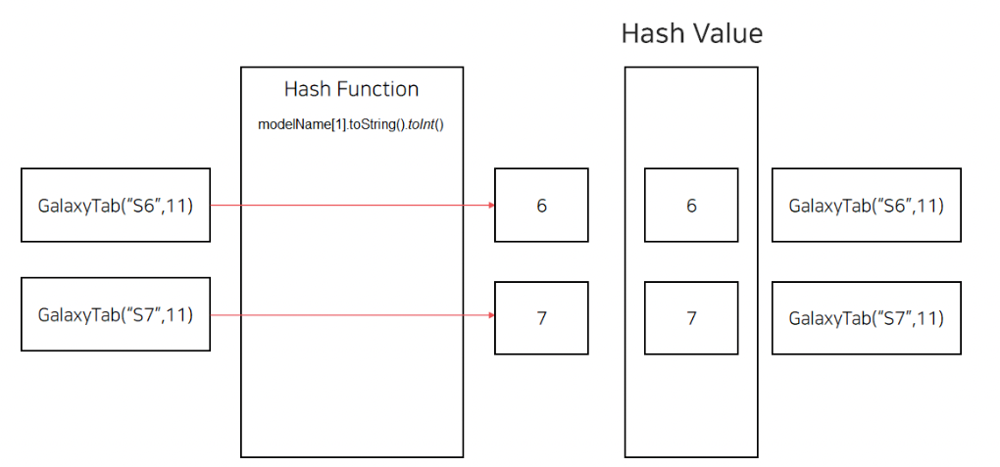
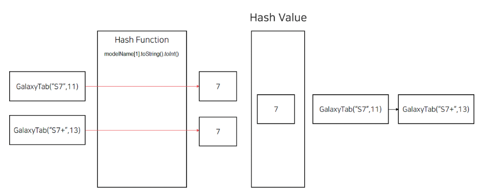

# Kotlin 클래스에 정의되어야 하는 equals, hashCode, toString 살펴보기

### 클래스에 정의되어야 하는 메서드

- Java에서 클래스는 Object 클래스를 상속받고, Object 클래스에 정의된 toString(), hashCode(), equals(other: Object) 메서드를 재정의할 수 있다.
- Kotlin에서도 Java와 마찬가지로 Any 클래스를 상속받으며 Any 클래스에 정의된 toString(), hashCode(), equals(other: Any?)를 재정의할 수 있다.
    
    ```kotlin
    public open class Any {
    	public open operator fun equals(other: Any?): Boolean
    	
    	public open fun hashCode(): Int
    
    	public open fun toString(): String
    }
    ```
    
    - 이 세 가지 메서드를 재정의하지 않으면 문제가 생기게 된다.
    - equals(other: Any?) 메서드를 재정의하지 않는 경우, 동등성 연산을 할 때 문제가 생기게 된다.
    - hashCode() 메서드를 재정의하지 않는다면, hashMap 혹은 hashSet과 같은 해시 기반 컬렉션 프레임워크를 사용할 때 문제가 생기게 된다.
    - toString()의 경우 객체의 정보에 대해 문자열로 출력해주는 기능인데 재정의하지 않으면 단순히 인스턴스가 저장된 힙 메모리 위치에 대해서 알려주게 된다.

### equals, hashCode, toString 메서드가 재정의되지 않는다면 어떤 문제가 발생할까

- GalaxyTab이라는 클래스가 있다고 해보자.
    
    ```kotlin
    class GalaxyTab(val modelName: String, val size: Int)
    ```
    
- equals(other: Any?)
    
    ```kotlin
    val tab1 = GalaxyTab("S7", 11)
    val tab2 = GalaxyTab("S7", 11)
    
    println(tab1 == tab2) // false
    ```
    
    - 재정의하지 않을 시, 객체 간의 관계에 대한 동등성 연산(equals)을 할 때 문제가 생긴다.
    - 단순히 저장된 위치가 같은지만 보게 된다.
        - 동등성 연산을 해야 하는데 동일성 연산을 하게 되는 것
        - 동등성 연산 → 같은 프로퍼티를 갖는 인스턴스인지 비교. 프로퍼티만 모두 같으면 된다.
        - 동일성 연산 → 똑같은 인스턴스인지 비교(주소값이 같아야 함)
    - 이를 해결하기 위해서는 다음과 같이 GalaxyTab 클래스를 재정의해야 한다.
        
        ```kotlin
        class GalaxyTab(val modelName: String, val size: Int) {
        	override fun equals(other: Any?): Boolean {
        		return if (other is GalaxyTab) {
        			other.modelName == this.modelName && other.size == this.size
        		} else {
        			false
        		}
        	}
        }
        ```
        
    - 위처럼 GalaxyTab 클래스를 재정의하게 되면, GalaxyTab 인스턴스의 modelName과 size가 같으면 동등한 객체임을 확인할 수 있게 된다.
        
        ```kotlin
        val tab1 = GalaxyTab("S7", 11)
        val tab2 = GalaxyTab("S7", 11)
        
        println(tab1 == tab2) // true
        ```
        
- hashCode()
    - **hash와 관련된 자료구조(hashMap, hashTable)는 동등성 연산(equals) 전에 먼저 hash value 비교를 수행한다.**
        - **즉, hashCode()의 값이 같은 경우에만 동등성 연산이 수행된다.**
    - **hash와 관련된 자료구조의 사용은 필수적이므로, 동등한 값 객체에 대해 동일한 hashCode()를 반환할 수 있도록 짜는 것은 필수적이다.** 그렇지 않으면 오류가 생기게 된다.
    - 예를 들어 아래와 같이 hashCode를 생성하는 GalaxyTab 클래스가 있다고 해보자.
        
        ```kotlin
        class GalaxyTab(val modelName: String, val size: Int) {
        	override fun hashCode(): Int {
        		return modelName[1].toString().toInt()
        	}
        }
        ```
        
        - HashTable에서는 해당 값을 비교하기 위해 먼저 hash value를 비교한다. hash value가 다른 경우 동등성 연산(equals) 없이 다른 값으로 판단한다.
            
            ```kotlin
            val tabS6 = GalaxyTab("S6", 11)
            val tabS7 = GalaxyTab("S7", 11)
            
            val tabStock = mutableMapOf<GalaxyTab, Int>()
            
            tabStock[tabS6] = 0
            tabStock[tabS7] = 2
            ```
            
        
        
        
        - **두 개의 다른 인스턴스에 대해 같은 hash value가 나오는 경우를 hash 충돌(hash collision)이라고 한다.**
            - 이런 경우는 hash value가 같으므로 동등성 연산(equals)가 수행된다.
            - 같은 해시 값을 갖는 인스턴스들이 LinkedList 형태로 이어져있어 하나하나씩 Iteration이 돌아가면서 동등성 연산이 수행된다.
            - **따라서 N개의 값 객체가 있고 해당 값 객체들이 모두 같은 hash value를 갖는다면 동등성 연산 수행에 O(N)의 시간 복잡도가 필요하다.**
            - 하지만 모든 값 객체들이 다른 hash value를 갖는다면 동등성 연산 수행에 O(1)의 시간 복잡도만 들게 된다.
            - 따라서 우리는 hashCode() 값을 hash 충돌을 최대한 피할 수 있도록 짜야 한다.
                
                ```kotlin
                val tabS7 = GalaxyTab("S7", 11)
                val tabS7Plus = GalaxyTab("S7+", 13)
                
                val tabStock = mutableMapOf<GalaxyTab, Int>()
                
                tabStock[tabS7] = 2
                tabStock[tabS7Plus] = 3
                ```
                
            
            
            
- toString()
    - toString()은 객체의 정보를 받기 위해 필요한 메서드이다.
    - 재정의하지 않는다면 toString()은 클래스명과 객체가 저장된 위치를 반환한다.
        
        ```kotlin
        val tab = GalaxyTab("S7", 11)
        println(tab.toString()) // GalaxyTab@610455d6
        ```
        
    - 이는 유용하지 않은 정보로, 유용한 정보를 출력하기 위해서는 toString() 메서드를 재정의해야 한다.
        
        ```kotlin
        class GalaxyTab(val modelName: String, val size: Int) {
        	override fun toString(): String {
        		return "GalaxyTab : modelName = ${modelName}, size = "${size}"
        	}
        }
        ```
        
    - 재정의한 후 위의 내용을 다시 출력하면 다음과 같이 나온다.
        
        ```kotlin
        val tab = GalaxyTab("S7", 11)
        println(tab.toString()) // GalaxyTab: modelName = S7, size = 11
        ```
        

### data class

- Kotlin에서는 위 세 가지 메서드 재정의에 대한 보일러 플레이트 코드를 줄이기 위해 컴파일러 단에서 위 세 가지 메서드를 자동으로 만들어주는 data class를 제공한다.