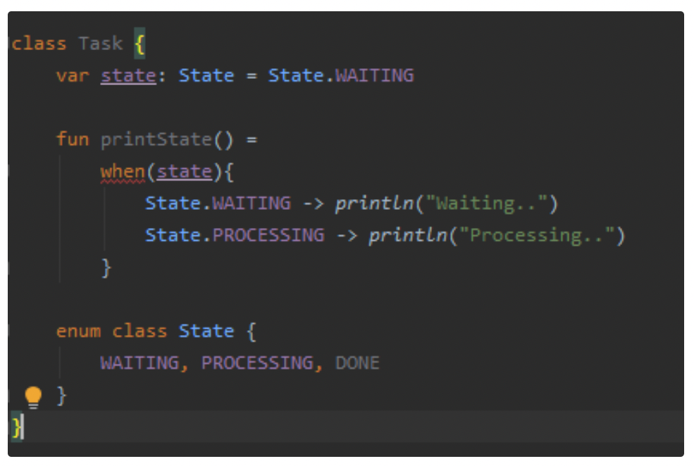

# Kotlin enum class

### enum class를 왜 사용해야 하는가?

- 변수의 상태 별로 다른 결과값을 출력하는 코드를 짜야 한다면 어떻게 짜야할까? 직관적으로 떠오르는 방법은 변수의 상태를 상수로 정의한 다음 상태별로 동작을 정의하는 것이다.
- 예를 들어, Task라는 작업 단위가 있고 해당 작업 단위의 상태값인 state를 출력해주는 클래스를 설계한다고 해보자. 그러면 해당 클래스는 아래와 같이 만들어질 수 있다.
    
    ```kotlin
    class Task {
    	var state: Int = WAITING
    	
    	fun printState() = 
    		when (state) {
    			WAITING -> println("Waiting..")
    			PROCESSING -> println("Processing..")
    			else -> println("Process not configured")
    		}
    
    	companion object {
    		const val WAITING: Int = 0
    		const val PROCESSING: Int = 1
    	}
    }
    
    fun main() {
    	val task = Task()
    	task.printState() // Waiting..
    }
    ```
    
- 하지만 이러한 방식으로 코드를 짜게 되면 State의 종류가 늘어났을 때 처리 로직을 빼먹거나, 처리되지 말아야 하는 상수값(Int)이 들어갔을 때 처리가 될 수 있다. 또한 상수값이 Int값이므로 state에 Int값을 직접 넣어 코딩을 하는 가능성을 만들 수 있다.
- 예를 들어, DONE이라는 새로운 state를 추가한 아래와 같은 상황이 생길 수 있다.
    
    ```kotlin
    
    class Task {
    	var state: Int = DONE
    	
    	fun printState() = 
    		when (state) {
    			WAITING -> println("Waiting..")
    			PROCESSING -> println("Processing..")
    			else -> println("Process not configured")
    		}
    
    	companion object {
    		const val WAITING: Int = 0
    		const val PROCESSING: Int = 1
    		const val DONE: Int = 2
    	}
    }
    
    fun main() {
    	val task = Task()
    	task.printState() // Process not configured
    }
    ```
    
- DONE이라는 state를 추가했는데 DONE에 대한 **변수값을 처리하는 동작이 없다**보니 Process not configured라는 문자가 뜨는 것이다.
- 이러한 상황 방지를 위해 **enum class를 사용할 수 있다.** enum 클래스는 상수 값의 타입 안정성을 보장해주며, when 문에 상수에 정의한 값에 대한 처리를 꼭 해주도록 만든다.
    
    ```kotlin
    class Task {
    	var state: State = State.WAITING
    
    	fun printState() =
    		when (state) {
    			State.WAITING -> println("Waiting..")
    			State.PROCESSING -> println("Processing")
    		}
    
    	enum class State {
    		WAITING, PROCESSING
    	}
    }
    ```
    
- 위의 코드에서는 **내부 클래스로 State라는 enum class를 생성했고, 그 내부에 두 가지 상수값 WAITING, PROCESSING**을 정의하였다. Task 클래스의 printState()에서는 클래스 내부에 전역으로 잡힌 state 변수를 가져와서 state를 알려주는 문자값을 print해준다.
- 이 때 우리가 State에 DONE을 추가한다고 해보자. 이러한 상황에서 IDE는 DONE에 대한 처리 로직이 없으면 아래와 같은 오류를 생성한다.
    
    
    
- 이를 해결하기 위해서는 아래와 같이 DONE에 대한 처리를 해주어야 한다.
    
    ```kotlin
    class Task {
    	var state: State = State.WAITING
    
    	fun printState() =
    		when (state) {
    			State.WAITING -> println("Waiting..")
    			State.PROCESSING -> println("Processing")
    			State.DONE -> 
    		}
    
    	enum class State {
    		WAITING, PROCESSING, DONE
    	}
    }
    ```
    
- 즉, enum class를 사용해주면 상수 값의 **타입 안정성이 보장**되며, **특정한 상태가 추가되었을 때 처리해야 하는 코드들을 IDE 단에서 잡아준다.** 코드가 작을 때는 이러한 상태값에 빠진 동작이 있더라도 금방 잡아낼 수 있지만, 코드가 커지면 커질수록 이러한 자잘한 잘못된 동작들이 모여 시스템을 망가뜨린다.
- enum class를 사용하면 다음과 같은 이점이 생긴다.
    - 상수 값의 타입 안정성이 보장된다.
    - 코드 가독성이 올라간다.
    - 상수 값에 대한 특정한 동작이 필요할 때 특정 상수값에 대한 동작을 빼먹는 것을 방지할 수 있다.
    - 상수와 연관된 변수를 상수에 저장할 수 있다.

### enum class에 대한 함수 만들기

```kotlin
class Task {
	var state: State = State.WAITING
	
	fun printState() = 
		when (state) {
			State.WAITING -> println("Waiting..")
			State.PROCESSING -> println("Processing..")
			State.DONE -> println("Task done")
		}
	
	enum class State {
		WAITING, PROCESSING, DONE
	}
}
```

- 이 코드는 문제가 있다. 특정한 state가 추가될 때마다 when의 분기에 무조건 print를 위한 처리 로직을 넣어주어야만 한다.
- 우리는 enum class에 이러한 처리를 다음과 같이 함수(fun)으로 넣어줄 수 있다. 이렇게 만들면 변수에 따라 공통으로 처리된다.
    
    ```kotlin
    class Task {
    	var state: State = State.WAITING
    	
    	fun printState() = state.print()
    	
    	enum class State {
    		WAITING, PROCESSING, DONE;
    
    		fun print() = println("${this}..")
    	}
    }
    
    fun main() {
    	val task = Task()
    	task.state = Task.State.WAITING
    	task.printState() // WAITING..
    
    	task.state = Task.State.PROCESSING
    	task.printState() // PROCESSING..
    	
    	task.state = Task.State.DONE
    	task.printState() // DONE..
    }
    ```
    
- 위와 같이 printState()를 했을 때 각자 공통으로 처리되어 보일러 플레이트 코드가 줄어든다. 하지만, **공통으로 처리할 때만 사용할 수 있으며 개별로 처리되어야 할 때는 추상 함수를 이용해야 한다.**

### 추상 함수 만들기

- 추상 함수(abstract fun)가 선언되면, 모든 enum class의 종류별로 모두 추상 함수를 구현해야 한다. 이제 우리는 원래 결과값을 얻을 수 있게 되었다. 이러한 추상 함수를 사용하게 되면, 상수값에 대한 함수를 구현하는 것을 강제하므로 특정 상수값(enum)에 대한 처리를 빼먹는 것을 방지할 수 있다.
    
    ```kotlin
    class Task {
    	var state: State = State.WAITING
    	
    	fun printState() = state.print()
    	
    	enum class State {
    		WAITING {
    			override fun print() {
    				println("Waiting..")
    			}
    		},
    		PROCESSING {
    			override fun print() {
    				println("Processing..")
    			}		
    		}, 
    		DONE {
    			override fun print() {
    				println("Task Done")
    			}
    		};
    
    		abstract fun print() = println("${this}..")
    	}
    }
    
    fun main() {
    	val task = Task()
    	task.state = Task.State.WAITING
    	task.printState() // WAITING..
    
    	task.state = Task.State.PROCESSING
    	task.printState() // PROCESSING..
    	
    	task.state = Task.State.DONE
    	task.printState() // Task Done
    }
    ```
    

### enum class에 변수값 넣기

- 상수값과 연관된 변수를 해야하는 경우 상수값 외부에 선언하게 되면 관리가 어려워진다. 이를 위해서도 enum class를 사용할 수 있다.
- 예를 들어, 색깔(Color)을 표현하는 함수를 표현한다고 해보자. 이러한 경우 RGB값이 필요하다. 이러한 RGB값을 상수값 외부에 선언한다고 해보자. 그렇다면 아래와 같이 선언할 수 있다.
    
    ```kotlin
    class ColorState(R: Int, G: Int, B: Int)
    
    val red = ColorState(255, 0, 0)
    val green = ColorState(0, 255, 0)
    val blue = ColorState(0, 0, 255)
    ```
    
- 이렇게 하면 반복되어 사용되는 변수라도 외부에 선언이 되어야 한다. 이렇게 된다면 관리 포인트가 여러 개가 된다.
- enum class를 이용하면 다음과 같이 쓰면 된다. **클래스 선언부의 오른족에 상수가 가져야 하는 변수값을 선언한 다음, 상수값에 연관된 변수를 상수 오른쪽에 저장**할 수 있다.
    
    ```kotlin
    enum class Color(R: Int, G: Int, B: Int) {
    	RED(255, 0, 0)
    	GREEN(0, 255, 0)
    	BLUE(0, 0, 255)
    }
    ```
    
- 이렇게 되면 관리 포인트는 하나가 되어 변수 관리가 간편해진다.

### enum class의 모든 변수 가져오기

- enum class에 선언된 모든 상수값을 가져올 수도 있다. 우리는 이를 위해 enum class에 values 함수를 사용해서 Array 형태로 가져올 수 있다.
    
    ```kotlin
    enum class Color(R: Int, G: Int, B: Int) {
    	RED(255, 0, 0)
    	GREEN(0, 255, 0)
    	BLUE(0, 0, 255)
    }
    
    fun main() {
    	val colorArray: Array<Color> = Color.values()
    	colorArray.forEach {
    		println(it)
    	}
    }
    /*
    RED
    GREEN
    BLUE
    */
    ```
    
- 위의 코드를 보면 Color의 Array를 Color.values()를 통해 가져올 수 있다.

### 정리

- 여러 곳에 같은 상수를 정의하거나 상수 외부에 상수와 관련된 변수나 함수를 정의하게 되면 코드가 커지면 커질수록 관리가 어렵게 된다.
- enum class를 사용하면 상수값에 대한 관리 포인트를 일원화할 수 있다.