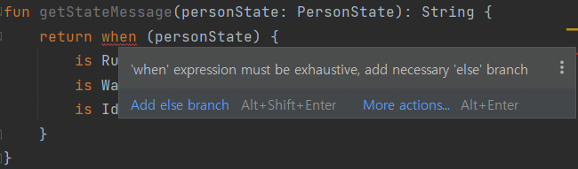
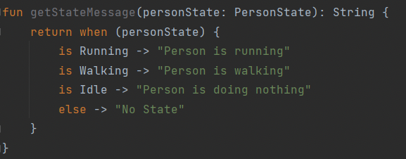
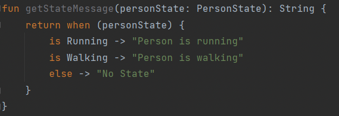
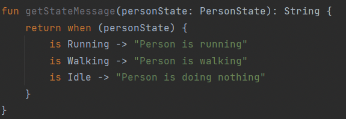
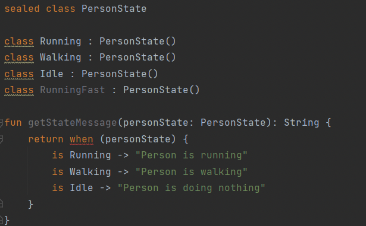
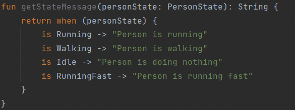
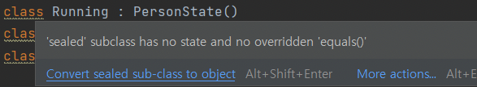
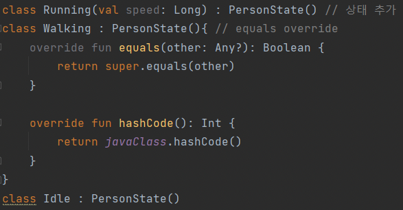
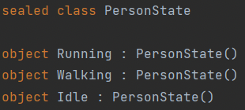

# Kotlin sealed class

### sealed class의 등장 배경

- 여러 자식 클래스들이 하나의 부모 클래스를 상속받았다고 했을 때, 컴파일러는 부모 클래스를 상속받은 자식 클래스들이 있는지 알지 못한다.
- 예를 들어보면, 우리가 사용자의 런닝 운동을 기록해주는 앱을 만들고 있다고 하자. 이 때 우리는 사람의 상태를 클래스로 만들고자 한다. 상태의 종류는 3가지로 뛰는 상태(Running), 걷는 상태(Walking), 쉬는 상태(Idle)이 있다. 이는 다음과 같이 코드로 만들어질 수 있다.
    
    ```kotlin
    abstract class PersonState
    
    class Running: PersonState()
    class Walking: PersonState()
    class Idle: PersonState()
    ```
    
- 각 PersonState별로 상태 메시지를 얻고 싶다고 해보자. 이를 위해 getStateMessage 함수를 작성한다.
    
    ```kotlin
    fun getStateMessage(personState: PersonState): String {
    	return when (personState) {
    		is Running -> "Person is Running"
    		is Walking -> "Person is Walking"
    		is Idle -> "Person is doing nothing"
    	}
    }
    ```
    
- 하지만 위의 코드는 다음과 같이 else branch를 추가하라는 오류를 만든다.
    
    
    
- 이를 해결하기 위해 when에 else branch를 추가해주면 오류가 사라진다.
    
    
    
- 왜 else branch를 추가하라고 했을까? 바로 컴파일러가 PersonState를 상속받는 하위 클래스의 종류를 알지 못해 그렇다.
- 이 문제는 단순해보이지만, 단순한 문제가 아니다. 위의 코드에서 쉬는 상태(Idle)에 대한 분기를 지워보자. 그러면 아래와 같이 오류 없이 컴파일되는 것을 확인할 수 있다.
    
    
    
- 만약 위 코드가 실제 사용되는 어플리케이션에 올라갔다면 Idle 상태에 대한 처리가 되어있지 않아 어플리케이션은 제대로 동작을 하지 않을 것이다. 즉, 코드에 문제가 있더라도 컴파일 단에서 잡아내지 못하고 오류도 찍히지 않아 문제를 잡아내기가 매우 힘들어진다.
- PersonState를 사용하는 부분이 이 부분 하나면 그나마 다행이지만, 보통의 어플리케이션에서는 그렇지 않다. 즉 위의 코드는 오류를 미친 듯이 내뱉을 수 있고 관리도 되지 않는 코드로 전락해버린다.

### sealed class란?

- sealed class란 추상 클래스(abstract class)로 상속받는 자식 클래스의 종류를 제한하는 특성을 가지고 있다. 즉, 컴파일러에서 sealed class의 자식 클래스가 어떤 것이 있는지 알 수 있다.
- 위의 예시를 sealed class를 이용해 다시 한 번 작성해보면 다음과 같이 작성된다.
    
    ```kotlin
    sealed class PersonState
    
    class Running: PersonState()
    class Walking: PersonState()
    class Idle: PersonState()
    ```
    
    
    
- 위에서는 오류가 생기지 않는다. 이유는 컴파일러에서 sealed class PersonState의 자식 클래스는 Running, Walking, Idle 세 가지만 있는 것을 알고 있기 때문이다. 따라서 when에 else branch를 사용하지 않고도 필요한 메시지만 수신할 수 있게 되었다.
- 만약 우리가 앱을 확장해서 PersonState에 RunningFast라는 자식 클래스를 추가한다고 해보자.
    
    
    
- 이 때 컴파일러는 오류를 내뱉는다. sealed class인 RunningFast에 대한 처리가 안 되어 있기 때문이다.
    
    
    
- 이에 대해 위와 같이 RunningFast에 대한 분기를 처리하면 오류가 사라진다.

### sealed class로 상속 받기

- class로 상속 받기
    
    ```kotlin
    sealed class PersonState
    
    class Running: PersonState()
    class Walking: PersonState()
    class Idle: PersonState()
    ```
    
    - 위에서는 익숙함을 위해 sealed class의 상속을 class로 제한하여 예시를 만들었다. 하지만 왜 상속을 받은 class들에 주의 표시(노란 밑줄)가 되어 있을까?
        
        
        
    - 즉, 상태(변수)가 있거나 equals를 override할 경우에만 class로 상속받으라는 이야기이다. 그 이외에는 메모리 절약을 위해 object를 이용한다. 따라서 위의 코드를 다음과 같이 바꾸면 Warning이 사라진다.
        
        
        
- object로 상속받기
    - object는 싱글톤 패턴으로 한 번만 메모리에 올라가고 재사용된다. 따라서 상태가 없는 경우 객체를 두 번 이상 생성하여 메모리에 올리는 것은 메모리를 낭비하는 일이다. 따라서 아래와 같이 상태 변수가 없는 값을 모두 object로 바꿀 경우 warning이 사라지게 된다.
        
        
        

### sealed class의 특징

- 같은 패키지의 자식 클래스만 상속 가능
    - 컴파일러가 모든 패키지를 돌면서 자식을 찾는 것은 너무 리소스를 많이 소모하는 작업이다. 따라서 sealed class는 자식 클래스에 대한 선언을 같은 패키지 내로 제한한다.
    - 예를 들어 sealed class가 위치한 패키지의 바깥에서 sealed class를 상속 받는 클래스를 선언하려고 하면 오류가 발생한다.
- 추상 클래스로 직접 객체 인스턴스 생성이 불가하다.
    - sealed class는 abstract class로 직접 인스턴스 생성이 불가하다. 만약 sealed class로 객체를 만들려고 하면 오류가 생긴다.