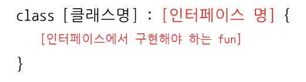
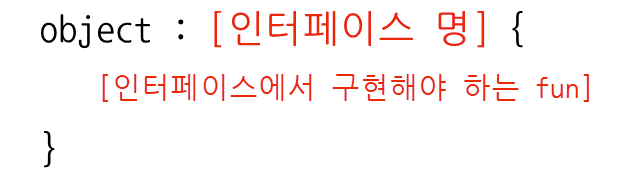

# Kotlin object를 이용한 무명 객체 활용

### 무명 객체란 무엇인가?

- 무명 객체란 익명 클래스로부터 생성되는 객체를 뜻한다.
- 익명 클래스는 다른 클래스들과 달리 이름을 가지지 않는 클래스다.
- 정리하면 이름을 가지지 않는 익명 클래스로부터 무명 객체를 생성할 수 있다.
- Kotlin에서는 이를 object라는 하나의 키워드를 통해 구현할 수 있다.

### 무명 객체가 필요한 이유

- 무명 객체는 클래스가 한 번만 활용되어야 하는 경우 매우 유용하다. 만약 한 번만 활용되어야 하는데 매번 클래스를 생성하면 너무 클래스가 많아지는 불편함이 있기 때문이다.
- 예를 들어 아래와 같은 인터페이스가 있다.
    
    ```kotlin
    interface ButtonClickListener {
    	fun onButtonClicked()
    }
    ```
    
- 버튼에서는 ButtonClickListener 인터페이스를 버튼 클릭 시 콜백 작업에 활용하기 위해 사용한다. 따라서 ButtonClickListener 인터페이스를 구현하는 어떤 클래스라도 저 val buttonClickListener 자리에 올 수 있다.
    
    ```kotlin
    class Button(private val buttonClickListener: ButtonClickListener) {
    	fun buttonClickCallback() {
    		buttonClickListener.onButtonClicked()
    	}
    }
    ```
    
- 예를 들어 OK버튼을 클릭했을 때 “OK clicked”라는 단어를 프린트해주는 클래스를 만든다고 해보자.
    
    ```kotlin
    class OkButtonClickListener: ButtonClickListener {
    	override fun onButtonClicked() {
    		println("OK clicked")
    	}
    }
    ```
    
- 이 클래스는 Button에 다음과 같이 들어갈 수 있다.
    
    ```kotlin
    fun main() {
    	Button(OkButtonClickListener())
    }
    ```
    
- 만약 이 OkButtonClickListener가 이 버튼에서만 활용된다면 저 클래스를 하나 더 생성하는 것보다 바로 저 자리에 작성해 생성하는 것이 유용할 수 있다.

### 무명 객체(익명 클래스) 구현하기

- 무명 객체를 만드는 것을 이해하기 위해서는 먼저 클래스로부터 객체를 생성하는 방식을 이해해야 한다.
- 클래스는 `:` 뒤에 인터페이스가 오고 클래스에서는 인터페이스에서 구현해야 하는 함수를 구현해야 한다.
    
    
    
    ```kotlin
    class OkButtonClickListener: ButtonClickListener {
    	override fun onButtonClicked() {
    		println("OK clicked")
    	}
    }
    ```
    
- 이렇게 클래스가 생성되면 우리는 이 클래스를 이용해 클래스명()을 써서 객체를 생성해 사용한다.
    
    ```kotlin
    fun main() {
    	Button(OkButtonClickListener())
    }
    ```
    
- 무명 클래스는 다음의 형식을 통해 만들 수 있다.
    
    
    
- 클래스와 다른 점은, class [클래스명] 대신 object가 들어갔다는 점이다. object 키워드가 클래스의 역할을 한다. 즉, object는 이름이 없는 클래스라 해서 익명 클래스라 불린다.
- 또한 이렇게 생성된 익명 클래스는 바로 자기 자신을 객체로 생성한다. 이 객체 또한 이름이 없으므로 이는 무명 객체라 불린다.
- 따라서 위의 OkButtonClickListener() 객체와 같은 역할을 하는 무명 객체는 다음과 같이 만들 수 있다.
    
    ```kotlin
    object : ButtonClickListener {
    	override fun onButtonClicked() {
    		println("OK clicked")
    	}
    }
    ```
    

### 무명 객체 사용하기

- 이제 위의 Button의 파라미터 자리에 만든 무명 객체를 넣어보자. 이 무명객체는 위의 OkButtonClickListener()와 똑같은 역할을 하게 된다.
    
    ```kotlin
    fun main() {
    	Button(object : ButtonClickListener {
    		override fun onButtonClicked() {
    			println("OK clicked")
    		}
    	})
    }
    ```