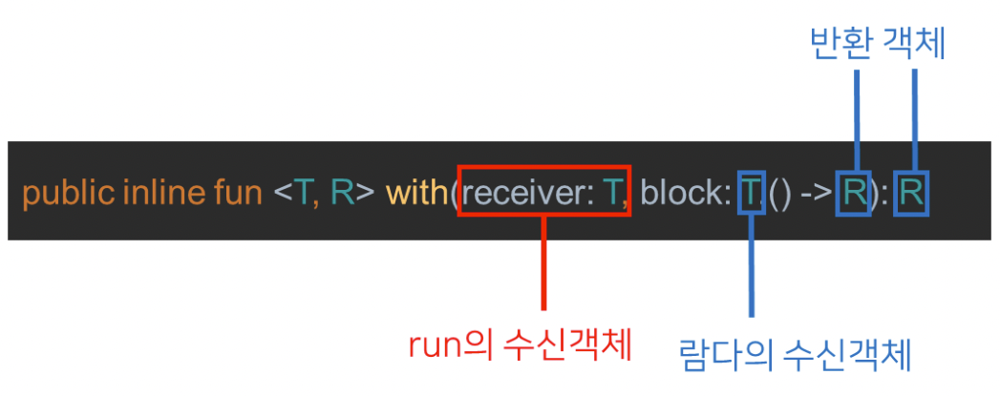

# Kotlin apply, run, with, let, also 차이 한 번에 정리하기

### 범위 지정 함수(Scope function)란?

- 범위 지정 함수는 **특정 객체에 대한 작업을 블록 안에 넣어서 실행할 수 있도록 하는 함수**이다.
- **블록은 특정 객체에 대해 할 작업의 범위가 되며, 따라서 범위 지정 함수**라 부른다.
- 특정 객체에 대한 작업을 블록 안에 넣게 되면 가독성이 증가하여 유지보수가 쉬워진다.
- Kotlin에서는 apply, run, with, let, also 총 5가지의 기본적인 범위 지정 함수를 지원한다.

### 범위 지정 함수와 수신객체 지정 람다(함수)

- 범위 지정 함수는 다른 말로 수신객체 지정 람다(함수)라고도 부른다.
    - 이유는, 수신객체를 명시하지 않거나 it을 호출하는 것만으로 람다 안에서 수신객체의 메서드를 호출할 수 있도록 해주기 때문이다.
- 이것이 가능한 이유는 블록(block) 람다식에서 수신객체를 람다의 입력 파라미터 혹은 수신객체로 사용하였기 때문이다.
- 예를 들어, also를 보면 also에서의 block은 람다식의 입력 파라미터로 also의 수신객체(T)를 지정한다.
    
    ```kotlin
    public inline fun <T> T.also(block: (T) -> Unit): T
    ```
    
    
    
- apply에서의 block은 람다식의 수신객체로 apply의 수신객체(T)를 지정한다.
    
    ```kotlin
    public inline fun <T> T.apply(block: T.() -> Unit): T
    ```
    
    
    
- 위 두 가지를 활용하면 람다 블록에서 수신객체의 지정함수의 수신객체를 명시하지 않고 접근 가능하거나 it으로 접근할 수 있게 된다. 이에 대한 분류를 하면 아래와 같다.
    
    
    
- 좀 더 이해하기 위해, 아래의 data class를 활용하여 각각이 어떻게 적용되는지 살펴보자.
    
    ```kotlin
    data class Person(
    	var name: String = "",
    	var age: Int = 0,
    	var temperature: Float = 36.5f
    )
    ```
    

### apply

- **apply는 수신객체 내부 프로퍼티를 변경한 다음 수신객체 자체를 반환하기 위해 사용되는 함수**이다.
- 따라서, 객체 생성 시 다양한 프로퍼티를 설정해야 하는 경우 자주 사용된다.
- apply에서의 block은 람다식의 수신객체로 apply의 수신객체(T)를 지정하기 때문에 람다식 내부에서 수신객체에 대한 명시를 하지 않고 함수를 호출할 수 있게 된다.
    
    ```kotlin
    public inline fun <T> T.apply(block: T.() -> Unit): T
    ```
    
    
    
- apply를 활용하면 다음의 방법으로 수신객체의 프로퍼티 지정이 가능하다. 람다식의 수신객체가 apply의 수신객체이기 때문에 수신객체에 대한 명시를 생략하는 것이 가능하다.
    
    ```kotlin
    val person = Person().apply {
    	name = "Dev"
    	age = 25
    	temperature = 36.2f
    }
    ```
    
- 기존에는 위의 Person 클래스를 초기화하고 프로퍼티를 설정하기 위해서는 다음의 방법을 사용하였다.
    
    ```kotlin
    val person = Person()
    person.name = "Dev"
    person.age = 25
    person.temperature = 36.2f
    ```
    

### run

- **run은 apply와 똑같이 동작하지만 수신객체를 return하지 않고, run 블록의 마지막 라인을 return하는 범위 지정 함수이다.**
- **이는 수신객체에 대한 특정한 동작을 수행한 후 결과값을 리턴받아야 할 경우 사용**한다.
    
    ```kotlin
    public inline fun <T, R> T.run(block: T.() -> R): R
    ```
    
    
    
- 예를 들어 위 Person 객체의 체온을 체크해서 아픈지(Sick)를 확인한다고 하자. 만약 사람의 체온이 37.5도 이상이면 아픈 것으로 다음과 같이 마지막 줄을 리턴받을 수 있다.
    
    ```kotlin
    data class Person(
    	var name: String = "",
    	var age: Int = 0,
    	var temperature: Float = 36.5f
    ) {
    	fun isSick(): Boolean = temperature > 37.5f
    }
    ```
    
    ```kotlin
    fun main() {
    	val person = Person(name = "Dev", age = 25, temperature = 36.5f)
    	val isPersonSick = person.run {
    		temperature = 37.2f
    		isSick() // return 값
    	}
    
    	println("PersonIsSick: ${isPersonSick}")
    }
    ```
    
    ```kotlin
    /*
    출력
    PersonIsSick: false
    */
    ```
    
- run은 수신객체 없이도 동작할 수 있다. 다만 수신객체 없이 run을 사용하려면 내부에 수신객체를 명시해줘야 한다.
    
    ```kotlin
    val person = Person("Dev", 25, 36.5f)
    val isPersonSick = run {
    	person.temperature = 37.2f
    	person.isSick()
    }
    ```
    

### with

- **with는 수신객체에 대한 작업 후 마지막 라인을 리턴한다.**
- **run과 완전히 똑같이 동작한다. 하지만 다른 점 하나는 run은 확장함수로 사용되지만 with는 수신객체를 파라미터로 받아 사용한다는 점이다.**
- run을 사용하는 것이 깔끔하므로 실제로는 거의 사용되지 않는다.
    
    ```kotlin
    public inline fun <T, R> with(receiver: T, block: T.() -> R): R
    ```
    
    
    
- 위의 run 예시와 똑같이 사용한다면 다음과 같이 사용된다.
    
    ```kotlin
    fun main() {
    	val person = Person(name = "Dev", age = 25, temperature = 36.5f)
    	val isPersonSick = with(person) {
    		temperature = 37.2f
    		isSick()
    	}
    
    	println("PersonIsSick: ${isPersonSick}")
    }
    ```
    

### let

- let은 수신객체를 이용해 작업을 한 후 마지막 줄을 리턴할 때 사용한다.
- run이나 with와는 수신객체를 접근할 때 it을 사용해야 한다는 점만 다르고 나머지 동작은 같다.
- 하지만 실제 사용에서 조금 차이가 있다.
    
    ```kotlin
    public inline fun <T, R> T.let(block: (T) -> R): R
    ```
    
- let은 다음과 같은 경우 사용한다.
    - **null check 후 코드를 실행**해야 하는 경우
    - **nullable한 수신객체를 다른 타입의 변수로 변환**해야 하는 경우
- 요약하면, nullable한 값을 처리해야 할 때는 let을 사용할 수 있다.
- let을 이용해 null check를 하려면 아래와 같이 null check 연산자인 `?`와 함께 사용해야 한다.
- `?.let`을 사용하게 되면 let의 block은 수신 객체가 null이 아닐 때만 수행된다. 따라서 let block에서 it의 타입은 nullable하지 않은 타입이 된다.
- 예를 들어 사람이 null이 아닐 때만 영화를 예매해야 한다고 해보자.
    
    ```kotlin
    fun main() {
    	var person = Person? = null
    	val isReserved = person?.let { it: Person ->
    		reserveMovie(it)
    	}
    }
    ```
    
- person은 nullable한 객체(Person?)이었는데, `?.let`을 사용하면 let block에서는 더 이상 nullable하지 않은 `it: Person`이 된 것을 확인할 수 있다.
- 즉, null check 후 코드가 실행된 것을 확인할 수 있다.
- 또한, person을 사용해 영화를 예매하고 결과값을 리턴받았으므로 person 객체가 다른 타입의 변수로 변환된 것 또한 확인할 수 있다.
    - 물론 let은 nullable하지 않은 대상에 대해서도 사용할 수 있지만, 실무에서는 nullable한 값이 아닐 경우에는 run을 사용하는 것이 일반적이다.

### also

- also는 apply와 마찬가지로 수신객체 자신을 반환한다.
- apply가 프로퍼티를 세팅 후 객체 자체를 반환하는데만 사용된다면, also는 프로퍼티 세팅 뿐만 아니라 객체에 대한 추가적인 작업(로깅, 유효성 검사 등)을 한 후 객체를 반환할 때만 사용된다.
- also에서의 block은 람다식의 입력 파라미터로 also의 수신객체(T)를 지정하기 때문에 내부에서 수신객체를 사용하기 위해서는 it을 사용해야 한다.
    
    ```kotlin
    public inline fun <T> T.also(block: (T) -> Unit): T
    ```
    
    
    
- also가 사용되는 예는 다음과 같다.
    - number를 반환받는 함수를 만든 후 해당 number의 숫자를 올리고 싶을 때 다음과 같이 number를 리턴한 다음 number의 값을 올린다.
        
        ```kotlin
        var number = 3
        
        fun getAndIncreaseNumber() = number.also {
        	number++
        }
        
        fun main() {
        	println("first number ${getAndIncreaseNumber()}")
        	println("second number ${getAndIncreaseNumber()}")
        }
        ```
        
        ```kotlin
        /*
        출력
        first number 3
        second number 4
        */
        ```
        
    - 주의할 점은 객체를 사용할 때는 객체의 주소값을 리턴하는 것이기 때문에 객체의 프로퍼티가 바뀌면 also에서 리턴하는 객체의 프로퍼티 또한 바뀐다는 점이다.
    - 따라서 객체의 프로퍼티를 다음과 같이 바꾸어 버릴 경우 바뀐 프로퍼티가 객체의 값이 되어버린다.
    - 분명 age가 25에서 시작됐는데 26으로 나오는 것을 볼 수 있다.
        
        ```kotlin
        var person = Person("Dev", 25, 36.2f)
        
        fun getAndIncreaseAge() = person.also {
        	person.age = it.age + 1
        }
        
        fun main() {
        	println("person ${getAndIncreaseNumber()}")
        	println("person ${getAndIncreaseNumber()}")
        }
        ```
        
        ```kotlin
        /*
        출력
        person Person(name=Dev, age=26, temperature=36.2)
        person Person(name=Dev, age=27, temperature=36.2)
        */
        ```
        
    - 따라서 보통 객체에 대해 같은 용도로 사용하고자 할 때는 copy를 사용해야 한다. 그래야 바뀌지 않은 객체가 리턴됨을 보장할 수 있다.
        
        ```kotlin
        var person = Person("Dev", 25, 36.2f)
        
        fun getAndIncreaseAge() = person.also {
        	person = person.copy(age = it.age + 1)
        }
        
        fun main() {
        	println("person ${getAndIncreaseNumber()}")
        	println("person ${getAndIncreaseNumber()}")
        }
        ```
        
        ```kotlin
        /*
        출력
        person Person(name=Dev, age=25, temperature=36.2)
        person Person(name=Dev, age=26, temperature=36.2)
        */
        ```
        
    - 이러한 문제 때문에 also는 거의 사용되지 않고, 사용할 때는 프로퍼티를 바꾸지 않고 동작을 추가적으로 해야 하는 경우(로깅 등)에서만 가끔 사용된다.