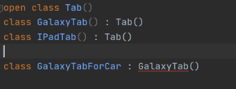
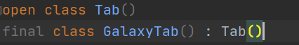
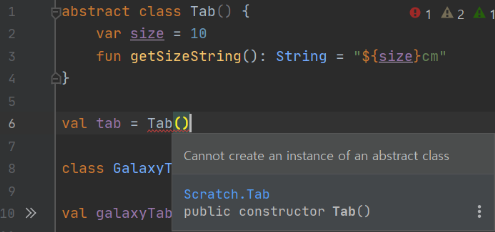

# Kotlin의 상속 변경자 - final, abstract, open

### 개요

- Java에서는 클래스는 기본적으로 상속이 가능했다. 상속을 불가능하게 만들기 위해서는 final 변경자를 붙여야 했다.
- 객체 지향적인 관점에서는 객체가 있고 해당 객체에 대한 코드를 줄이기 위해 재사용 가능하다면 재사용 하는 것이 좋지만, **이러한 사용 방식은 상속하는 기반 클래스가 변경이 없는 경우에만 유효하다.**
- **기반 클래스가 변경이 잦은데 무분별하게 클래스를 상속하게 된다면, 취약한 기반 클래스(fragile base class) 문제에 직면하게 된다.** 기반 클래스가 변경될 때마다 기반 클래스를 상속하는 모든 자식 클래스들은 변경되어야 하며, 어느 부분에 문제가 생길지 모른다.
- 이러한 문제를 해결하기 위해 Kotlin에서는 클래스의 기본 상속 변경자를 final로 설정하였다. 만약 특정 클래스가 상속되어도 되는 경우에만 open이라는 변경자를 이용하여 상속이 가능하다. 만약 open을 붙이지 않고 상속을 하게 된다면 아래와 같이 오류가 생기게 된다.
    
    
    
- 상속 변경자(modifier)
    - (final) class
        - **상속이 불가능한 변경자**
        - 클래스 멤버의 기본 변경자이다.
        - 생략 가능하다.
    - open class
        - **상속이 이루어질 수 있는 변경자**
        - Kotlin에서는 무분별한 상속을 막기 위해 별도로 open해야만 상속이 가능하다.
    - abstract class
        - **상속이 이루어져야만 하는 변경자**
        - 추상 클래스로 공통화된 메서드와 프로퍼티를 정의할 때 사용된다.

### final

- **final 변경자는 상속이 불가능한 변경자**이다.
- Java에서는 명시해야만 final이 되었으나, Kotlin에서는 무분별한 상속을 막기 위해 기본 변경자로 변경되었다. 아래와 같이 final은 IDE단에서 생략 가능함을 회색으로 표시함으로써 나타낸다.
    
    
    

### open

- open 변경자는 상속이 가능한 열려있는(open) 변경자이다. 아래 코드와 같이 open된 클래스는 상속이 가능하다.
    
    ```kotlin
    open class Tab()
    class GalaxyTab(): Tab()
    ```
    

### abstract

- **abstract class는 상속을 해야만 인스턴스화가 가능한 변경자이다.** 상속을 하지 않을 시 아래와 같이 abstract class는 인스턴스화할 수 없다는 오류가 뜬다.
    
    
    
- 보통 공통적인 메서드나 프로퍼티를 정의하기 위해 abstract class를 사용한다.
    
    ```kotlin
    abstract class Tab() {
    	var size = 10
    	fun getSizeString(): String = "${size}cm"
    }
    
    class GalaxyTab(): Tab()
    
    val galaxyTab = GalaxyTab()
    
    println(galaxyTab.getSizeString())
    ```