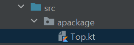

# Kotlin, Java의 최상위 선언 차이점

### 최상위 선언

- 최상위 선언이란 파일 취상위에 선언되는 클래스, 메서드, 변수를 뜻한다.

### Java의 최상위 선언

- Java에서는 모든 코드가 클래스 기반으로 작성된다. 이 때문에 Java의 모든 파일은 클래스에 연결되어 있는데, 이로 인해 아래와 같이 최상위 선언에는 클래스만이 들어올 수 있는 구조가 만들어진다.
    
    
    
    ```java
    package apackage;
    
    public class GalaxyTab { .. }
    ```
    
- 따라서 **Java의 최상위 선언에는 class만이 들어갈 수 있으며, 파일명과 같은 클래스만이 정의가 가능하다. 메서드를 정의하기 위해서는 class 내부에 정의**를 해야 한다. 이러한 구조에서는 메서드를 정의하기 위해 클래스를 만들고 내부에 메서드를 만들어야 한다. 메서드를 만들기 위해 불필요한 클래스가 필요해진다.

### Kotlin의 최상위 선언

- Kotlin의 최상위 선언은 다르다. **Kotlin의 최상위 선언에는 클래스(class), 메서드(fun), 변수(val, var) 모두 선언이 가능**하다. 이러한 동작이 어떻게 가능해지는지, 기존 Java와 어떻게 호환되는지 살펴보자.

### 클래스 vs 메서드, 변수 최상위 선언

- Kotlin의 최상위 선언 동작 방식은 두 가지로 나뉜다. 하나는 클래스 선언이고 다른 하나는 메서드와 변수 선언이다.
- **클래스는 패키지 레벨에 최상위 선언으로 그대로 감싸진다.** 반대로 **메서드와 변수는 파일 이름에 해당하는 클래스가 만들어진 후 해당 클래스 내부에 변수와 메서드로 들어가게 된다.** 이렇게 말하면 이해가 잘 되지 않기 때문에, 아래와 같은 구조의 kt 파일 안에 클래스와 변수, 함수가 있을 때 어떻게 바뀔 지 알아보자.
    
    
    
    ```kotlin
    package apackage
    
    class Tab()
    
    val a = 10
    
    fun printAA() = println("AA")
    ```
    
- 위 코드가 Top.kt에 선언되어 있을 때 이는 바이트코드로 컴파일 후 Java 코드로 디컴파일 했을 때 아래 코드와 같은 구조로 바뀌게 된다. 즉, 최상위 선언된 class는 해당 패키지에 클래스로 선언되며, 변수와 메서드는 해당 패키지 내부의 TopKt class 내부에 변수와 메서드로 선언된다.
    
    ```java
    // 최상위 선언된 class는 해당 패키지에 클래스로 선언
    package apakage;
    
    public final class Tab {}
    
    public final class TopKt {
    	private static final int a = 10;
    
    	public static final int getA() {
    		return a;
    	}
    
    	public static final void printAA() {
    		String var0 = "AA";
    		System.out.println(var0);
    	}
    }
    ```
    
- 최상위 선언의 기본 가시성 변경자는 public이므로, class, fun, val 모두가 public 가시성 변경자를 가지는 것을 볼 수 있다. 변수는 캡슐화가 중요하기 때문에 private으로 선언된 다음 get 메서드를 public으로 둔다.