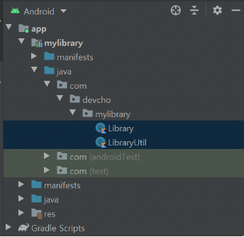
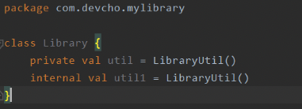
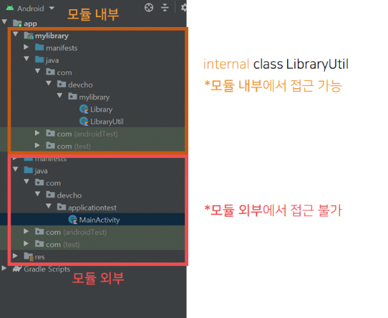

# Kotlin 최상위 선언에서 가시성 변경자 - public, internal, private

### 최상위 선언에서의 가시성 변경자

- 최상위 선언에서는 3가지의 가시성 변경자를 쓸 수 있다.
    - public
        - **기본 가시성 변경자**
        - **모든 곳에서 접근 가능**
    - internal
        - **같은 모듈 안에서만 접근 가능**
        - Kotlin의 특별한 접근자로, 이 접근자를 통해 모듈화가 수월해짐
    - private
        - **같은 파일(.kt) 안에서만 접근 가능**
        - 최상위 선언에는 여러 클래스(class)와 메서드(fun), 변수(val, var)가 들어갈 수 있는데, private으로 선언되었다면 같은 파일 안에서는 언제나 접근 가능하다.

### internal 접근 제한자

- internal 가시성 변경자는 같은 모듈 내부에서만 접근 가능하다.
- 또한 접근 시, 접근하는 변수 혹은 메서드는 internal 가시성을 가져야 한다. 모듈 내부에서만 접근 가능한 가시성이 모듈 외부에서 접근 가능해진다면 모듈화가 깨지기 때문이다.
- 아래와 같이 mylibrary라는 android library 모듈이 만들어졌다고 해보자.
    
    
    
- LibraryUtil 클래스의 최상위 선언에 대한 가시성을 internal로 두었다.
    
    ```kotlin
    package com.devcho.mylibrary
    
    internal class LibraryUtil {
    	fun printAA() = println("AA")
    }
    ```
    
- 이 때 이 LibraryUtil 클래스에 접근하기 위해서 해당 클래스를 인스턴스화하는 변수는 아래와 같이 internal 가시성 제한자를 가져야 한다.
    
    ```kotlin
    package com.devcho.mylibrary
    
    class Library {
    	internal val util = LibraryUtil()
    }
    ```
    
- 따라서 internal 가시성에 접근하기 위해서는 internal보다 낮은 혹은 internal 혹은 private 수준의 가시성을 사용해야 한다.
    
    
    
- 접근 범위
    - internal 클래스의 접근 범위인 모듈 내부는 모듈을 만들 때 생성되는 코드의 범위이다.
    - 모듈은 아래의 메뉴를 통해 생성 가능하다.
    - 즉, mylibrary라는 모듈을 만들었을 때 모듈 내부와 외부는 아래 그림과 같아진다.
        
        
        

### private 접근 제한자

- **최상위 선언에서의 private 접근 제한자는 .kt 파일 내부에서 접근이 가능함**을 뜻한다.
- Java에서는 하나의 파일에 하나의 클래스만 선언이 가능했지만, Kotlin에서는 하나의 파일(.kt)에 여러 최상위 선언이 가능하다.
- 이에 대한 것을 반영하여 Kotlin에서는 **파일을 캡슐화**하기 위해 private 접근자가 쓰인다. 이를 **파일 내부 가시성**이라고 한다.