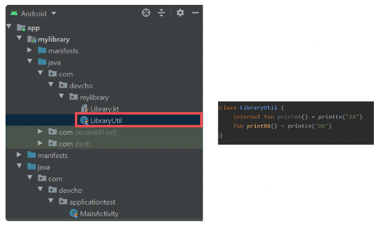
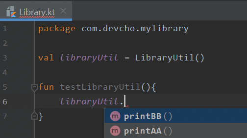
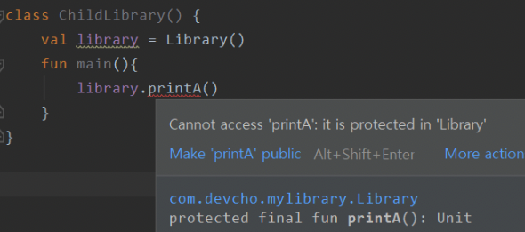
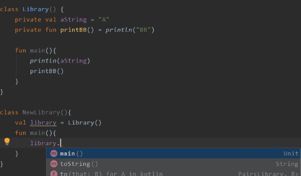

# Kotlin Class Member 가시성 변경자 - public, internal, protected, private의 차이

### 클래스 멤버의 가시성 변경자

- Kotlin은 클래스 내부에 클래스 멤버(class, fun, val, var)를 선언하고 외부에 변수를 참조하게 만들 수 있다. 하지만, 모든 클래스 멤버들이 외부에서 가시적이라면 클래스에 대한 무분별한 참조가 일어나 캡슐화가 깨질 수 있다.
- 이러한 상황을 방지하기 위해 클래스 멤버들에는 가시성 변경자를 설정할 수 있도록 한다.
- 클래스 멤버에 설정 가능한 가시성 변경자는 4가지이다.
    - public
        - 모든 곳에서 접근 가능
    - internal
        - 모듈 내부에서만 접근 가능
    - protected
        - 해당 클래스 멤버가 포함된 클래스를 상속받는 클래스에서 접근 가능
    - private
        - 같은 클래스 내부에서만 접근 가능

### internal - 모듈 내부 가시성

- **internal 가시성 변경자를 가진 클래스 멤버는 클래스가 같은 모듈에서 인스턴스화 되었을 때만 접근 가능**하다.
- mylibrary 모듈에 LibraryUtil 클래스의 멤버 메서드로 internal 접근 제한자를 가진 printAA()와 public 접근 제한자를 가진 printBB()가 있다고 해보자.
    
    
    
- 우리는 이러한 상황에서 같은 모듈인 Library.kt에서 해당 LibraryUtil을 인스턴스화할 때 접근 가능한 메서드의 목록과, 다른 모듈인 MainActivity에서 LibraryUtil을 인스턴스화할 때 접근 가능한 메서드의 목록을 살펴볼 것이다.
- 먼저 **같은 모듈인 Library.kt에서 LibraryUtil의 메서드에 접근해보자. 아래와 같이 public fun인 printBB()와 internal fun인 printAA() 메서드에 모두 접근이 가능**하다.
    
    
    
- 이번에는 **다른 모듈인 MainActivity에서 LibraryUtil의 메서드에 접근해보자. 아래와 같이 public fun인 printBB()에만 접근이 가능**한 것을 볼 수 있다. **internal fun에는 접근이 불가능**하다.

### protected - 상속 시 가시성

- 클래스 멤버의 protected 접근 제한자는 상속 시에만 접근이 가능하다.
- 아래와 같은 Library가 있다고 해보자. 이 클래스는 printA()라는 protected 접근 제한자를 가진 클래스 멤버를 가지고 있다.
    
    ```kotlin
    open class Library() {
    	protected fun printA() = println("A")
    }
    ```
    
- **Library를 상속하는 ChildLibrary는 printA()에 접근이 가능**하다.
    
    ```kotlin
    class ChildLibrary : Library() {
    	fun main() {
    		printA()
    	}
    }
    ```
    
- 하지만 **아래 그림과 같이 Library를 인스턴스화 시켜서 printA()에 접근은 불가능**하다. protected는 상속 시에만 접근이 가능한 접근 제한자이기 때문이다.
    
    
    

### private - 클래스 내부 가시성

- **클래스 멤버의 private 접근 제한자는 클래스 내부에서만 접근이 가능**하다. 해당 클래스를 인스턴스화를 시키더라도 외부 클래스에서는 접근이 불가능하다.
- 아래 그림과 같이 private 변수와 메서드를 가진 Library를 바깥에서 인스턴스화 시켜보자. public 가시성을 가진 main()만 접근이 가능하고, private 가시성을 가진 aString 변수와 printBB() 메서드는 접근이 불가능하다. 하지만, 클래스 내부에서는 aString 변수와 printBB() 메서드에 접근이 가능하다.
    
    