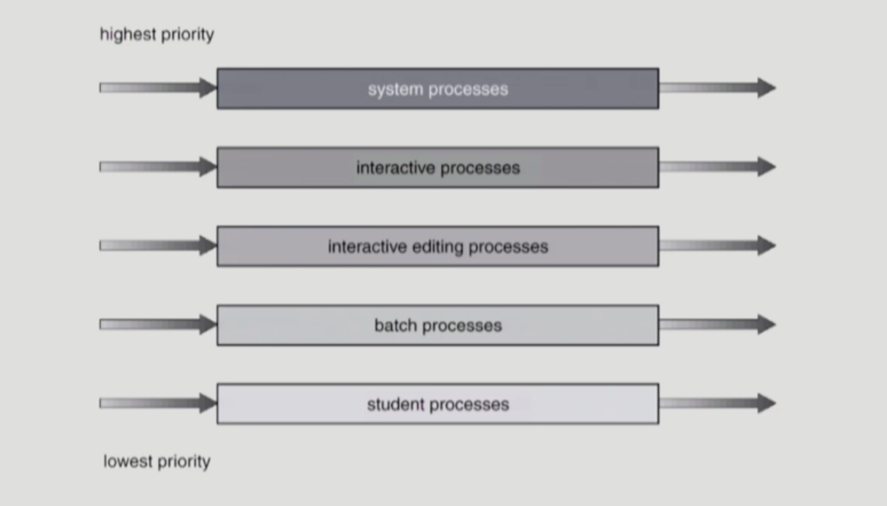
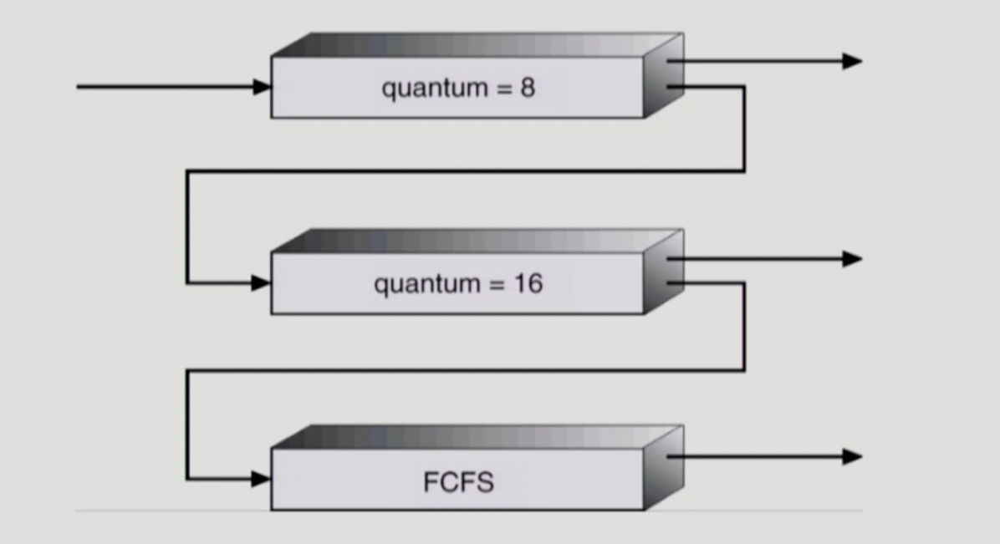

### CPU 스케줄링

- 여러 종류의 job(=process)이 섞여있기 때문에 CPU 스케줄링이 필요하다.
    - IO bound job → Burst duration은 짧으나 빈도가 높음
    - CPU bound job → Burst duration은 길지만 빈도가 낮음
    - Interactive job에게 적절한 response를 제공해야 하기 때문
    - CPU와 IO Device 등 시스템 자원을 골고루 효율적으로 사용
- 프로세스의 특성 분류
    - 프로세스는 그 특성에 따라 다음 두 가지로 나눌 수 있다.
    - IO bound process
        - CPU를 잡고 계산하는 시간보다 IO에 많은 시간이 필요한 job(many short CPU bursts)
    - CPU bound process
        - 계산 위주의 job(few very long CPU bursts)
- CPU Scheduler & Dispatcher
    - CPU 스케줄러
        - Ready 상태의 프로세스 중에서 이번에 CPU를 줄 프로세스를 고른다.
    - Dispatcher
        - CPU의 제어권을 CPU 스케줄러에 의해 선택된 프로세스에게 넘긴다.
        - 이 과정을 context switch(문맥 교환)라고 한다.
    - CPU 스케줄링이 필요한 경우는 프로세스에게 다음과 같은 상태 변화가 있는 경우이다.
        - Running → Blocked (ex - IO를 요청하는 시스템 콜)
        - Running → Ready (ex - 할당 시간 만료로 timer interrupt)
        - Blocked → Ready (ex - IO 완료 후 인터럽트)
        - Terminate
        - 1, 4에서의 스케줄링은 non-preemptive(=강제로 빼앗지 않고 자진 반납, 비선점형)
        - 2, 3에서의 스케줄링은 preemptive(=강제로 빼앗김, 선점형)
- 스케줄링 알고리즘의 성능 척도
    - 성능 척도
        - CPU utilization(이용률)
            - CPU가 쉬지 않고 일한 시간
            - keep the CPU as busy as possible
        - Throughput(처리량)
            - 주어진 시간동안 얼마나 작업을 완료했는가
            - number of process that complete their execution per time unit
        - Turnaround time(소요 시간, 반환 시간)
            - 어떤 프로세스의 작업이 완료될 때까지 걸린 시간
            - amount of time to execute a particular process
        - Waiting time(대기 시간)
            - ready queue에서 프로세스가 대기한 시간의 합
            - amount of time a process has been waiting in the ready queue
        - Response time(응답 시간)
            - ready queue에서 CPU를 최초로 할당받을 때까지 대기한 시간
            - amount of time it takes from when a request was submitted until the first response is produced, not output (for time-sharing environment)
    - 예시
        - 식당의 쉐프를 고용했다고 하자.
        - 사장의 입장에서, 쉐프가 쉬지 않고 계속 일을 하면 좋다. → CPU Utilization
        - 사장의 입장에서, 시간 당 손님이 많은 것이 좋다. → Throughput
        - 손님의 입장에서, 식사하러 들어가서 다 먹고 나갈 때까지 걸린 시간(음식을 기다리는 시간 + 음식을 먹는 시간) → Turnaround time
        - 손님의 입장에서, 모든 대기하는 시간 → Waiting time
        - 손님의 입장에서, 첫 음식이 나올 때까지 대기하는 시간 → Response time
- 여러 스케줄링 알고리즘
    - FCFS(First Come, First Served)
        - 먼저 온 순서대로 프로세스에게 CPU를 할당한다.
        - 비선점형 스케줄링 방식
        - 썩 효율적이지는 않다. 
        왜냐하면 굉장히 CPU를 오래 쓰는 프로세스가 먼저 들어오면, 이후에 들어오는 CPU를 짧게 쓰는 프로세스들이 먼저 CPU를 할당받은 프로세스가 작업을 완료할 때까지 기다려야 하기 때문이다.
        - Convoy effect: CPU를 사용하는 시간이 짧은 프로세스가 CPU를 사용하는 시간이 긴 프로세스보다 늦게 도착해 오래 기다리게 되는 현상
    - SJF(Shortest Job First)
        - 각 프로세스의 다음 번 CPU burst time을 가지고 스케줄링에 활용한다.
        - CPU burst time이 가장 짧은 프로세스에게 제일 먼저 CPU를 할당한다.
        - Non-Preemptive vs Preemptive
            - Non-Preemptive
                - 일단 CPU를 할당받으면 이번 CPU burst가 완료될 때까지 CPU를 빼앗기지 않음
                - 프로세스의 CPU burst가 끝날 때마다 스케줄링이 이루어짐
            - Preemptive
                - 현재 수행중인 프로세스의 남은 CPU burst time보다 더 짧은 CPU burst time을 가지는 새로운 프로세스가 도착하면 CPU를 빼앗김
                - 새로운 프로세스가 ready queue에 도착할 때마다 스케줄링이 이루어짐
                - 이 방법을 SRTF(Shortest Remaining Time First)라고도 한다.
        - SJF(Preemptive)는 최적이다.
            - 주어진 프로세스들에 대해 minimum average waiting time을 보장하기 때문
        - 단점
            - Starvation: 기아 현상
                - 우선순위에서 계속 밀리는 프로세스는 최악의 경우 영원히 CPU를 할당받지 못하는 상황이 발생할 수 있다.
            - 다음 번 CPU burst time을 정확히 알지는 못 하고, 과거의 CPU burst time을 이용해 추정하는 것만 가능하다.
    - Priority Scheduling
        - 높은 우선순위를 가진 프로세스에게 CPU를 할당한다. (우선순위 값이 작은 것이 우선순위가 높다.)
        - Non-Preemptive vs Preemptive 방식 존재
        - SJF는 일종의 Priority Scheduling이다.
            - priority = predicted next CPU burst time
        - 단점
            - Starvation(기아 현상)
                - 우선순위에서 계속 밀리는 프로세스는 최악의 경우 영원히 CPU를 할당받지 못하는 상황이 발생할 수 있다.
                - 해결 방안 - Aging 기법
                    - 시간이 지날수록 프로세스의 우선순위를 높여 영원히 대기하는 상황을 방지한다.
    - Round Robin(RR)
        - 각 프로세스는 동일한 크기의 할당 시간(time quantum)을 가진다. (일반적으로 10-100ms)
        - 할당 시간이 끝나면 프로세스는 선점(preempted)당하고 ready queue의 제일 뒤로 들어간다.
        - n개의 프로세스가 ready queue에 있고, 할당 시간이 q time unit인 경우 프로세스는 최대 q time unit 단위로 CPU 시간의 1/n을 얻는다.
            - 즉, 어떤 프로세스도 (n - 1) * q time unit 이상 기다리지 않는다.
        - time quantum의 크기에 따른 성능
            - q가 너무 크면, FCFS 알고리즘과 유사해진다.
            - q가 너무 작으면, 오히려 프로세스 간 Context Swtich가 빈번하게 일어나 오버헤드가 커진다.
        - 일반적으로 SJF보다 average turnaround time이 길지만, response time은 더 짧다.
    - Multi-level Queue
        
        
        
        - 프로세스들을 하나의 ready queue에 한 줄로 세우는 것이 아니라, 여러 큐를 두고 각 queue에 우선순위를 부여해 우선순위가 높은 큐에서부터 프로세스를 꺼내오는 방식
        - ready queue를 여러 개로 분할
            - foreground(interactive)
            - background(batch - no human interaction)
        - 각 큐는 독립적인 스케줄링 알고리즘을 가진다. (큐 안에서의 스케줄링)
            - foreground - RR
            - background - FCFS
        - 큐에 대한 스케줄링이 필요하다. (큐 간의 스케줄링)
            - Fixed priority scheduling
                - 고정된 우선순위대로 스케줄링한다.
                - 우선순위 스케줄링의 고질적인 문제점인 starvation의 가능성을 배제할 수 없다.
            - Time slice
                - 각 큐에 CPU time을 적절한 비율로 할당
                - ex - foreground 80%, background 20%
    - Multi-level Feedback Queue
        
        
        
        - Multi-level Queue에서, 프로세스가 다른 큐로 이동할 수 있다는 특징이 추가됨
        - 우선순위가 높은 큐에서는 time quantum이 짧은 RR을, 중간 큐에서는 time quantum이 조금 더 긴 RR을, 낮은 큐에서는 FCFS 알고리즘으로 스케줄링을 수행하는 등의 방식으로 사용된다.
    - Multi-Processor Scheduling
        - CPU가 여러 개인 경우 스케줄링은 더욱 복잡해진다.
        - Homogeneous processor인 경우
            - 큐에 한 줄로 세워서 각 프로세서가 알아서 꺼내가게 할 수 있다.
            - 반드시 특정 프로세서에서 수행되어야 하는 프로세스가 있는 경우에는 문제가 더욱 복잡해진다.
        - Load sharing
            - 일부 프로세서에 job이 몰리지 않도록 부하를 적절히 공유하는 메커니즘이 필요하다.
            - 별개의 큐를 두는 방법 vs 공동 큐를 사용하는 방법
        - Symmetric MultiProcessing(SMP)
            - 각 프로세서가 각자 알아서 스케줄링 결정
        - Asymmetric MultiProcessing
            - 하나의 프로세서가 시스템 데이터의 접근과 공유를 책임지고 나머지 프로세서가 거기에 따름
    - Real-Time Scheduling
        - Hard real-time systems
            - Hard real-time task는 정해진 시간 안에 반드시 끝내도록 스케줄링해야 함
        - Soft real-time computing
            - Soft real-time task는 일반 프로세스에 비해 높은 priority를 갖도록 해야 함
    - Thread Scheduling
        - Local scheduling
            - User level thread의 경우 사용자 수준의 thread library에 의해 어떤 thread를 스케줄할지 결정
            - 프로세스 내부에서 어떤 스레드에게 CPU를 할당할 것인지 결정
        - Global scheduling
            - Kernel level thread의 경우 일반 프로세스와 마찬가지로 커널의 단기 스케줄러가 어떤 스레드를 스케줄할지 결정
- 스케줄링 알고리즘 평가
    - Queueing models
        - 확률 분포로 주어지는 arrival rate와 service rate 등을 통해 각종 performance index 값을 계산
    - Implementation(구현) & Measurement(성능 측정)
        - 실제 시스템에 알고리즘을 구현하여 실제 작업(workload)에 대해서 성능을 측정 비교
    - Simulation(모의 실험)
        - 알고리즘을 모의 프로그램으로 작성 후 trace를 입력으로 하여 결과 비교