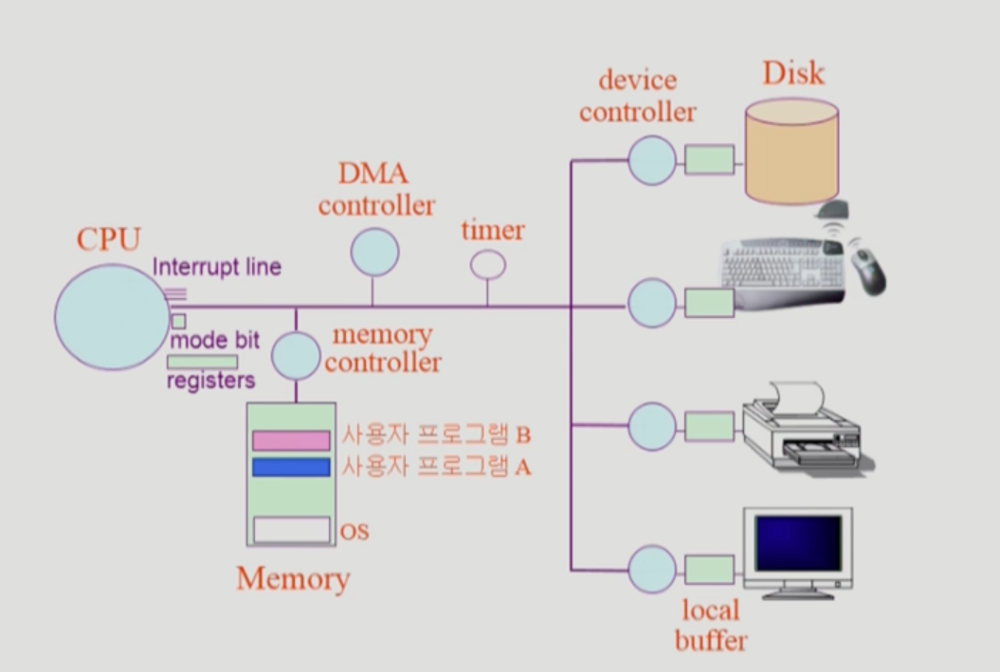

# 운영체제
[참고 강의](http://www.kocw.net/home/m/search/kemView.do?kemId=1046323) - 모두를 위한 열린 강좌 KOCW(이화여대, 반효경)

### 목차

- [운영체제](#운영체제)
    - [목차](#목차)
    - [운영체제(Operating System)란?](#운영체제operating-system란)
    - [컴퓨터 시스템의 구조](#컴퓨터-시스템의-구조)

### 운영체제(Operating System)란?

- 컴퓨터 하드웨어 바로 위에 설치되어 사용자 및 다른 모든 소프트웨어와 하드웨어를 연결하는 소프트웨어 계층이다.
- 하드웨어를 직접 다루는 복잡한 부분을 운영체제가 대행한다.
- 컴퓨터 시스템의 자원(프로세서, 기억장치, 입출력 장치 등)을 효율적으로 관리한다.
- 좁은 의미의 운영체제
    - 운영체제의 핵심 부분으로 메모리에 상주하는 부분
- 넓은 의미의 운영체제
    - 커널 뿐 아니라 각종 주변 시스템 유틸리티를 포함한 개념
- 운영체제의 목적
    - 컴퓨터 시스템을 편리하게 사용할 수 있는 환경을 제공한다.
    - 컴퓨터 시스템의 자원을 효율적으로 관리한다.
- 혼돈하기 쉬운 용어 정리
    - Multitasking
    - Multiprogramming
    - Time sharing
    - Multiprocess
    - 위 용어들은 컴퓨터에서 여러 작업을 동시에 수행하는 것을 뜻한다.
    - Multiprogramming은 여러 프로그램이 메모리에 올라가 있음을 강조한 것이다.
    - Time sharing은 CPU의 시간을 분할하여 나누어 쓴다는 의미를 강조한 것이다.
    - Multiprocessor: 하나의 컴퓨터에 CPU(processor)가 여러 개 붙어 있음을 의미한다.
- 운영체제의 구조
    - 누구한테 CPU를 줄까? → CPU 스케줄링
    - 한정된 메모리를 어떻게 쪼개어 쓰지? → 메모리 관리
    - 디스크에 파일을 어떻게 보관하지? → 파일 관리
    - 각기 다른 입출력장치와 컴퓨터 간에 어떻게 정보를 주고받게 하지? → 입출력 관리
    - 프로세스의 생성과 삭제, 자원 할당 및 반환, 프로세스 간 협력 → 프로세스 관리
    - 보호 시스템, 네트워킹, 명령어 해석기(command line interpreter 등)

### 컴퓨터 시스템의 구조

- CPU는 메모리에서 instruction을 하나씩 읽어들여 수행한다.
- CPU는 IO Device를 직접 제어하지 않고, IO Controller에게 제어하도록 시킨다.
- CPU는 굉장히 좋은 성능을 가지기 때문에, 만일 사용자 프로그램 A가 IO Device로부터 무언가를 읽어와야 하는 상황일 경우 CPU는 IO 컨트롤러에게 일을 시킨 후, 다른 프로그램으로 옮겨가 작업을 수행한다.
- timer는 특정 프로그램이 CPU를 독점하는 것을 막는다. timer에 할당된 시간만큼만 프로그램은 CPU를 사용할 수 있다.
- CPU는 instruction을 실행한 후 interrupt line을 체크하게 되는데, timer가 interrupt를 걸면 CPU는 하던 일을 멈추고 CPU의 제어권이 사용자 프로그램으로부터 운영체제로 넘어가게 된다.
- 운영체제가 CPU의 제어권을 얻게 되면, 다른 프로그램에게 timer를 걸고 CPU를 할당하게 된다.
- 프로그램이 IO Device로부터 무언가를 읽어와야 할 때, 운영체제를 통해 작업을 요청한다.
    - IO Device에서 요청받은 작업을 수행하면, interrupt를 발생시킨다.
    - 운영체제는 IO Device에서 요청받은 작업의 결과물을 메모리에 로드한다.
- Mode bit
    - 1 → 사용자 모드, 0 → 커널 모드
    - Mode bit이 0일 때는 메모리 접근, IO Device 접근 등 모든 작업이 가능하다.
    - 하지만 Mode bit이 1일 때는 제한된 instruction만 수행 가능하다.
    - 즉, Mode bit은 운영체제가 아닌 사용자 프로그램이 CPU를 제한적으로 활용할 수 있도록 하기 위한 안전장치이다.(사용자 프로그램의 잘못된 수행으로 다른 프로그램 및 운영체제에 피해가 가지 않게 하기 위함)
    - Interrupt나 Exception이 발생하면 Mode bit는 0으로 바뀐다.
    - 사용자 프로그램에게 CPU를 할당하기 전에 Mode bit은 1로 바뀐다.
- Timer
    - 정해진 시간이 흐른 뒤 운영체제에게 CPU 제어권이 넘어가도록 interrupt를 발생시킨다.
    - 타이머는 매 클럭 틱마다 1초씩 감소한다.
    - 타이머 값이 0이 되면 타이머 interrupt가 발생한다.
    - CPU를 특정 프로그램이 독점하는 것으로부터 보호한다.
- IO Device 컨트롤러
    - 해당 IO 장치 유형을 관리하는 일종의 작은 CPU
    - 제어 정보를 위해 control register, status register를 가진다.
    - 일종의 data register인 local buffer를 가진다.
    - IO는 실제 device와 local buffer 사이에서 일어난다.
    - Device 컨트롤러는 IO가 끝났을 때 interrupt로 CPU에 그 사실을 알린다.
    - 참고) Device 드라이버 vs Device 컨트롤러
        - 드라이버 - 소프트웨어, 컨트롤러 - 하드웨어
- DMA 컨트롤러
    - DMA(Direct Memory Access), 즉 DMA 컨트롤러는 CPU와 마찬가지로 메모리에 접근할 수 있다.
        - CPU와 DMA 컨트롤러가 메모리에 동시 접근하는 상황을 막기 위해 메모리 컨트롤러가 존재한다.
    - IO Device에서 작업이 끝나서 CPU에게 interrupt로 작업 완료를 알리게 되면, 매 IO 작업이 완료될 때마다 지나치게 많은 interrupt를 받게 되어 효율이 떨어질 수 있다.
    - 따라서 DMA 컨트롤러는 IO Device의 작업이 완료될 때 CPU 대신 메모리에 직접 접근해 작업 결과물을 로드한다.
    - 즉, CPU가 했어야 할 일을 대신해서 수행함으로써 CPU가 잡다한 일을 하지 않도록 해 효율을 더욱 높이는 방식이다.
- 입출력(IO)의 수행
    - 모든 입출력 명령은 커널 모드에서만 수행 가능하다.
    - 사용자 프로그램은 어떻게 IO를 하는가? - 시스템 콜(System Call)
        - 사용자 프로그램이 직접 interrupt를 걸어 운영체제에게 CPU를 넘기며(커널 모드 진입), IO를 요청한다.
        - trap을 사용해 인터럽트 벡터의 특정 위치로 이동
        - 제어권이 인터럽트 벡터가 가리키는 인터럽트 서비스 루틴으로 이동
        - 올바른 IO 요청인지 확인 후 IO 수행
        - IO 완료 시 제어권을 시스템 콜 다음 명령으로 옮김
- Interrupt(인터럽트)
    - interrupt를 당한 시점의 레지스터와 program counter를 저장한 후 CPU의 제어를 interrupt 처리 루틴에 넘긴다.
    - Interrupt(넓은 의미)
        - Interrupt(하드웨어 인터럽트): 하드웨어가 발생시킨 interrupt(IO 작업이 수행된 후 발생)
        - Trap(소프트웨어 인터럽트)
            - Exception: 프로그램이 오류를 범한 경우
            - System call: 프로그램이 커널 함수를 호출하는 경우(IO 작업을 수행하기 위해 호출됨)
    - 관련 용어
        - 인터럽트 벡터: 해당 인터럽트의 처리 루틴 주소를 가지고 있음
        - 인터럽트 처리 루틴: 해당 인터럽트를 처리하는 커널 함수
    - Interrupt가 발생했을 때만 운영체제가 CPU를 갖게 된다.
- 시스템 콜(System Call)
    - 사용자 프로그램이 운영체제의 서비스를 받기 위해 커널 함수를 호출하는 것